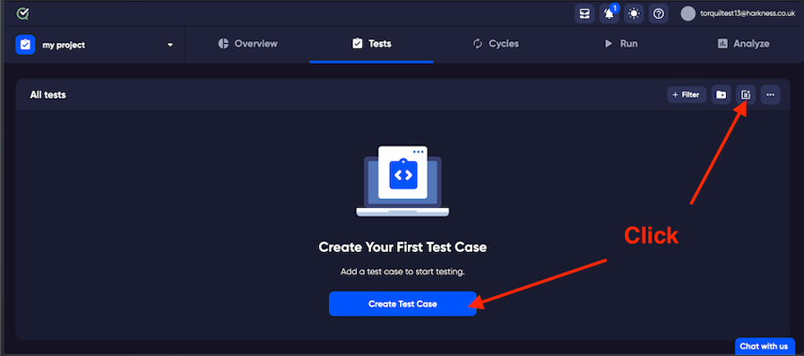
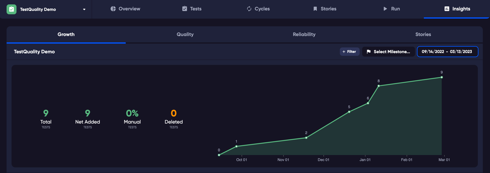

# Your Comprehensive Guide to Efficient Test Management

Congratulations on taking the first step towards improving your testing processes with TestQuality! Here's a step-by-step overview of what you'll do:

1. Create a project
2. Create a test
3. Create a cycle
4. Execute your test
5. Analyze test results

## Create your first project

When you first open TestQuality, you'll be prompted to create your initial project. Assuming you've completed this step, let's dive right into your next operation.

## Creating a Test

Follow these steps to create a test:

1. Navigate to the "Tests" tab at the top of the page.

   

2. Choose to either:
   - Click 'Create Test Case' in the middle of the page (for new tests).
   - Use the "New Test" button in the top-right corner.
   
   

3. Provide a name, add a test step (e.g., "Login"), and specify the expected result.

## Creating a Cycle

A cycle is a group of tests that you want to run together multiple times, such as before releasing a new version of your application. 

To create a test cycle, follow these steps:

1. A cycle can contain one or more tests. Use the test selector to choose tests for your cycle.
2. Click 'Add to Cycle' in the menu at the bottom of the page.
   
3. In the appearing box, name your new cycle.
   
4. Press Enter or click "Create" to confirm.

## Executing Your Tests

### Creating a Test Run

Before you can execute your tests, it's essential to set up a test run. Follow these steps:

1. Start by selecting the tests you want to include from the 'Tests' tab.

2. In the menu that appears at the bottom of the page, click "Run."

   

3. In the run dialogue, click "Create." At this stage, there's no need to specify a Cycle or a Milestone.

Now, let's move on to executing your tests:

1. Click the "Test Runs" tab.

   

2. To access and execute your specific test, click on the pending test. This action will open the test drawer.

   

3. Here, you can enter the actual result and assign a status to complete the execution process.

## Next Steps
- Create more tests to expand your testing suite.
- Analyze your test results in the 'Insights' tab to make informed decisions..
- Consider inviting your team to collaborate within TestQuality.

Learn more about how defects work in this [short video](https://www.example.com/defectsvideo).

## Integrations

Explore options to integrate TestQuality with other tools like GitHub or Jira in the Integrations section.

## Import Your Tests

If you have tests stored in another application or wish to set up continuous integration for importing automated test results, learn about the process of importing your tests in this section.

We hope this guide has provided you with a solid foundation to start using TestQuality effectively. If you have any questions or need further assistance, please don't hesitate to reach out to our support team or refer to our comprehensive documentation for more in-depth information. Happy testing!
