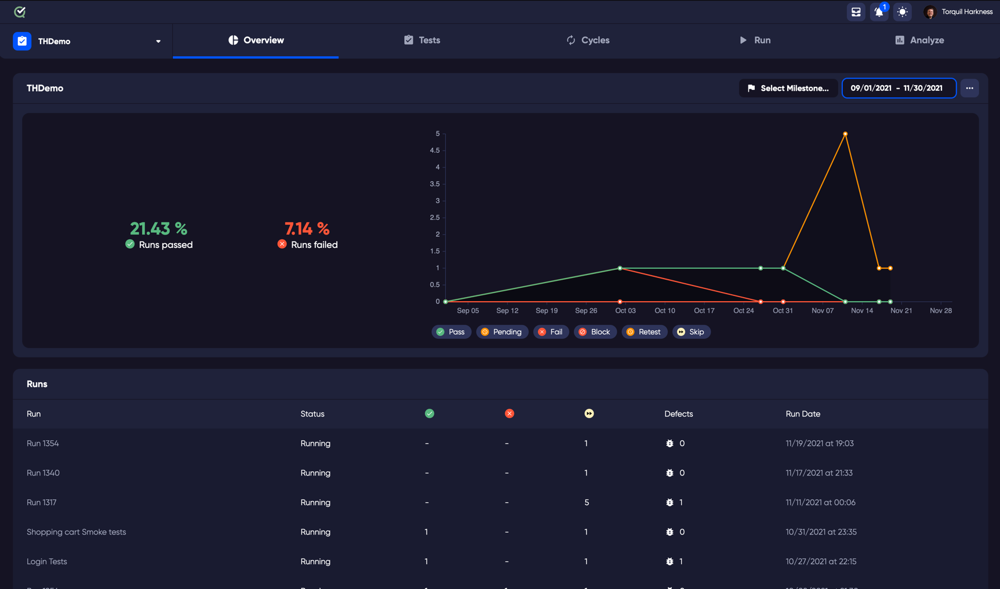

The import feature adds test cases from different platforms, manual testing results from spreadsheet files, test automation XML, and custom CLI integration with your automated testing.

To open the Import Data screen:
Go to the Tests tab. 
From the menu on the top right of the Tests pane, click the ellipses [...] button. 
Click on 'Import Tests'

## Test Automation Import

To import test automation results, drag and drop your file in to the dotted pane, or click to automatically open a file browser window to choose a local file. 

Once your file has been added, you can optionally choose a Cycle and Milestone that you would like to link to your test run result.

Click Import to process the file.

## Gherkin Feature Files
To import Gherkin feature files, drag and drop your file in to the dotted pane, or click to automatically open a file browser window to choose a local file.

Once your file has been added, you can optionally choose a Cycle and Milestone that you would like to link to your test run result.

If your Gherkin file is a Gherkin based test results json file, please click and select the 'automated run results' checkbox.

Click Import to process the file.
