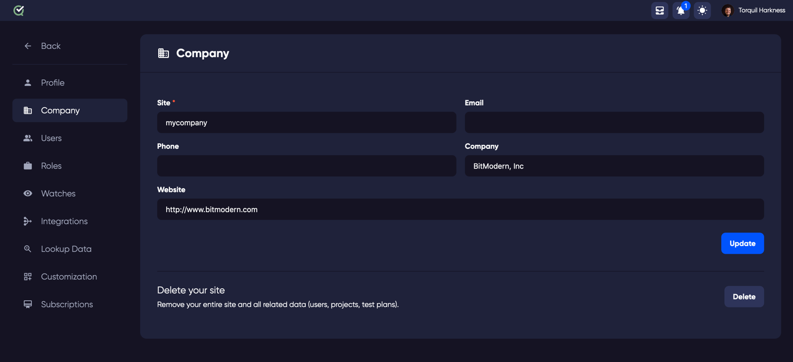
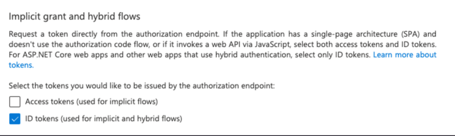
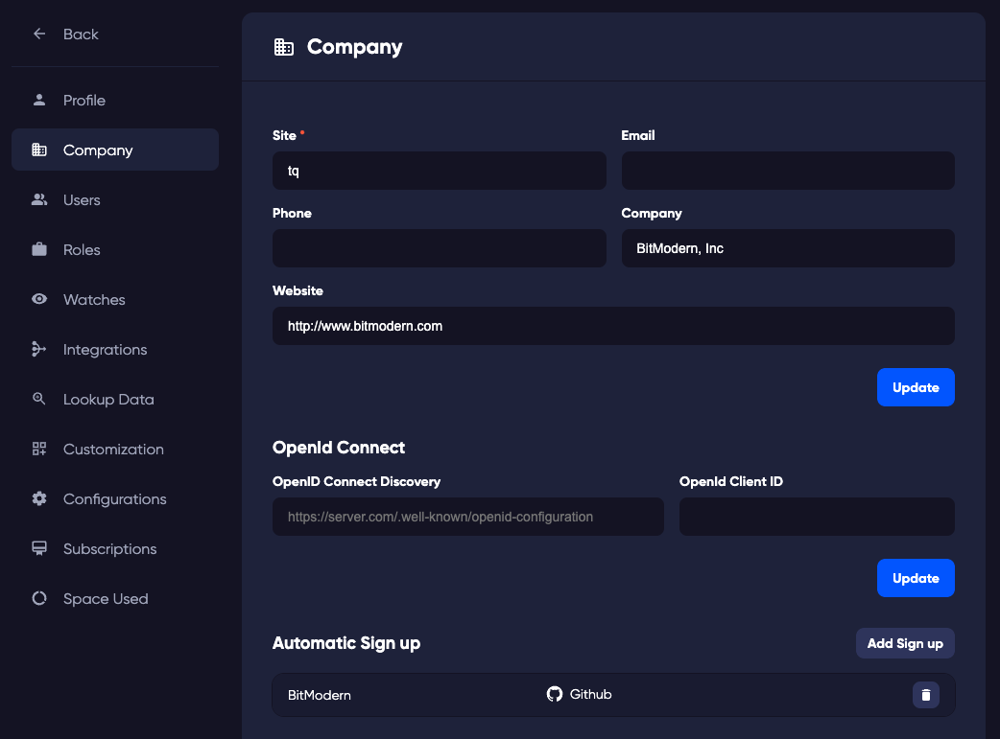

### Site

This is the name of your TestQuality site. It is also reflected in the web address of the site, so if it is changed, any links to items in your site that you may have saved in 3rd party locations will need to be changed to reflect the new address.

### Email

The email address used for your company. 

### Phone
A contact phone number for your company.

### Company
The name of your company.

### Website
Your company website.

### Single Sign On (SSO)

#### OpenID Connect

To use single sign on with applications that support OpenID, you can use this section to configure your organisations SSO. 

The following example is how to use *Microsoft Azure* as your SSO provider.

**Azure AD**
1. Go to "App Registrations" and click "New Registration".
   2 Fill a new application form.
   Introduce a name.
   "Under Redirect URI" select platform Web and introduce the following url https://api.testquality.com/api/sso/openid/callback
   Click "Register"
3. Go to "Authentication" and select "ID tokens (used for implicit and hybrid flows)"
   
4. Save the changes.

5. In the application overview Under Endpoints copy "OpenID Connect metadata document"
   will be something like https://login.microsoftonline.com/{{tenant-id}}/v2.0/.well-known/openid-configuration and the "Application (client) ID" from overview page.
   We will need those later during azure id setup on testQuality.
   
6. Go to "Company" in the administration Area in TestQuality.

   
7. Paste "OpenID Connect metadata document" from Azure AD onto "OpenID Connect Discovery" and "Application (client) ID" onto "OpenID Client ID".

To allow automatic signup to TestQuality we add authorised domains under "Automatic Sign up"

#### Automatic Sign Up

To configure GitHub as your SSO provider, you will need to have a valid integration set up. 

1. In TestQuality in the top right corner menu select "Integrations".
   
   
   
2. Click on the GitHub gear icon to set up the integration and grant permissions to the organizations we want to have access to TestQuality.

3. Click Authorise and follow the wizard to allow GitHub to link to TestQuality. 

Important note: You need to be the administrator of the repository that you are linking. The reason for this is during the setup of the integration, the system configures webhooks to send information. 
Once the integration is configured, the admin rights are no longer required. 

Next we are going to add organizations to testQuality to allow users that belong to the organization to sign up.

4. Under "Company" in the administration area click on the 'Add Sign up' in the Automatic Sign up section.
5. Select the sign up type as "GitHub" and Select an organization within your GitHub account.

### Delete 

**WARNING** This will remove your site entirely. This action is not reversible. 
