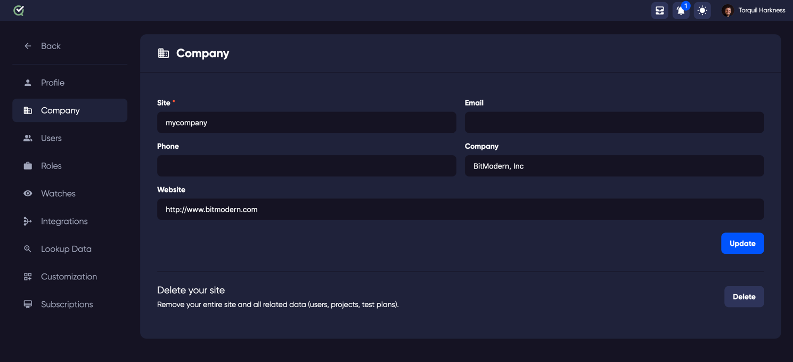
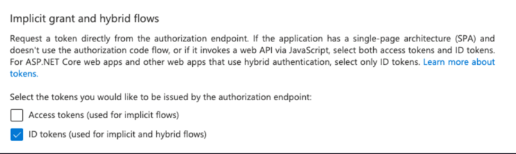
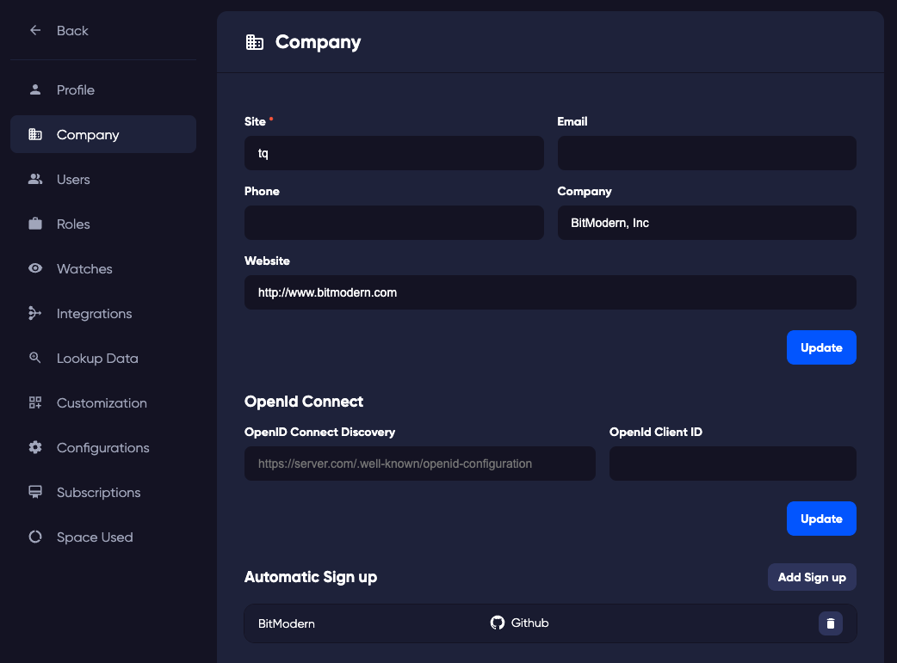
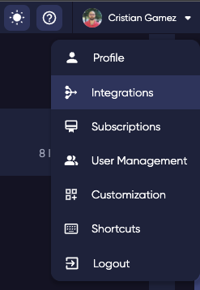
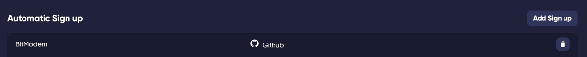
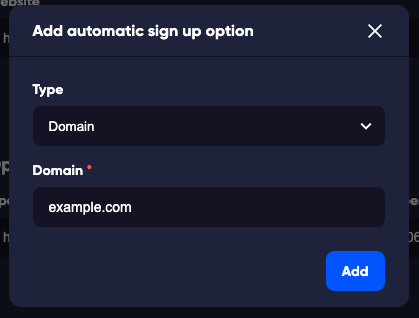

# Company

Manage your site details, single sign-on, and automatic sign-up from this page.

## Site details

**Site** — Required. Your TestQuality site name, used in your site's URL. If you change it, update any saved links to match the new address.

**Email** — Your company's contact email.

**Phone** — Your company's phone number.

**Company** — Your company's name.

**Website** — Your company's website.

Click **Update** to save changes.

## Single sign-on (SSO)

SSO lets users access TestQuality using existing credentials from an identity provider. TestQuality supports OpenID Connect and GitHub.

### OpenID Connect

TestQuality works with any standard OpenID Connect provider. The examples below use Microsoft Azure AD and OneLogin, but the same approach applies to other OIDC providers: register an application, then paste two values into TestQuality.

#### Microsoft Azure AD

1. In Azure, go to **App registrations** and click **New registration**
2. Fill in the form:
   - Enter a name
   - Under **Redirect URI**, select platform **Web** and enter: `https://api.testquality.com/api/sso/openid/callback`
   - Click **Register**
3. Go to **Authentication** and enable **ID tokens (used for implicit and hybrid flows)**

   

4. Click **Save**
5. From the application overview, copy:
   - **OpenID Connect metadata document** (under Endpoints) — e.g. `https://login.microsoftonline.com/{{tenant-id}}/v2.0/.well-known/openid-configuration`
   - **Application (client) ID**
6. In TestQuality, go to **Settings → Company**

   

7. Paste the values:
   - **OpenID Connect metadata document** → **OpenID Connect Discovery**
   - **Application (client) ID** → **OpenID Client ID**
8. Click **Update**

#### OneLogin

1. In OneLogin, sign in to the admin portal and go to **Applications → Applications**, then click **Add App**
2. In the search box, enter **openid** and select the **OpenId Connect (OIDC)** application
3. Enter a **Display Name** (for example, "TestQuality"), then click **Save**
4. Go to the **Configuration** tab. In the **Redirect URI's** field, enter: `https://api.testquality.com/api/sso/openid/callback`
5. Leave **Post Logout Redirect URIs** blank, then click **Save**
6. Go to the **SSO** tab and copy:
   - **Client ID**
   - **Well-known Configuration** URL (right-click and copy the link) — e.g. `https://<your-subdomain>.onelogin.com/oidc/2/.well-known/openid-configuration`
7. Assign the users or roles who should have access to the application
8. In TestQuality, go to **Settings → Company**
9. Paste the values:
   - **Well-known Configuration** URL → **OpenID Connect Discovery**
   - **Client ID** → **OpenID Client ID**
10. Click **Update**

### GitHub SSO

To use GitHub as your SSO provider, you need an active GitHub integration first.

1. In TestQuality, click your name in the top right and select **Integrations**

   

2. Click the GitHub gear icon and grant permissions to the organizations you want to connect

   

3. Click **Authorise** and follow the prompts

> You must be an administrator of the repository you are linking. This is required to configure webhooks during setup. Admin rights are not required after setup is complete.

4. Go to **Settings → Company** and click **Add sign up** in the Automatic sign-up section
5. Select **GitHub** as the sign-up type and choose an organization from your GitHub account

   

## Automatic sign-up

Adding a domain here allows any user with a matching email address to sign up and join your site automatically. Click **Add sign up** to add a domain or GitHub organization.

Existing sign-up configurations are listed here. Each entry shows the site name and provider. Click the delete icon to remove a configuration.

## Delete your site

Removes your entire site and all related data (users, projects, test plans).

**WARNING:** This action cannot be reversed.