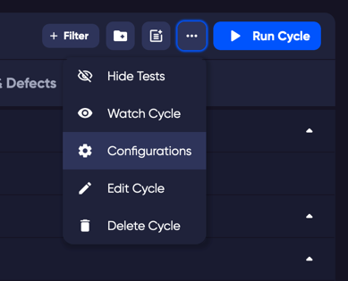

## Adding a configuration to a Cycle

Go to the Cycles tab
With the Cycle selected that you would like to apply the configuration, click the ellipses menu on the top right of the window.
Choose the 'Configurations' from the drop down menu.

Click the   button to open the menu of configurations to choose from. When you have chosen a system and an application, you can add more using the Add System Configuration button again or the Submit button to apply your changes.

## Testing with configurations

Once your Cycle has a system configuration applied (as described in the previous step) you can move to testing.

- Choose your Cycle from the Cycles tab, and click the blue 'Run Cycle' button.

- This will open the Run dialogue and give you extra options for creating your Run. If you do not wish to change anything in this wizard, click 'Create' to close the window and create your run.

- After clicking 'Create', the display will change and you will be redirected to your new run.
- The initial display you will see is the Overview page for your new test run. 

### Your test run is now ready to start testing. 

- Click on the Test Runs tab.
- Select a test.
- At the top of the [Test Drawer](/test_drawer) you will see your system configuration(s) that you have applied to the cycle.
    - If you have more than configuration applied to your cycle, each test will have a status for each configuration. This means that you can have a test pass on one configuration but a different status on another.  

### Adding a custom configuration

In the customization page you can add and manage custom objects for [Tests](/tests) or for [Cycles](/cycles).

It can be useful to add a field or object for information in a test or as a mandatory field that requires data before you can, for example, create a test.

