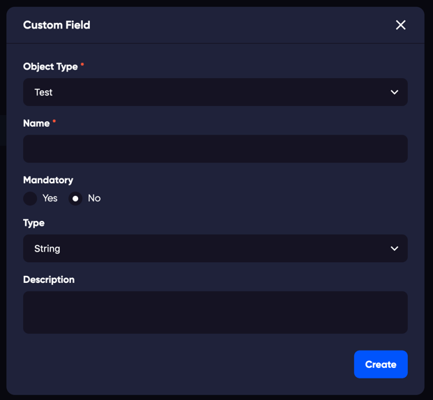

### Adding a custom field

In the customization page you can add and manage custom objects for [Tests](/tests) or for [Cycles](/cycles).

It can be useful to add a field or object for information in a test or as a mandatory field that requires data before you can, for example, create a test.

