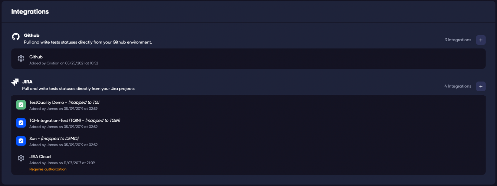

# Integrations

View and manage your active integrations with Jira, GitHub, and personal access tokens.

> You need administrator rights on the repository to set up an integration. Once connected, other users do not need admin rights.

## Jira

Linked Jira projects are listed here, each showing the project name mapped to a TestQuality project, who added it, and when.

- Click **Link Project** to connect a new Jira project
- Click the gear icon next to a project to edit its settings
- Click the delete icon to remove the linked project

For setup and configuration see [Jira](../integrate_with_jira).

## GitHub

Linked GitHub repositories are listed here, each showing the repo name mapped to a TestQuality project, who added it, and when.

- Click **Link Repo** to connect a new GitHub repository
- Click the gear icon next to a repo to edit its settings
- Click the delete icon to remove the linked repository

For setup and configuration see [GitHub](../integrate_with_github).

## Personal access tokens

Personal access tokens are used to authenticate API and CLI access to TestQuality.

Click **+** to create a new token. Each token shows its name, creation date, and expiry date. Click the delete icon to revoke a token.

For API usage see [API & CLI](../api).