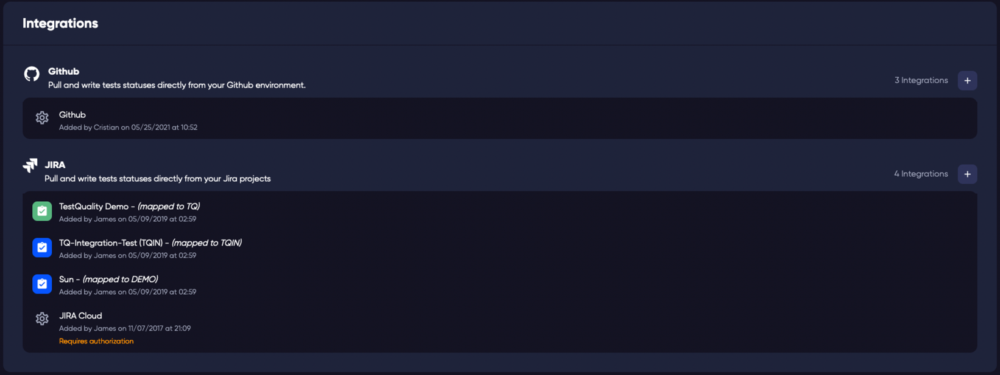

The Integrations configuration is located in the Profile > Integrations menu by clicking on your username in the top right of any page. 

The integrations that you have connected to your projects are listed on this page.

Clicking on the configuration icon  for your configuration will open the settings page for your connection to your 3rd party repository.

## Edit Project Integration

Clicking on the name of the integration will open the configuration for that integrated project.

Project - The name of the project in TestQuality that your repository is linked to. 

Organisation - The GitHub Organisation for your repository.

Remote Project - The name of the repository.

GitHub Status - This is the mapping of the issue status from either side of the integration. 

GitHub Resolution - Mappings for the integration of a closed issue resolution.

Delete integration - Deleting the integration will remove the integration connection to the currently linked project. *WARNING* Removing the integration will remove all the linked defects and requirements in the project.
