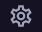
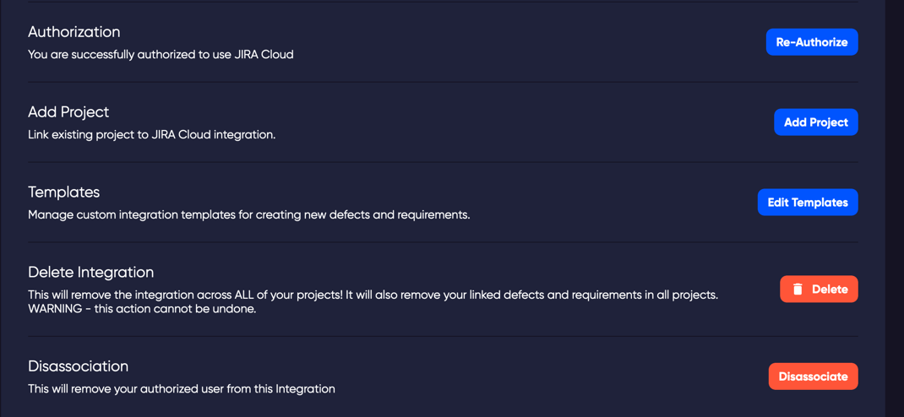
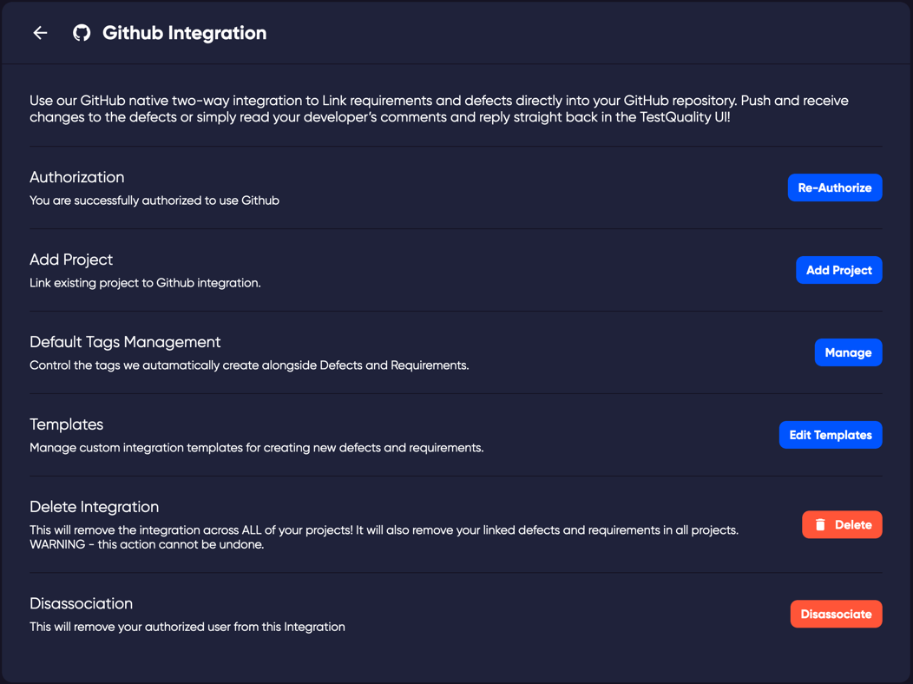
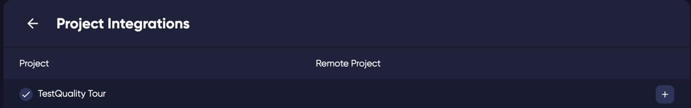
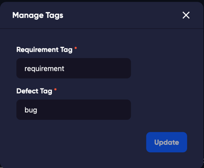
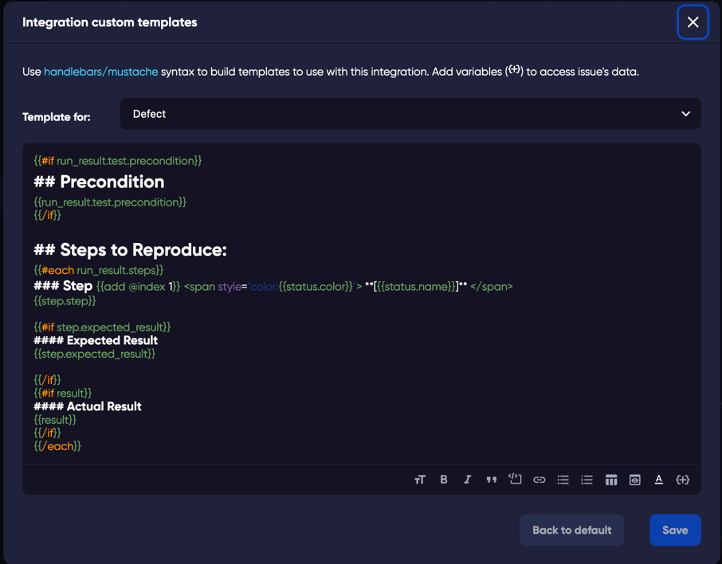
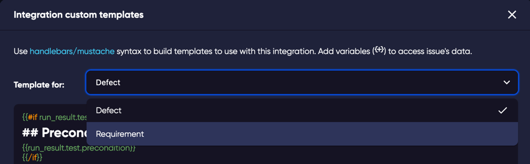
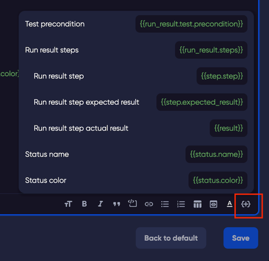

The Integrations configuration is located in the Profile > Integrations menu by clicking on your username in the top right of any page. 

The integrations that you have connected to your projects are listed on this page.

Clicking on the configuration icon  for your configuration will open the settings page for your connection to your 3rd party repository.

**Admin Privileges** - To set up an integration, you will need to have administration rights to the repository that you are setting up. Once the connection is made, your users will not need to have admin rights, it is only during the initial setup while it creates the webhook connections.

## Jira integration settings

## GitHub integration settings

Clicking on the name of the integration will open the configuration for that integrated project.

*The items below are slightly different for the settings of GitHub or Jira integrations*

## Authorization
If you would like to change the user that has set up the integration, the authorization function resets the connection and refreshes the connection with your Jira/GitHub user. 

## Add Project
Clicking on 'Add Project' button will take you to the projects page where you can add or edit your TestQuality projects to your remote repositories.

Clicking on each integration will open the edit settings for the linked project. 

## Default Tags Management
When a defect is linked or created in your remote repository, labels/tags are added to the issue to identify that it was created by TestQuality and that it is a bug/defect. 
You can edit these tags here to better match your use case.

## Templates
Defects and Requirements are created with a template that can be modified here. You can edit the template to better match your use case, or your preferred format of issues in Jira or GitHub.

### The Template editor

### Defects or Requirements

There are different templates available to modify for either Defects (Bugs), or Requirements.

When you open the editor you can select via the dropdown, the template you want to edit.

Should you make a mistake or wish to start again from the beginning, you can revert to defaults at any time with the 'Revert to Defaults' button.

### Static or dynamic content.
Static: It is possible to create your own static content for your preferred template. For example, you may wish to have static titles for your QA tech to add comments and process for what they found when testing. This could be to match your current use of GitHub issues and what is the expected behaviour of your defects.
Dynamic: The default template has basic dynamic content that adds the test details into the defect. For example, the first line `{{#if run_result.test.precondition}}` checks the test that the defect will be created from, to see if it has any data in the Precondition field. If yes, then it adds this to the defect, with a header of **'Precondition'**.

#### Nested variables

It is possible to have nested variables such as within each step, you can check for an 'expected result' text.

If you click the \{+\} button in the bottom of the editor, example variables are shown. The nested variables are tabbed to the right. 

If you would like to create your own more advanced templates, there is a link to the [mustache syntax](https://handlebarsjs.com/guide/) at the top of the editor.

## Delete integration

Deleting the integration will remove the integration connection to the currently linked project. *WARNING* Removing the integration will remove all the linked defects and requirements in the project.

## Disassociation

If you want to remove your user as being the user that is the authorized admin for the integration, you can disassociate your user from the integration. To link the projects again, another admin user will have to login and Re-authorize. 