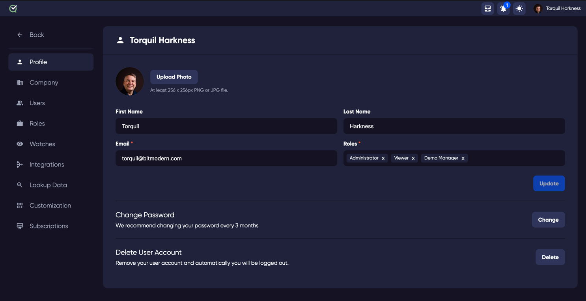

### Profile Details

#### Accessing Profile

Click your name or picture at the top right of any page to see and change your account details.

#### Change Picture

To use a new picture, click 'Upload Photo' next to your current one.

#### Important Fields

First Name & Last Name - Both fields are needed

Email - Your email may be used for notifications from the TestQuality app, either for status changes for tests cases assigned to you, or for invoices if you have your account set up to be the account to receive invoices notifications. It is a required field as it may also be needed to reset your password. 

[Roles](roles)

Roles decide what you can do on this site. Change them in the 'Roles' section. You must have at least one role.

### Change Password
This will popup a change password dialogue. We recommend changing your password every few months.

### Delete User Account
Deleting your user account will remove ALL of your comments and interactions with your projects. You will no longer have access to the projects and will be removed from the site. 

**WARNING** This action cannot be reversed!
