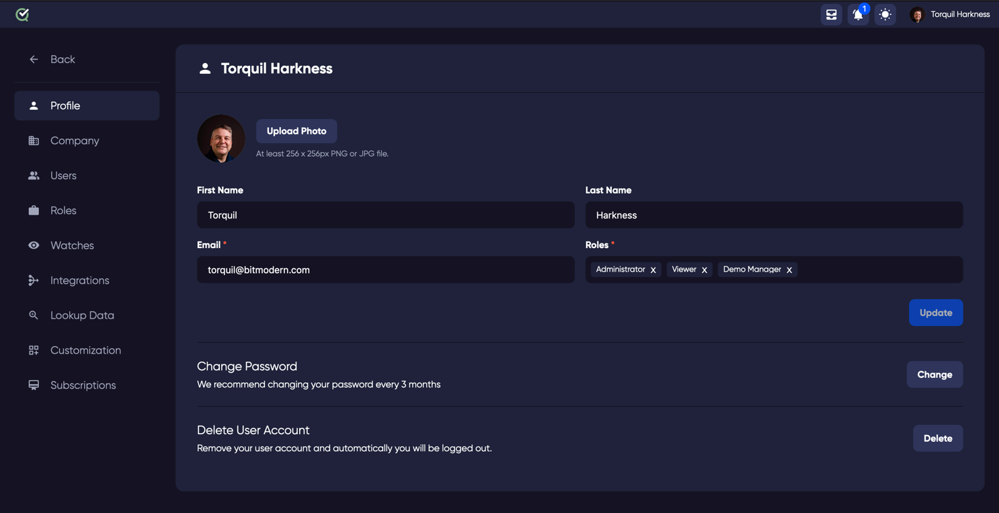

# Profile

Access your profile by clicking your name or photo in the top right of any page.

## Profile details

Update your name, email, photo, and roles from this screen. Click **Update** to save changes.

**First name / Last name** — Both fields are required.

**Email** — Required. Used for:
- Password reset
- Notifications for test cases assigned to you
- Invoice notifications (if your account is set up to receive them)

**Roles** — Controls what you can do in TestQuality. You must have at least one role assigned. See [Roles](roles) for details.

**Photo** — Click **Upload photo** to replace your current one. Minimum size: 256 x 256px, PNG or JPG.

## Getting started wizard

Click **Open** next to **Open TestQuality getting started** to run through the setup wizard again.

## Checklist

Click **Show** next to **Open TestQuality checklist** to view the onboarding checklist again.

## Change password

Click **Change** to open the change password dialog. We recommend updating your password every 3 months.

## Delete user account

Permanently removes your account, all your comments, and your access to all projects. You will be logged out immediately.

**WARNING:** This action cannot be reversed.