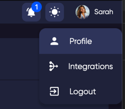
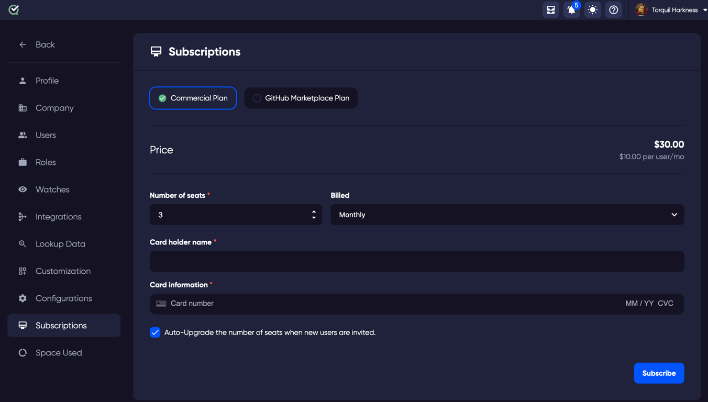

Roles are groups of permissions that you can assign to your site users. You can assign only one role to a user, but you can create multiple versions of different roles to match your different use cases. 

For example you may wish to have your QA Team members with permissions to execute a Test Run, but only the Team Lead role that can create a new defect.

To open Roles, Click on your profile icon in the top right of the screen.

In the new page that opens, choose Roles from the menu on the left.

### Name

Each different role identified by a name describing the common permissions of that role. It may be required that for that role in your workflow, thr role may need additional, or less permissions. If this is the case, you can edit the role and change the default permissions. 
You may also wish to add your own role, to include a set of permissions that match a new role for your organisation.

### No. of Users
This number identifies the amount of users on your site that have this role assigned to their user. 

**Warning** Deleting a role will remove those assigned permissions for every user that has that role assigned unless the permission is being applied from another role that they have assigned. 
