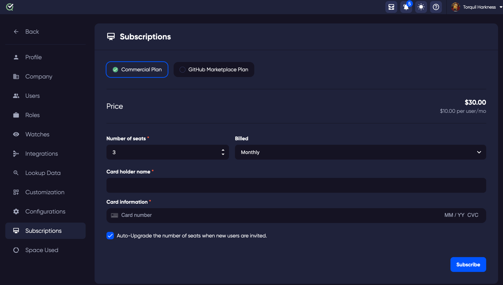

## GitHub Marketplace:

If you have purchased a subscription via GitHub marketplace, you can apply the purchase using the 'GitHub Marketplace Plan' button on the Subscriptions page.

## Subscriptions:

To purchase a subscription in TestQuality, the subscriptions page can be accessed via the settings dropdown on your username in the top right of the application and clicking on the Subscriptions page.

There are two subscription options to choose from, monthly, or annual.

For maintenance free simplicity, your subscription will automatically renew on the chosen subscription duration.

If a payment is not able to be processed, access to the site will be limited until the subscription is reactivated.

## Auto-Upgrade:

The Auto-Upgrade feature is to reduce administration effort, so that you can increase the number of subscriptions automatically as you invite additional users. 