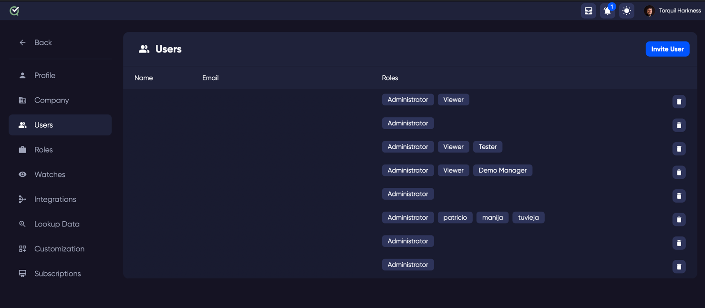
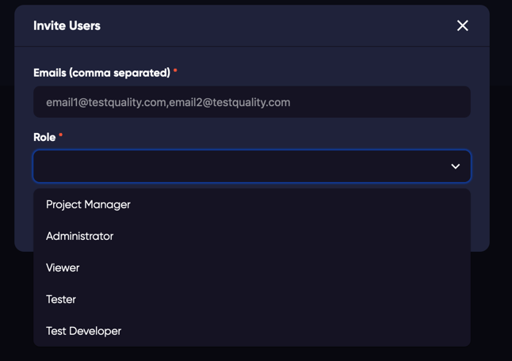

The site users page is for user management tasks and inviting new users that are not yet part of your site. 

## Invite a user
In the top right of the user list the  button can be used to email an invitation to your TestQuality site.

You can add multiple user emails and the invitation will be sent, and the user created in your site. To assign a role to the invited user, choose from the dropdown in the invite wizard.
To add a custom permissions for the new users, create a new [role](roles) and it will be available in the dropdown list.

## User Permissions
To edit the permissions of a user, click on the list of users. This will open the details of the user, where you can assign different [roles](roles).

## Delete a User
To remove a user from your site, click the delete icon for the user you wish to remove . WARNING: This action cannot be undone.

