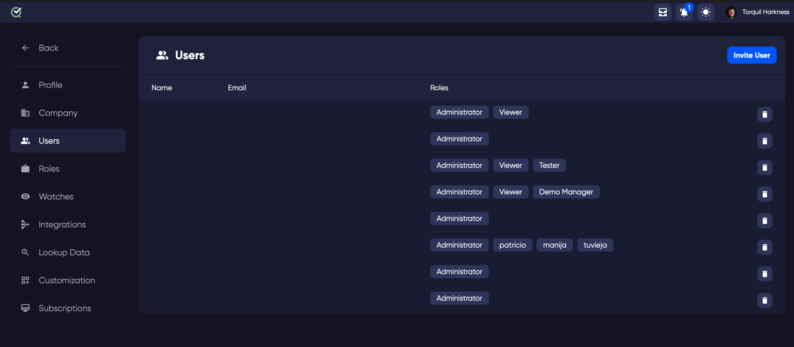
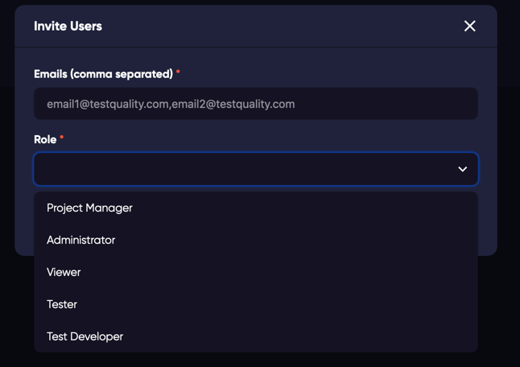

# Users

Manage users and invite new members to your TestQuality site.

## Invite a user

Click **Invite User** in the top right to send an email invitation to your site.

You can enter multiple email addresses at once. Each invited user is created in your site immediately. Assign a role to the user from the dropdown in the invite dialog.

To assign custom permissions, create a [role](roles) first — it will appear in the dropdown automatically.

## Edit a user

Click on any user in the list to open their details. From there you can update their assigned [roles](roles).

## Delete a user

Click the delete icon next to the user you want to remove.

**WARNING:** This action cannot be undone.