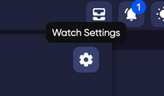
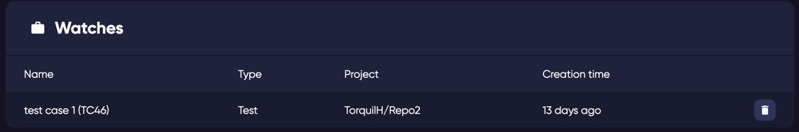

### Managing your Watched items

Your watch list can be accessed quickly by clicking on the configuration icon in your watch notifications menu at the top of any page. 

From here you can remove any of your watched items which will stop you being notified about that previously watched item. 

The great feature with your watch list is that it identifies the project and gives you a great overview of what items you are watching across all your projects. 

