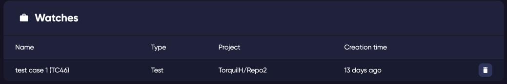
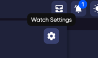

# Watches

Watches let you track specific items across your projects. When a watched item changes, you receive a notification.

You can watch items of type **Test** or **Project**. Watched items are listed here with their name, type, project, and the date you started watching.

## Access your watch list

Click the notifications bell in the top right of any page, then click the gear icon to open Watch settings.

## Remove a watch

Click the delete icon next to any item to stop watching it. You will no longer receive notifications for that item.

## Slack notifications

Click **Edit Slack Integration** to configure Slack notifications for your watched items. This requires an active Slack integration. See [Slack](../integrate_with_slack) for setup instructions.