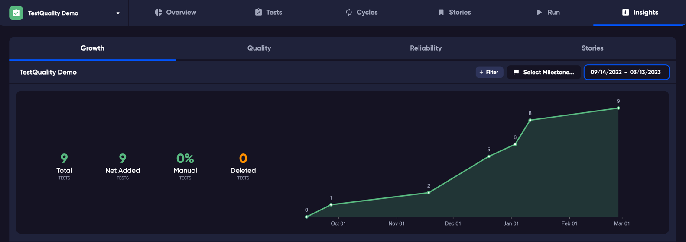

## Test Growth
Measure your test growth over time. How many tests you have and what is the breakdown of those tests, automated or manual. 

## Test Quality
Based on the execution of your tests, which were useful and those that were not as useful. You will also see those tests that are highlighted for quality reasons. Tests that have not been run yet etc.

## Reliability
How flaky are your tests? Do they fail and then succeed many times? Are they useful to you, or will they be ignored by your team? Test reliability will help you identify those tests that are flaky.
Below the graph each test's flakiness is displayed as icons. 

Helping you identify the reasons behind the reliability. Clicking on the icons takes you directly to the linked test run.

## Stories

Track the number of tests that are linked to your Stories over a specific period. Change the date range to trace how your requirements are linked to tests.

The graph identifies your tests that are linked to requirements in your linked repository.

### Filtering the graph.

When viewing by Milestone, the data for your Milestone is displayed on the graph and Test Totals display to the left of teh graph.

When selecting by Milestone, if your Milestone does not have a start and end date you will be prompted to enter dates. 

*Note: The filter by Milestone for Test Growth works differently than filtering by Milestone on the [Overview](overview) page. This is because the Overview page graph is listing Runs and Tests that are linked to a Milestone regardless of dates, whereas this Test Growth graph is a display of changes over a time period.*
