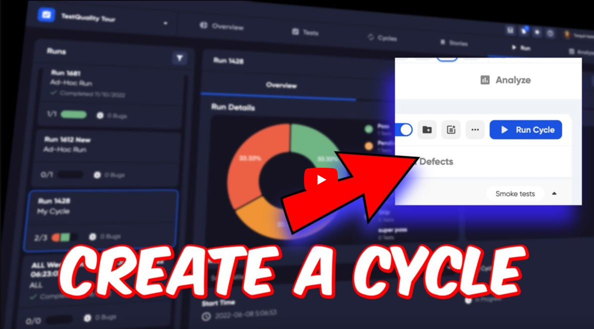

## Importing Tests

You can import tests from a file using our [Import](importing) function.

## Importing Test results
You can import test result XML files manually using the [Import](importing) function, or connect via the CLI tool or API.

You can find the open-source CLI tool on GitHub here: https://github.com/BitModern/testQualityCli

## Continuous Integration

If you are using a CI platform such as Jenkins, Cloudbees, Circle CI, Travis CI and want to upload your test results, you can add TestQuality to your scripts.

To connect via command line, you can use the command files from http://cli.testquality.com/ then using the file from your system, log in with username and password, or we can provide you with a personal access token so you do not have to provide your login details in the command.

## TestQuality CLI

To integrate your tests you can use the TestQuality CLI and an access token to authenticate your test system and push your results.

Not only can you push results to your projects, but with the commands available you can also get information about your projects.

The commands and options that are available are listed below:

**Commands:**

`testquality login  <userame> <password>`  &nbsp;&nbsp; Login to TestQuality

`testquality projects   `                 &nbsp;&nbsp; List projects TestQuality

`testquality plans  `                     &nbsp;&nbsp; List plans in project.

`testquality plan_suite  `                     &nbsp;&nbsp; List plan-folder relationships in project.

`testquality suites  `               &nbsp;&nbsp;  List folders in project.

`testquality suite_test  `               &nbsp;&nbsp;  List folder-test relationships in project.

`testquality milestones  `               &nbsp;&nbsp;  List milestones in project.

`testquality upload_test_run <xmlfiles> `&nbsp;&nbsp;  Login to TestQuality

`testquality upload_csv <files> `                  &nbsp;&nbsp;   CSV files upload.

`testquality upload_feature <files> `                  &nbsp;&nbsp;   Gherkin feature files upload.

`testquality requirements `                  &nbsp;&nbsp;   List requirements and related tests in a project.

`testquality restore `                  &nbsp;&nbsp;   Restore plan or test.

|   Option    	|Description     	|
|---	|---	|
|--help   	|Show help     	|
|--version   	|Show version number     	|
|--verbose, -v   	|boolean (default: false)   	|
|--save, -s   	|Save tokens for future use   	|
|--username, -u   	|User name you login as   	|
|--access_token, --at   	|Access Token   	|
|--expires_at, --ea   	|Access Token Expires at Unix Epoch   	|
|--refresh_token, --rt   	|Refresh Token   	|
|--project_id, -i   	|Project Id   	|
|--project_name, -n   	|Project Name   	|
|--milestone_id, --mi   	|Milestone ID   	|
|--milestone_name, --mn   	|Milestone Name   	|
|--plan_id, --pi   	|Plan ID   	|
|--plan_name, --pn   	|Plan Name   	|

To get information on your projects and plans is really easy using the command line. 

For example, to get a list of Projects in your TestQuality site, you can use the following command:

`testquality-macos projects`

This will list your projects with their ID, Key and Name. 

Then you might want to list the Test Plans that are in your project, you can use the following command where you add the ID number of the project in the command (shown here as XXX):

`testquality-macos plans --project_id=XXX`

To use a Personal Access Token, you can add it right in to the command. 

`testquality-macos plans --project_id=XXX -at="ey78x2y39229d3998....... (really long token code)!`

## Personal Access Token

A PAT (Personal Access Token) can be used with either the API or CLI. It is long-lived token typically used for personal use or in CI pipeline. PATs are useful for automating tasks you plan to repeat and want to avoid re-authentication. 

**Please Note** We do not store the PAT in your UI and once displayed in the create screen, it is not possible to see the PAT again. This is to reduce the security risk of someone getting your PAT. You should not save your PAT anywhere vulnerable as anyone with your PAT could gain full access to your account in TestQuality.

In the Integrations section of the settings menu you can create yourself a token.

Click on your username in the top right of any page.

Choose Integrations 

The Integrations section will open within the settings menu.

On the right of the main window, you can choose to add a new Personal Access Token from the menu.

Click on the '+' sign in the Personal Access Token section.

Choose a name for your token. Click 'Create'.

