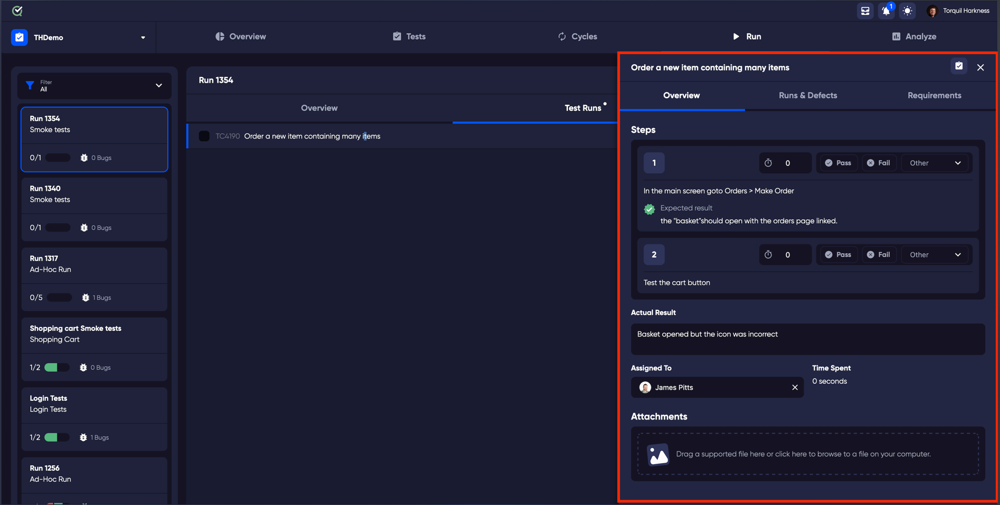
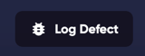
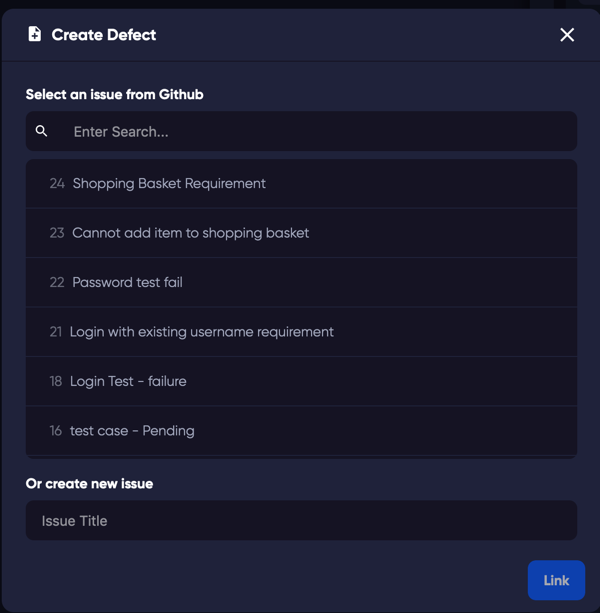
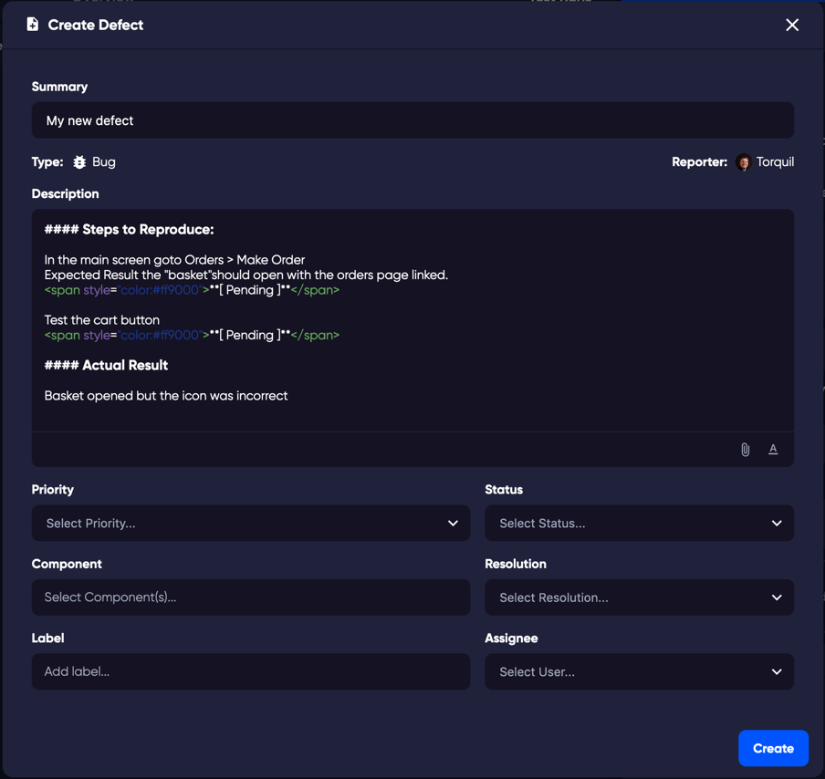
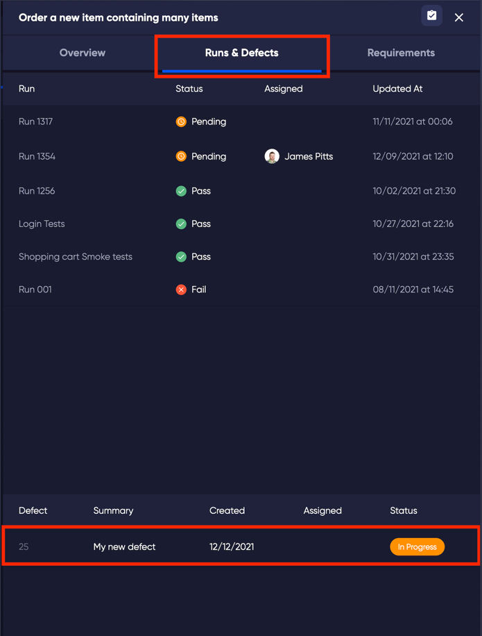
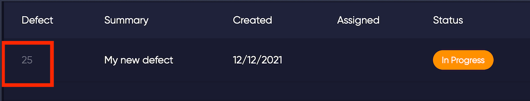
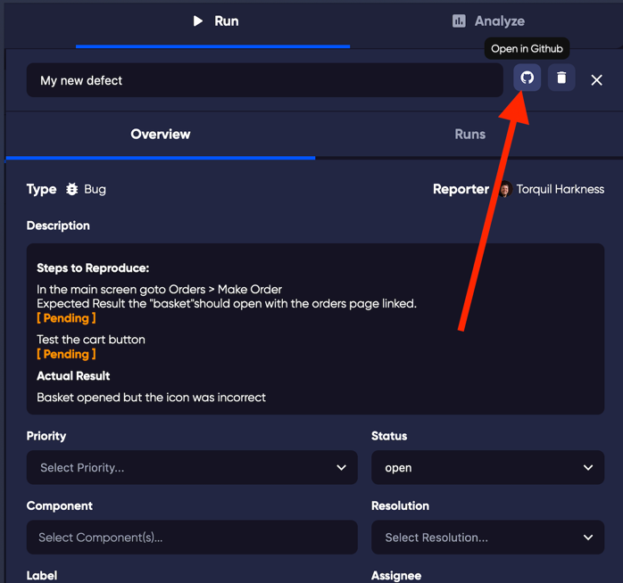
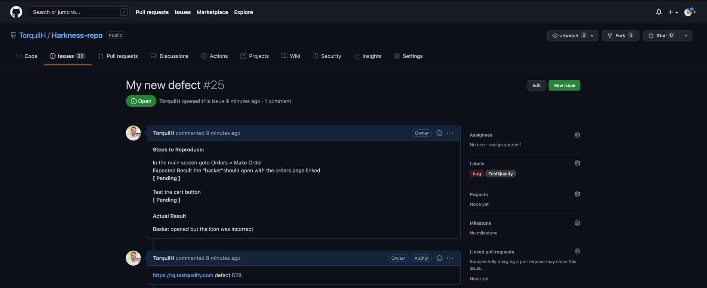

### Creating a Defect or Bug
You can easily create a defect or bug directly from a test in a [test run](run). This feature allows immediate logging of issues, ensuring a streamlined defect tracking process.

1. **Select a Test in a Run**: Choose a specific test during a test run. 
   
   
   
2. **Access the Test Drawer**: Click on the selected test to open the [Test Drawer](test_drawer). The Test Drawer is where you can manage and log details related to the test.
   
   
   
3. **Log a Defect**: In the Test Drawer, click on the 'Log Defect' button located at the bottom right. 
*Note*: If there is no integration set up with a defect tracking system (like GitHub or Jira), you will be prompted to set up an integration before you can proceed.
   
   

### Linking an Existing Defect or Creating a New One
4. **Choose to Link or Create Defect**: 
   - To link an existing defect, use the search field within the drawer.
   - To create a new defect, start by typing the defect's name in the 'Issue Title' field. 
     
     
     
     As you type, the 'Link' button will change to 'Next'.

5. **Proceed with Creating New Defect**: After typing the defect name, click 'Next'.

6. **Customize the Defect Details**: 
   - The defect window will open. Here, you can edit fields as needed, such as Priority or labels.
   - Upon creating a defect, it is directly created in your linked repository on GitHub or Jira. TestQuality does not save a local version of the defect but rather references a link to it in the test.

        
   - Click 'Create' to finalize.

7. **View the New Defect**:
   - Your new defect is now created in your linked repository.
   - To view it, select the 'Runs and Defects' tab in the test drawer. This tab allows you to manage and monitor all logged defects associated with your tests.
     
     
   - Click on the defect number link to open the Defect in the drawer. 
     
     
   - To open the defect in your linked repository, click the link in the drawer. This ensures seamless navigation between TestQuality and your defect tracking system.
     
     
     
     This will direct you to the third-party site where the defect is logged. 
     
     

For a visual recap or alternative explanation of the steps covered, check out our YouTube video on [How to Log a Defect](https://www.youtube.com/watch?v=E2ECzeuCpP4).

     
    
