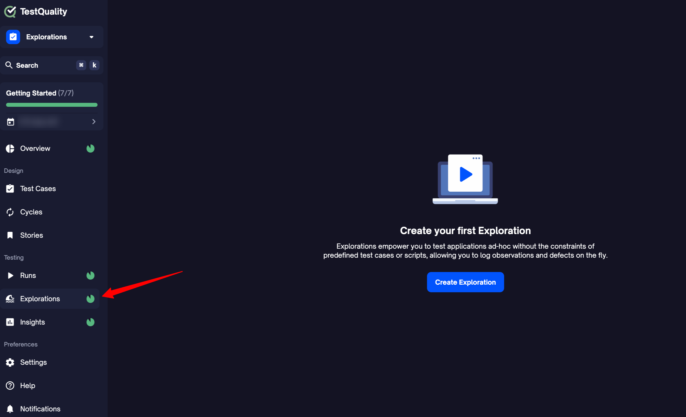
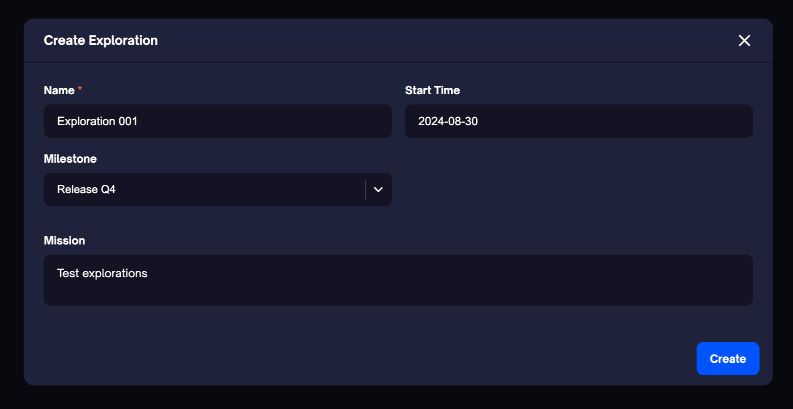
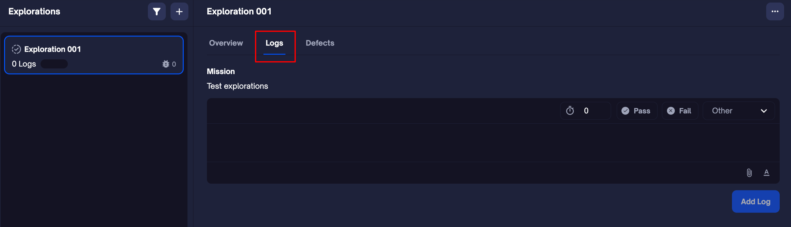
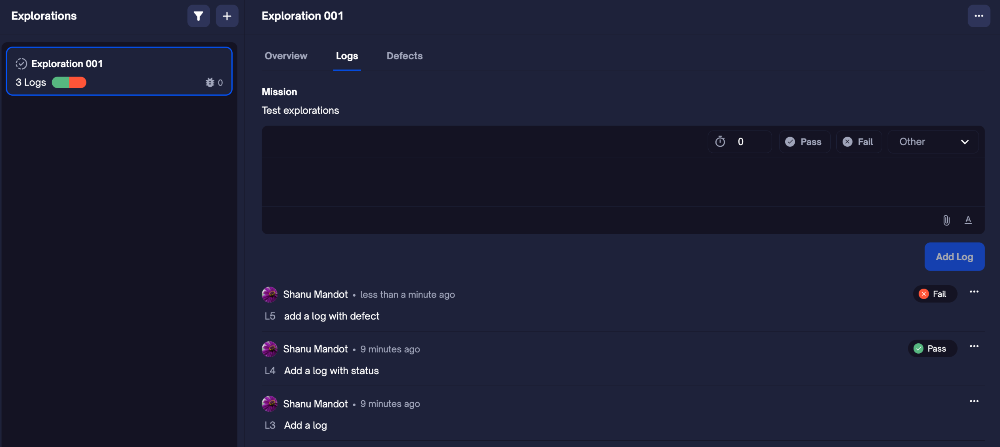
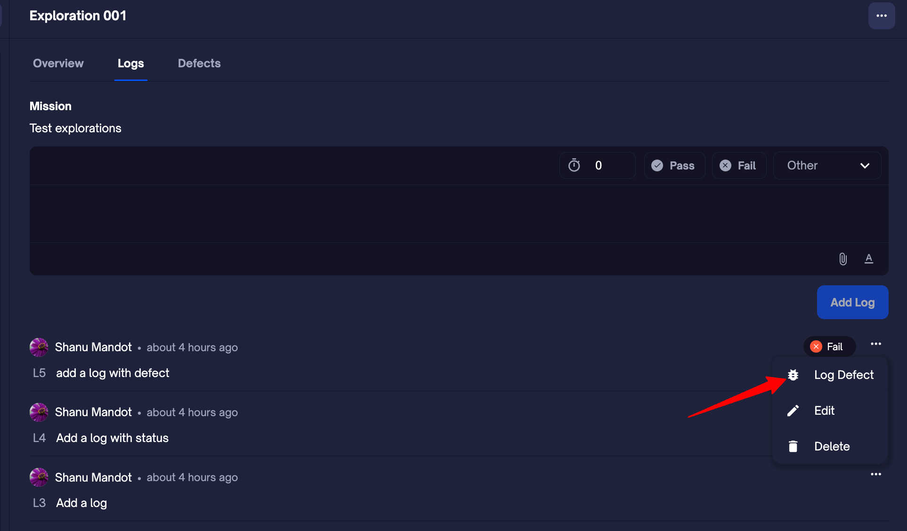
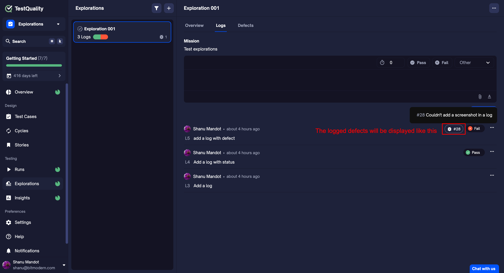
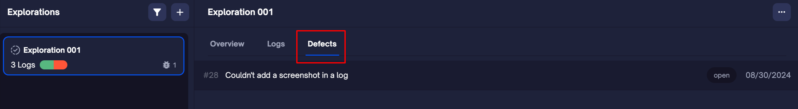
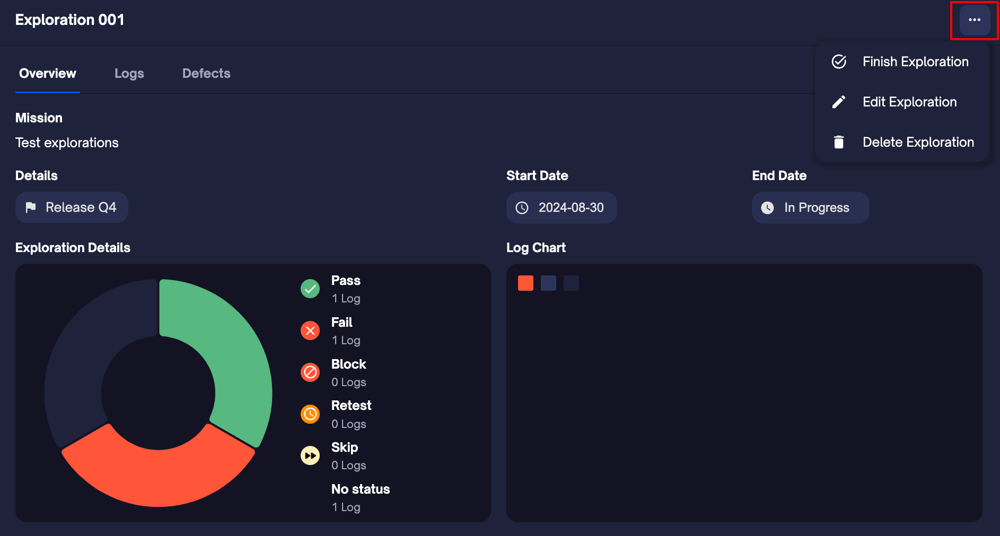

The Explorations feature in TestQuality empowers testers to conduct ad-hoc and exploratory testing without the constraints of predefined test cases or scripts. This feature allows testers to investigate application areas that require deeper analysis or are less structured, offering a more dynamic and adaptive testing experience.

## Why is it Needed?

Exploratory testing is essential when predefined test scripts might not cover every possible scenario or when you need to explore the application intuitively to uncover hidden issues. The Explorations feature is crucial in these situations as it allows testers the flexibility to explore, document findings, and identify defects on the fly. This helps in catching bugs that might otherwise go unnoticed and ensures a more thorough testing process.

## Importance of Doing It in TestQuality

TestQuality's Explorations feature integrates seamlessly with your existing testing process, allowing you to link explorations with milestones, log defects directly within the platform, and track all exploratory activities in one place. By conducting exploratory testing within TestQuality, you maintain a clear, organized record of all testing activities, making it easier to manage and review the testing lifecycle.

## Creating an Exploration

To create an exploration in TestQuality:

1. **Navigate to the Explorations tab** within your project. This is your starting point for setting up a new exploratory test.

    

2. **Click on "Create Exploration"** to open the exploration creation dialog.

    

3. **Fill in the Exploration Details:**
   - **Name:** Provide a clear and descriptive name for the exploration. This will help you and your team easily identify it (e.g., "Exploration 001").
   - **Milestone:** Optionally, link the exploration to a specific milestone by selecting it from the dropdown menu. This allows you to track progress relative to project goals.
   - **Start Time:** The start time is automatically set to the current date, but you can adjust it if necessary.
   - **Mission:** Define the mission or objective of the exploration in this field. This is where you can outline the scope, focus areas, and any specific goals you intend to achieve.
4. **Click "Create"** to initiate the exploration. Once created, it will be ready for testers to log their activities, observations, and defects.

## Logging Your Exploration

Once an exploration is created, you will initially land on the Overview page, where you can review key details such as the mission, milestone, and exploration statuses. To start logging your exploration, navigate to the **Logs** tab.

 

Here’s how you can effectively log your exploration:

1. **Add a Log:**
   - On the **Logs** tab, you can record observations, ideas, and findings in real-time. These notes are crucial as they form the foundation of your exploration, capturing every significant detail as it happens. You have the flexibility to add notes with or without assigning a status. This ensures that all relevant information is logged, even if it doesn’t fit neatly into a predefined category like **Pass** or **Fail**.

2. **Record Results with Statuses:**
   - You can assign different statuses to your logs, such as **Pass**, **Fail**, and **Other** (which includes **Block**, **Skip**, and **Retest**). Selecting the appropriate status helps in categorizing the outcomes of your testing efforts accurately.

    

3. **Add Attachments:**
   - If your exploration involves any visual evidence or additional files, you can attach these directly to your logs. This could include screenshots, documents, or any other files that provide context or evidence for the findings.

4. **Log Defects:**
   - After adding a status or a note, you can log defects by clicking on the three dots ("...") next to the log entry. This allows you to document any issues that arise during the exploration quickly. 

    

    

    All logged defects will appear under the **Defects** tab for easy access and further action.

    

5. **Editing and Deleting Logs:**
   - If you need to modify or remove a specific log, you can do so by using the edit or delete options available through the three dots ("...") next to each log entry. This ensures that your exploration logs remain accurate and up-to-date.

### Managing Your Exploration

#### Finishing the Exploration:
Once your exploration is complete, you have the option to finish it, which will close the exploration and lock in the results.

#### Editing the Exploration:
If you need to make adjustments to the overall exploration, you can edit the exploration details.

#### Deleting the Exploration:
You also have the option to delete the exploration if it’s no longer needed.

   

### Example of an Exploration in Action

Let’s consider an example to better understand the Explorations feature:

Imagine you’re testing a new feature in a streaming application that allows users to create custom playlists. You know the basics are covered by existing test cases, but you want to explore how the application behaves under less common conditions. You might:

- **Create an Exploration** called "Playlist Customization" with a mission to uncover edge cases.
- **Log observations** such as how the app handles extremely long playlist names, adding the same song multiple times, or removing songs while playing.
- **Record results** and add screenshots if you encounter any unexpected behavior, like UI glitches.
- **Log defects** directly from the exploration when you identify bugs, ensuring they’re tracked and addressed.

By conducting this exploration within TestQuality, you ensure all findings are systematically documented, linked to milestones, and can be reviewed alongside other testing efforts.
