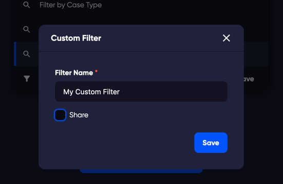

Tests can be filtered to change which tests are displayed, depending on the selected filter elements.

  

    To filter the test list, click on the '+ filter' button.
    
  
 

In the popup, select the item you would like to filter by.
You can filter the test list by Author, Case Type, Case Priority, Assignee, Automated, Label, Cycle, Name, or Status (available in Test Run).

  

## Save Filter

To save filter configurations in to a new custom filter:

- In Tests, Run, or Cycles views where you have a list of tests click the  button on the menu bar.
- In the filter selection window that opens, click a filter to add to your custom filter.
- Click the  button again to add a second filter. You can repeat this process as many times as you want, to add many options to your custom filter.
- When you are happy with your filtered view, click the  button again and choose the 'save' custom filter at the bottom of the filter selection window. 
- Choose a name for your custom filter.
- If you want to share this custom filter with other users on your site, click the  option. This will make the custom filter available for other users on your site.
- Click 'Save'.

## Delete a saved filter

- In any test list, click the  button.
- Click the trash icon to remove the filter.
  - **Please note**, if you have administrator rights, you can remove filters that have been added and shared by other users.
