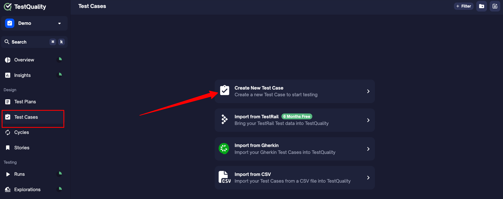
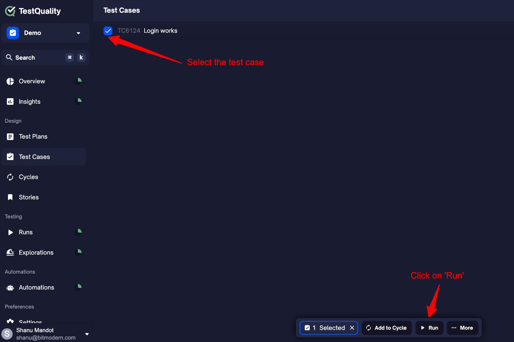
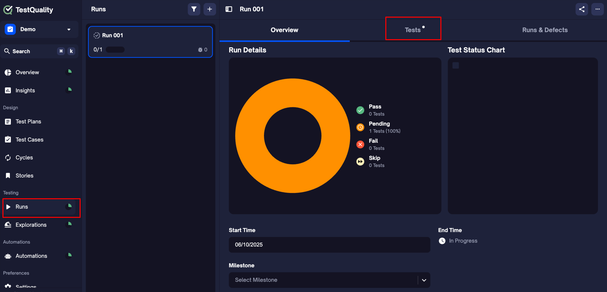
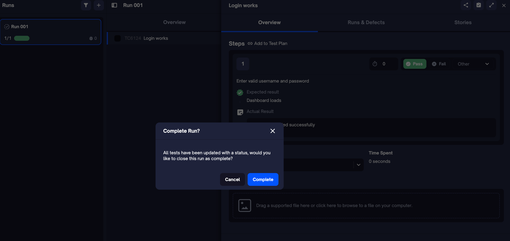
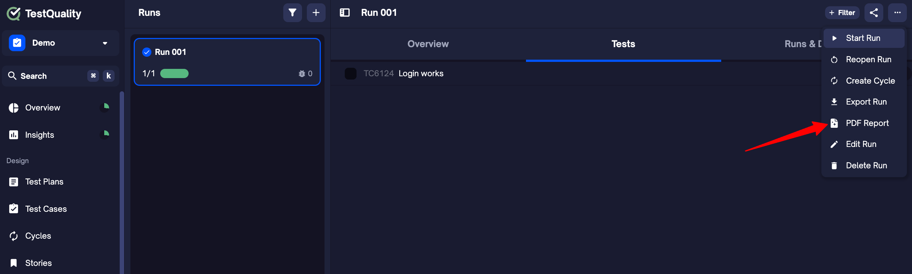
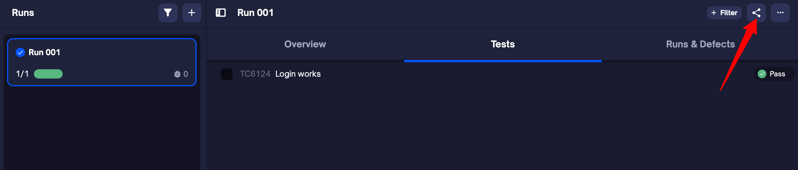

# Getting Started with TestQuality

Welcome to TestQuality — your **command center** for modern, collaborative, and insight-driven test management.

Whether you're managing manual testing, automation, or a blend of both, TestQuality brings clarity and control to your QA lifecycle. With native support for GitHub, Jira, Selenium, Jenkins, and more, it integrates seamlessly into your workflow — so you can focus on quality, not complexity.

---

## How TestQuality Is Structured

TestQuality is built around how testers actually work — whether you're starting small or scaling across teams.

At the heart of everything lies the **Test Case**. Whether you're executing ad hoc, as part of a regression cycle, or tracing back to requirements — it all starts with the test case.

---

### Core Flow: From Test Case to Insight

[Test Case] → [Run] → [Insights]

- **Test Case** : Define steps, expected outcomes, and test data

- **Run** : Execute the test and log results (manually or via CI)

- **Insights** : See pass/fail trends, flaky tests, and coverage over time

> 💡 Every test you execute — whether ad-hoc or through a cycle, story, or plan — automatically creates a Run.

### How Other Modules Enhance the Flow

These additional modules help you organize, structure, and scale your testing — but none are mandatory to get started.

| Module        | Purpose                                      | Required? | Example Use                          |
|---------------|----------------------------------------------|-----------|---------------------------------------|
| **Test Plan** | Set scope, objectives, and release milestones| ❌        | Plan tests for a major release        |
| **Cycle**     | Group reusable test sets                     | ❌        | Create a smoke suite or sprint suite |
| **Story**     | Link tests to requirements                   | ❌        | Map user stories to validation steps  |
| **Exploration** | Log exploratory or ad-hoc test sessions    | ❌        | Document session-based QA             |

### Everything Lives Inside a Project

All your work in TestQuality — from writing test cases to analyzing insights — is organized under a **Project**. Think of it as your QA workspace for a specific product, sprint, or team.

```
Project  
├── Test Cases (core)  
├── Runs (created whenever tests are executed)  
├── Cycles  
├── Test Plan  
├── Stories  
├── Explorations  
├── Integrations (Jira, GitHub, CI/CD)  
└── Insights  
```

> **Tip:** You can start simple with just Test Cases and Runs. As your testing evolves, layer in Cycles, Plans, and Stories to add structure and traceability.

### Each Module Supports a Phase in STLC

TestQuality is aligned with the Software Testing Life Cycle (STLC), making it easy to plug into your team’s workflow — whether you're doing manual QA, automation, or both.

| STLC Phase                  | TestQuality Module(s)                      |
|-----------------------------|--------------------------------------------|
| Requirements Analysis       | **Stories**                                |
| Test Planning               | **Test Plan**                              |
| Test Design                 | **Test Cases**                             |
| Test Environment Setup      | **Environments & Resources**, **Integrations** |
| Test Execution              | **Runs**, **Explorations**                 |
| Test Closure & Reporting    | **Insights**, **Reports** (from Run or Overview) |


### TL;DR for New Users

If you’re just getting started, here’s all you need:

1. **Create a Test Case**  
2. **Run it** → This creates a **Run**  
3. **View results** in **Insights**

When you're ready to level up:
- Use **Cycles** to group reusable test sets  
- Use **Test Plans** to align testing with releases or goals  
- Link test cases to **Stories** for traceability  
- Log session-based testing with **Explorations**

Start small. Scale when you're ready.

## Your First Walkthrough: Let's Run a Test

Now that you understand how TestQuality is structured, here’s how to put it into action — in just a few steps.

---

### Step 1: Create a Project

When you first log in to TestQuality, you’ll be prompted to create your first **Project**. This is your workspace where all test cases, runs, and reports will live. Assuming you've completed this step, let's dive right into your next operation.

### Step 2: Create a Test Case

Test cases are the building blocks of TestQuality. You’ll define what you’re testing and what outcome you expect.

[Watch video](https://youtu.be/HpgHJrP8gow) (1 min)

1. Go to the **Test Cases** tab  
2. Click **Create Test Case**  
3. Fill in:
   - **Title**: Login works
   - **Step**: Enter valid username and password
   - **Expected Result**: Dashboard loads  
4. Click **Create**



> You can also add extra details like priority, tags, or assignee — totally optional at this stage.

### Step 3: Create a Run

A **Run** is where you actually execute your test case and record the results. Every time you execute a test — manually or through CI — a Run is created.

1. Go to the **Test Cases** tab  
2. Select the test case you just created  
3. Click the **Run** button from the bottom toolbar  
4. In the dialog that opens:
   - You can leave the defaults as-is for now
   - Click **Create** to launch the run



> 💡 A Run captures the context and results of your test execution. You can create runs manually, from cycles, or even through automation later.

### Step 4: Execute the Run

Now that you've created a run, it's time to perform the actual test and record what happened.

1. Go to the **Runs** tab  
2. Open the run you just created and navigate to 'Tests' tab
3. Click into the test listed inside the run  
4. In the drawer that opens:
   - Enter the **Actual Result** (e.g., "Dashboard loaded successfully")
   - Choose the **Status** (Pass, Fail, Blocked, etc.)
   - Click **Save**



> 💡 You can also add attachments, comments, or defect links here — but they’re optional for now.

### Step 5: Complete the Run

Once you've executed all the test cases in a run, you’ll need to mark the run as complete. This locks in the results and enables report generation.

You have two options:

#### Option 1: From the Run view

1. After executing the last test case, a popup will appear  
2. Click **Complete Run**



#### Option 2: From the menu

1. In the **Runs** tab, locate your run  
2. Click the **three-dot menu (⋯)**  
3. Select **Finish Run**

> 💡 You can still reopen the run later if you need to make changes — unless your team enforces run locking via settings.

### Step 6: Generate a Report

Once a run is completed, you can export a professional PDF report — perfect for sharing results with your team or stakeholders.

1. Go to the **Runs** tab  
2. Open the **completed run**  
3. Click the **three-dot menu (⋯)** in the top right  
4. Select **PDF Report**



> The report includes all test results, execution timestamps, status breakdown, and any comments or attachments.

### Step 7: Share the Report

Once you've generated a run report, you can easily share it with your team or stakeholders for visibility and collaboration.

1. Open the **completed run**  
2. Click the **Share** icon at the top of the page  
3. Choose one of the following:
   - **Invite teammates** via email
   - **Copy shareable link** to send directly
4. (Optional) Adjust **permissions** to control who can view or edit the report



> All shared reports respect your project’s permission settings to ensure secure access.

### Step 8: Review Insights

The **Insights** tab gives you real-time visibility into test performance, quality trends, and flaky test patterns — all without setup.

1. Go to the **Insights** tab  
2. View:
   - Pass/fail trends
   - Test coverage across cycles, runs, and milestones
   - Flaky test indicators
3. Use filters to zoom in on specific tests, cycles, or tags

> 💡 You don’t need to configure anything — data flows in automatically as you run tests.

---

## What’s Next?

Once you’ve completed your first test run, here’s what you can explore next:

- [Import existing test cases](importing_data.md)
- [Connect automated results via CI](automations-imports/test-runners/integrating_with_Cucumber.md)
- [Invite your team](administration/users.md)
- [Integrate with GitHub or Jira](integrate_with_github.md) · (integrate_with_jira.md)

