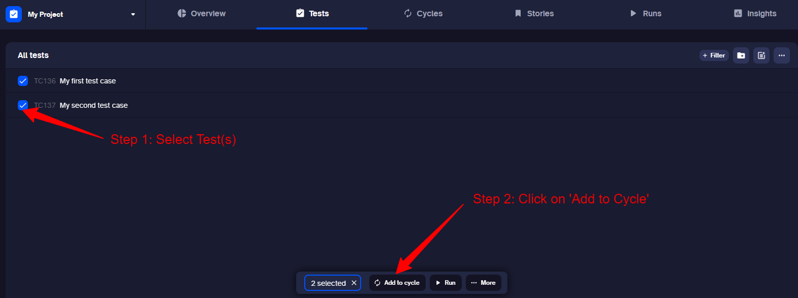
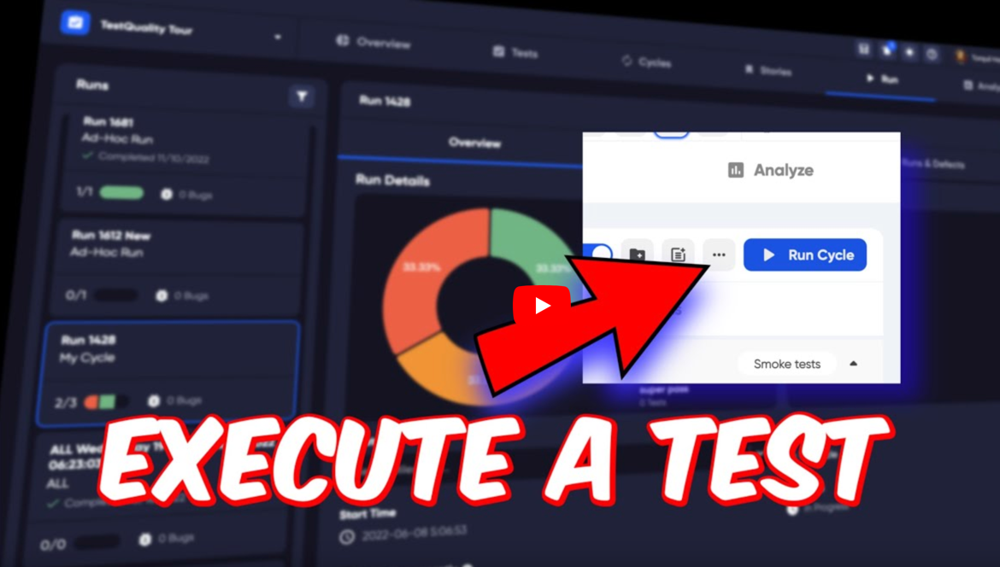
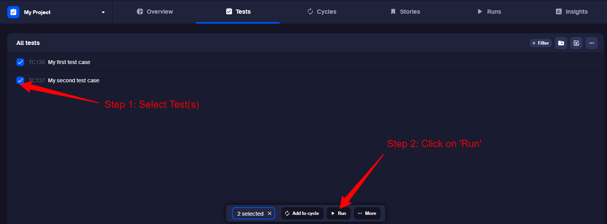

TestQuality is a test management application for building test plans or improving your current testing. 

Easily create tests, test sets or import your existing tests and results, to explore and discover quality and progress.

# Getting Started

When you open TestQuality, you are prompted to [create your first project](project.md). As you have probably done that already, we will move on to the first operation. 

To start seeing results you will want to create a test. You can import tests, but if you are new to TestQuality try creating a manual test to see how easy it is!

## Create a test

If you prefer, you can watch this short video on creating a test.

<a href="https://youtu.be/HpgHJrP8gow"> 

</a>

**Or follow the instructions below to create a Test:** 

Go to the Tests tab at the top of the page.

You can either click the 'Create Test Case' button in the middle of the page, if you do not have tests already, or you can choose to use the New Test button in the top right of the main window.

1. Choose a name for your test
2. Add a test step. This can be anything that you want your tester to do. Check a feature, test a function within your app, or just login to a web page. We will choose Login. 
3. Add an expected result. This is what you would expect to happen after your tester completes the previous step. For our example, we expect the tester to login to the app successfully.

## Create a Cycle

If you prefer, you can watch this short video on creating a Cycle.

<a href="https://youtu.be/pIBrfyhPVKw"> 

</a>

**Or follow the instructions below to create a Cycle:**

A cycle is a group of tests that you want to run together many times. For example, before you make a new version of your application, you may wish to run a set of tests. You would group these into a cycle. Then run the cycle to check your new version.

Your cycle can have a single test, but better would be a selection of tests that you would group together. If you want to make more tests, you can do so by going back to the Create a test step and make more tests.

1. To create a cycle of one or more tests, select the tests using the test selector (Select Tests.)
2. In the menu that appears at the bottom of the page, click 'Add to Cycle'.

3. In the box that appears, type the name you want for your new cycle.

4. Press Enter on your keyboard, or click the Create button under the name you have written.

## Run your test

If you prefer, you can watch this short video on executing a test.

<a href="https://youtu.be/d-dObYB2i8s"> 

</a>

**Or follow the instructions below to create a Cycle:**

Executing your test in 'Run Mode' gives you a history of what happened during the testing phase. Successes, failures, logged bugs or defects are important to track. They build a picture of your testing and help you find the most useful tests.

### Create a Test Run

1. Click on the selection box to the left of your test.
2. In the menu that appears at the bottom of the page, click Run. 
3. In the run dialogue, click create. At this stage you do not need a Cycle or a Milestone to create a run, you can ignore these options in the dialogue.

### Execute your test

After creating a test run, you will be taken to the Run tab. 

1. Click the Test Runs tab.

2. Click on your pending test to open the test drawer.

### Testing

In the test we created, we wanted the tester to login to the app. So we will open the test, and follow the steps. 

1. In the test drawer on the right, follow the steps. We only have one step, our example was to login to the app. 
2. Click the status of the test to pass or fail the test. Was the test a success for the tester? This is where they report a success or failure. 

Congratulations! You have successfully create a new test, you have run that test, and you have added that test to a cycle.

# Next steps
You could make more tests, look at your test results in the Analyze tab, or go to the settings and invite your team to join you!

Or look at how defects work in this short video. 

<a href="https://youtu.be/E2ECzeuCpP4"> 

</a>

## Integrations
Want to integrate with [GitHub](integrations.md) or [Jira](integrations.md)?

## Import your tests
You could [import](importing.md) your tests from another application, or set up a continuous integration and import your automated test results.

