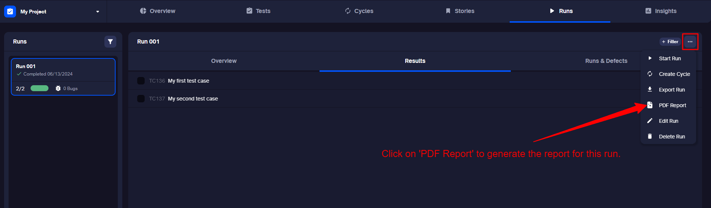

You’ve found the ultimate test management tool designed for QA and development teams. TestQuality supports advanced methodologies like shift-left, Behavior-Driven Development (BDD), and Test-Driven/ Acceptance Test-Driven Development (TDD/ATDD). It integrates effortlessly with popular tools like Jira, GitHub, Selenium, and Jenkins to streamline your processes and boost efficiency.

## Getting Started

Congratulations on taking the first step towards improving your testing processes with TestQuality! Here's a step-by-step overview of what you'll do:

1. Create a Project
2. Create a Test
3. Create a Cycle
4. Execute your Tests
5. Complete/Finish a Run
6. Generate a Run Report
7. Analyze Test Results

If you prefer, you can also check out this 3-minute quick overview video.

<a href="https://www.youtube.com/watch?v=x9TJeLVYB4Y"> 

</a>

### Creating your first Project

When you first open TestQuality, you'll be prompted to create your initial project. Assuming you've completed this step, let's dive right into your next operation.

### Creating a Test

To create a test, you can either watch the [Create a Test](https://youtu.be/HpgHJrP8gow) video or follow these steps:

1. Navigate to the 'Tests' tab at the top of the page.

2. Choose one of the following actions:
   - Click 'Create Test Case' in the middle of the page (for new tests). or
   - Use the "Create Test" button in the top-right corner.
   
   

3. Provide a name for your test, add a test step (e.g., "Login"), and specify the expected result. Then click on 'Create'.

   

4. If you wish, add or modify additional details like Case Priority, Case Type, Assigned To, etc., in the test drawer that opens up.

   

### Creating a Cycle

A cycle is a collection of tests and folders that you want to run repeatedly, such as before releasing a new version of your application.

There are two ways to create a cycle in TestQuality: from the Tests tab or the Cycles tab.

To facilitate the process, you can either watch the [Create a Cycle](https://youtu.be/pIBrfyhPVKw) video or follow these steps:

**From the Tests tab:**

1. A cycle can contain one or more tests. Use the test selector to choose the tests and folders you want to include in your cycle.

2. Click 'Add to Cycle' in the menu that appears at the bottom of the page.
  
   

3. In the dialog box that appears, enter a name for your new cycle.
   
   

4. Press Enter or click 'Create' to confirm.

**From the Cycles tab:**

1. Click on the 'Create Cycle' button.
2. Enter the name of the cycle.
3. Select tests to include in the cycle.
4. Click on 'Create'.

### Creating a Run from Test

Before you can execute your tests, it's essential to set up a test run. Follow these steps:

1. Start by selecting the tests you want to include from the 'Tests' tab.

2. Click 'Run' in the menu that appears at the bottom of the page.

   

3. In the run dialog, click 'Create.' At this stage, there's no need to specify a Cycle or a Milestone.

   

Now, let's move on to executing your tests:

1. Click the 'Tests' tab.

   

2. To access and execute your specific test, click on the pending test. This action will open the test drawer. You can also watch the [Execute a Test](https://youtu.be/d-dObYB2i8s) video for further guidance.

   

3. Here, you can enter the actual result and assign a status to complete the execution process.

   

### Complete or Finish a Run

After you have executed all the tests in the run as described in the previous steps, a popup will appear prompting you to 'Complete Run'.

1. Click on 'Complete' to finalize the run.

   

Alternatively, you can also finish a run by following these steps:

1. Navigate to the three dots as shown in the screenshot.
2. Click on 'Finish Run.'

   

### Generating a Run Report (in PDF)

You can generate a PDF report to share with external stakeholders for the executed or completed run by following these steps:

1. Click on the three dots as shown in the screenshot.
2. Select 'PDF Report' from the menu.

   

### Analyzing the Test Results

In the 'Insights' tab, you can access real-time reports on the growth, quality, reliability, and coverage of the tests you have executed.

## Next steps
- Expand your testing suite by creating more tests or [importing](importing_data.md) them from another application, or set up a continuous integration and import your [automated](automations-imports/test-runners/integrating_with_Cucumber.md) test results.
- Consider [inviting](administration/users.md) your team to collaborate within TestQuality.
- Integrate with [GitHub](github_setup.md) or [Jira](jira_setup.md).

