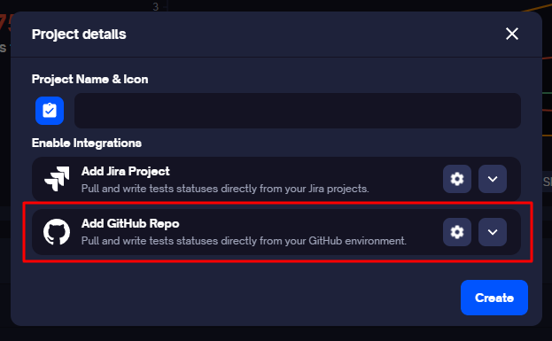
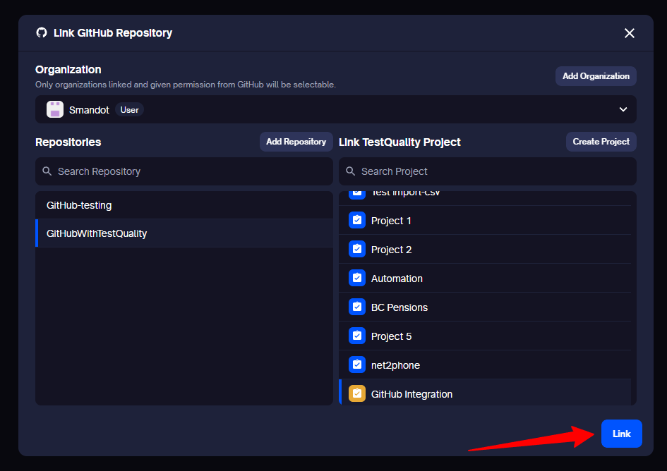
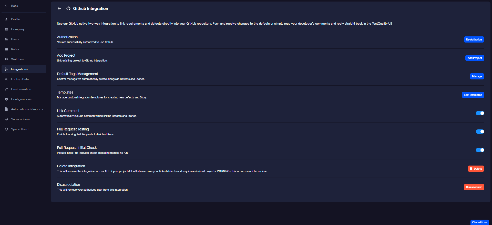

[GitHub](https://github.com/) serves as a central hub for developers, offering version control, collaboration tools, and project management features. Integrating TestQuality with GitHub brings together the power of test case creation, defect management, and test coverage analysis within your GitHub environment.

## Leveraging Two-Way Integration

The core advantage of TestQuality's integration with GitHub lies in its live two-way synchronization. This means that changes made in either platform, whether it's updating defect priorities or adding new stories, are reflected instantly across both TestQuality and GitHub. This real-time synchronization ensures that your teams and tools are always in sync, leading to enhanced productivity and collaboration.

## Setting up your GitHub Integration

To set up GitHub integration, follow these steps:

**Step 1: Begin Integration** 
- Navigate to the 'Create New Project' -> 'Project Details' screen -> 'Add GitHub Repo' or via the Settings menu -> Integrations.

**Via Create New Project**

**Via Settings**

- Locate the GitHub section.
- Click on 'Link on GitHub.'

 **Note:** Make sure you have admin privileges for the GitHub repository you're connecting to.

**Step 2: Authorize Access** 
- During installation, you may be prompted to authorize TestQuality to access your GitHub repositories and organizations. 
- Follow the on-screen instructions to grant the necessary permissions. 

- You will be navigated back to TestQuality after authorization.

**Step 3: Add Project** 
- Click on 'Add Project' to link an existing project to the GitHub integration. 
- Select the organization, repository, and project, and then click on 'Link.' You can also add a new project here.

You have the flexibility to link the same project to multiple GitHub repositories and vice versa.

After completing these steps, GitHub will be integrated with TestQuality, allowing for seamless interaction between the two platforms. Once integrated, you can now add stories and log defects from TestQuality.

**Configuring your Integration:**

You can configure your integration at both the global and project levels by accessing the gear icon.

**At Global Level**

- Manage default tags
- Edit integration templates for creating new stories and bugs
- Enable Link Comment
- Enable Pull Request Testing
- Delete the integration
- Disassociate the integration

**At Project Level**

- Enable Pull Request Testing
- Delete the integration

**Note:** Proceed with caution when deleting an integration. It will remove all defect and story integrations from TestQuality but not from GitHub.

## GitHub PR(Pull Request) Integration

TestQuality's integration with [GitHub PR](https://docs.github.com/en/pull-requests/collaborating-with-pull-requests/proposing-changes-to-your-work-with-pull-requests/about-pull-requests) ensures that every PR is thoroughly tested before being merged into the main branch. This integration helps streamline the development workflow by automating the testing process and ensuring code quality.

### Understanding GitHub PR Integration

#### What is GitHub PR Integration?

GitHub PR integration in TestQuality allows you to connect your PRs with TestQuality's testing framework. This ensures that all changes made in a PR are automatically tested before being merged, maintaining the integrity of the main branch.

#### Why Use GitHub PR Integration?

- **Automated Testing:** Automatically run tests on every PR to catch issues early.
- **Quality Assurance:** Ensure that only thoroughly tested code is merged.
- **Efficient Workflow:** Save time by automating the testing process, allowing developers to focus on writing code.

### Standard PR Workflow
1. **PR Created**: A Pull Request is created.
2. **Review**: The PR is reviewed.
3. **Optional Changes Requested**: Reviewers may request changes.
4. **Changes Made**: Changes are made by the developer.
5. **Review**: The PR is reviewed again.
6. **Successful Review**: If the review is successful, the PR is merged (feature added to the main branch).

### CI Pipeline Workflow
1. **PR Created**: A Pull Request is created.
2. **CI Pipeline Triggered**: The CI pipeline is automatically triggered.
3. **Automated Tests Executed**: Automation tests are executed as part of the CI pipeline.
4. **PR Check Results Added**: Test results are added as a [PR Check](https://docs.github.com/en/pull-requests/collaborating-with-pull-requests/collaborating-on-repositories-with-code-quality-features/about-status-checks).
5. **PR Check Indicates Success or Failure**:
    - If the PR Check fails, the merge is not allowed.
    - Developer fixes tests and commits the changes.
    - This triggers the CI pipeline again.
6. **All Checks Pass**: Once the tests are successful and all checks pass, the PR is reviewed.
7. **Merge**: The PR can now be merged.

### Simulating CI Pipeline for Manual Testing

#### Why simulate CI Pipeline for manual testing?
- **Acceptance Tests**: To ensure that the changes meet the acceptance criteria.
- **Tests Hard to Automate**: For tests that are very difficult to automate.
- **Developer Run Tests**: To allow developers to run specific tests before merging.
- **Gate PR with Specific Tests**: To enforce that certain tests or actions are performed and tracked before allowing a PR to be merged.

### Configuration Options
#### Enabling/disabling PR Testing

You can enable/disable PR testing at both the global and project levels by accessing the gear icon.
Refer to [Configuration](#setting-up-your-github-integration).

#### Associate the Run to a PR

Once the PR testing setting is enabled, you can link specific tests runs to the PR. When a PR is associated with a run, a check is created in the GitHub PR with that run. This ensures that test results are visible directly within the PR in GitHub.
 

#### Associate the Cycle to a Repo

At the Project level, you can link the Cycle to a Repo so runs get created automatically when new PRs are created.

### Executing Tests from GitHub PR
#### Re-run and Finish Run from a GitHub PR
Once a Run is assoiated with a PR in TestQuality, it will be displayed under 'Checks' in GitHub.
You can execute the run in TestQuality and the results will be synced with the associated PR check. 
Additionally, you can re-run or finish a run directly from the PR check. 

