# GitHub

Integrate GitHub with TestQuality to sync defects and requirements between both platforms. Changes made in either platform are reflected in real time.

## Prerequisites

- Active TestQuality and GitHub accounts
- Admin rights on the GitHub repository you are connecting

## Setup

You can set up the GitHub integration in two ways:

**Via a new project:**
1. Go to **Create New Project → Project Details → Add GitHub Repo**

   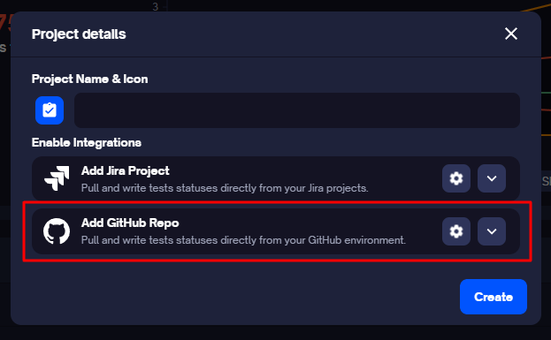

**Via Settings:**
1. Go to **Settings → Integrations**
2. In the GitHub section, click **Link Repo**

   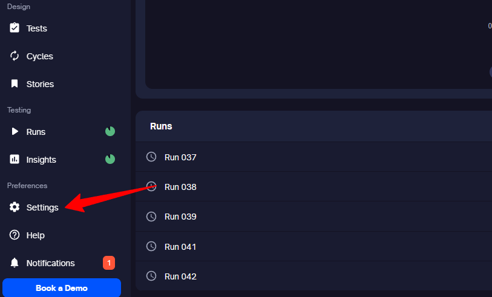

3. Click **Link on GitHub**

   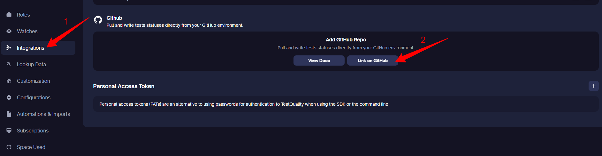

4. Authorize TestQuality to access your GitHub repositories and organizations. Follow the on-screen prompts.

   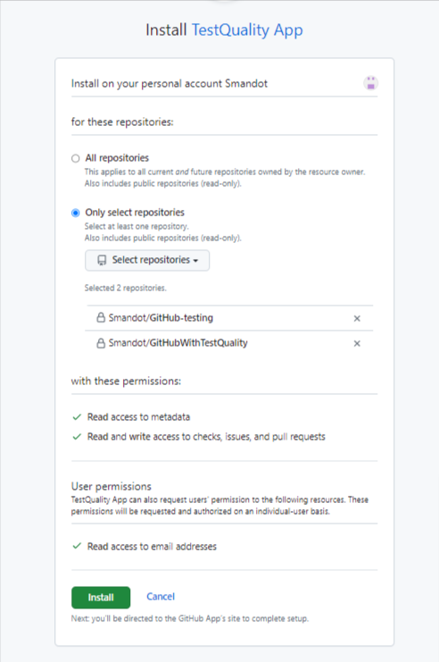

5. After authorization, you will be returned to TestQuality
6. Click **Add Project**, select your organization, repository, and TestQuality project, then click **Link**

   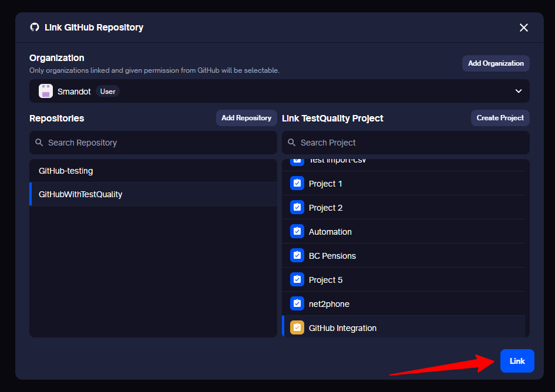

> You can link the same project to multiple GitHub repositories and vice versa.

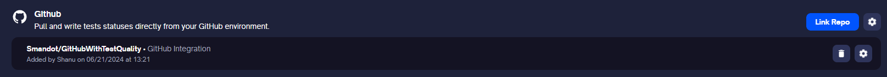

## Configuration

Access configuration settings by clicking the gear icon next to a linked repository in **Settings → Integrations**.

**Re-authorize** — Resets and refreshes the connection with your GitHub account. Use this if the authorized user changes or the connection breaks.

**Add Project** — Links an existing TestQuality project to the GitHub integration.

**Include TestQuality labels** — When enabled, TestQuality labels are automatically added to issues created in GitHub.

**Default labels management** — Click **Manage** to customize the labels automatically created alongside defects and stories.

**Templates** — Click **Edit Templates** to customize the format of defects and stories created in GitHub. Supports static content and dynamic variables using [Handlebars/Mustache syntax](https://handlebarsjs.com/guide/). Click **Revert to defaults** to reset.

**Link comment** — When enabled, a comment is automatically added when linking defects and stories.

**Pull request testing** — When enabled, test runs can be linked to GitHub pull requests. Results appear under Checks in the PR.

**Pull request initial check** — When enabled, an initial PR check is added indicating there is no run yet.

**Delete integration** — Removes the integration across all your projects, including all linked defects and requirements.

**WARNING:** This action cannot be undone.

**Disassociation** — Removes your user as the authorized admin for this integration. Another admin will need to re-authorize to restore the connection.

## Pull request testing

### Why link manual tests to a PR?

Automated checks catch predictable issues but miss things that require human judgment — usability problems, edge cases, complex workflows, and UI/UX issues. Linking manual test runs to a PR adds a quality gate before merge, ensuring:

- **Edge cases are covered** — exploratory testing surfaces issues automated tests miss
- **Complex workflows are verified** — multi-system scenarios that are hard to automate can be checked manually
- **Acceptance criteria are met** — new features are validated against real requirements before they ship
- **Immediate feedback** — developers get test results before the PR is merged, not after

TestQuality surfaces these results directly in the GitHub PR checks, keeping everything in one place.

### Link a run to a PR

When creating a run, select the PR you want to associate it with. You can link multiple runs to the same PR but each must be linked individually.

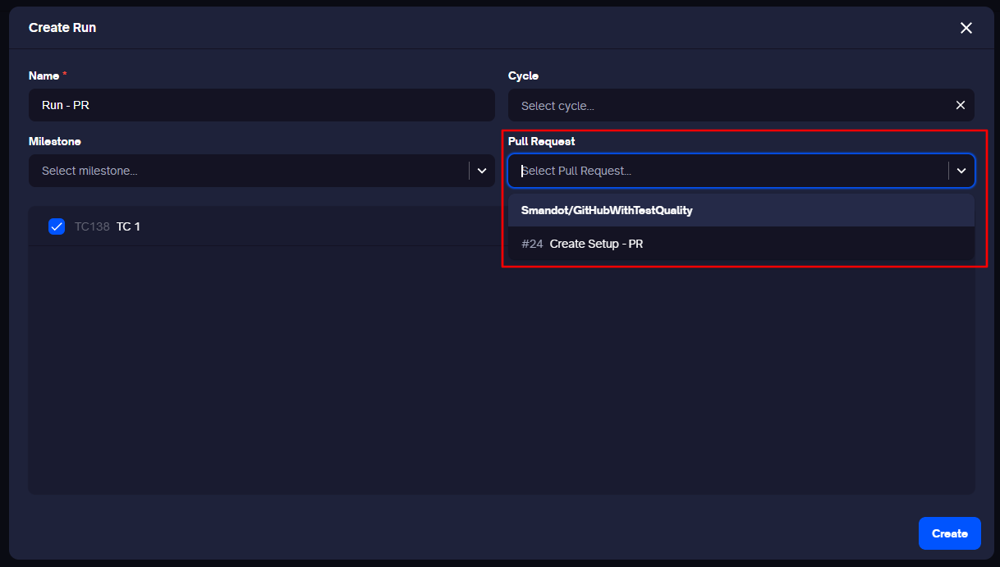
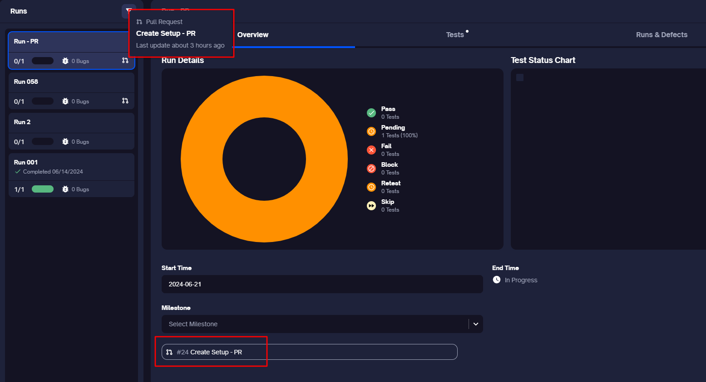

Once linked, the run appears under **Checks** in the GitHub PR.

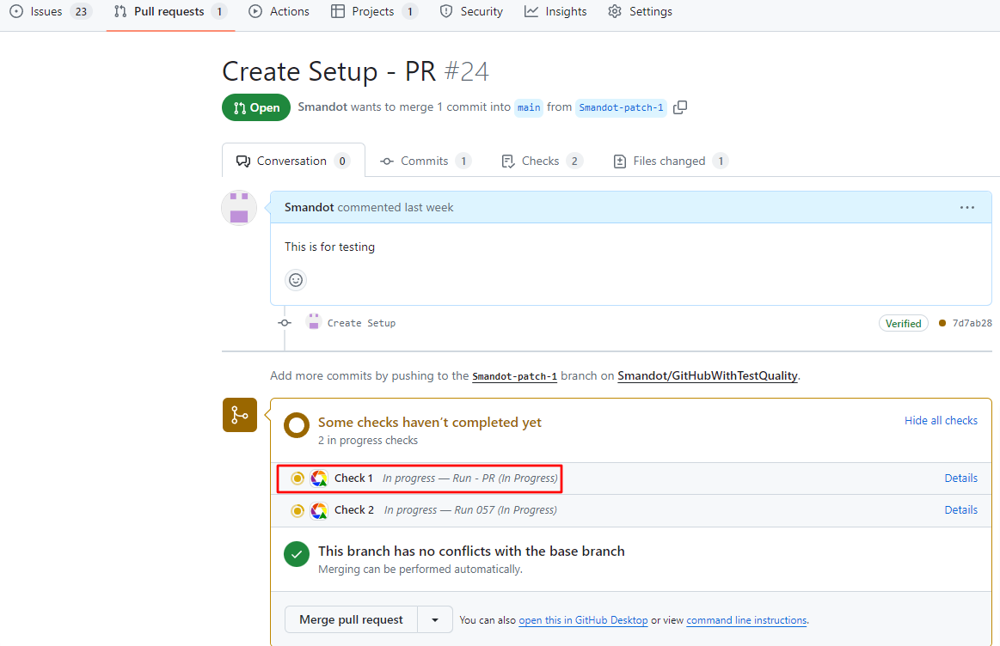

### Execute tests

Run your tests in TestQuality — results sync automatically with the PR check.

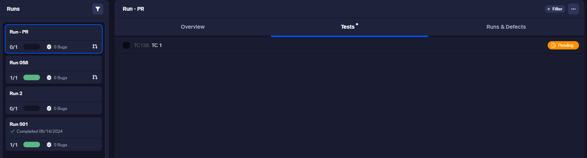

You can also re-run or finish a run directly from the PR check in GitHub.

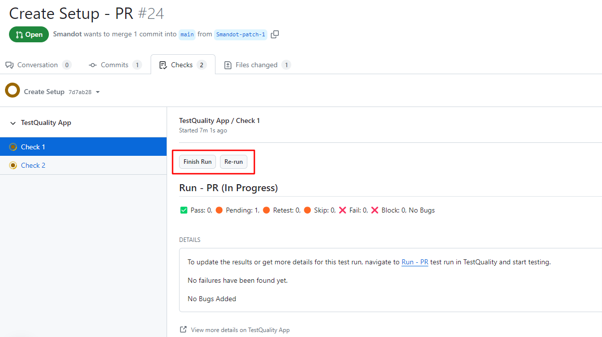
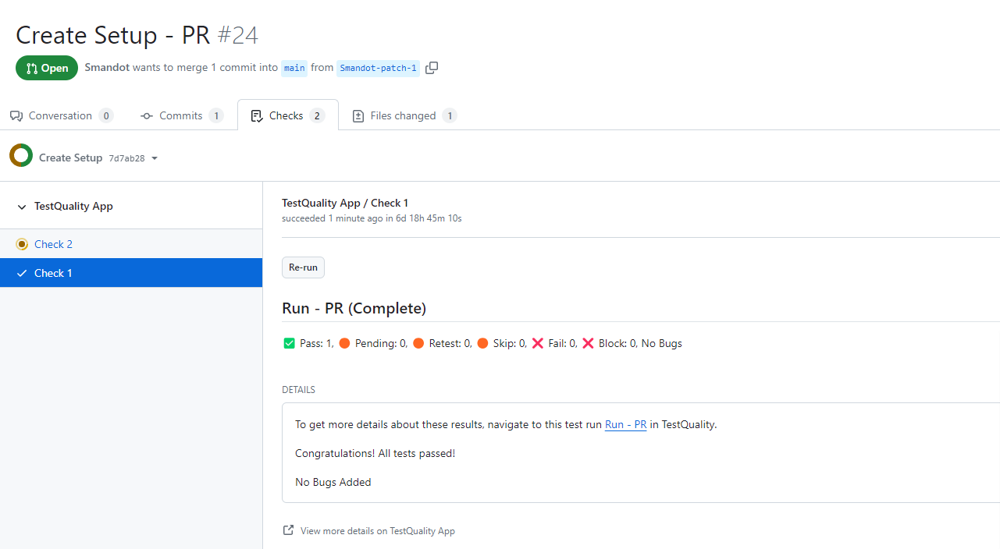
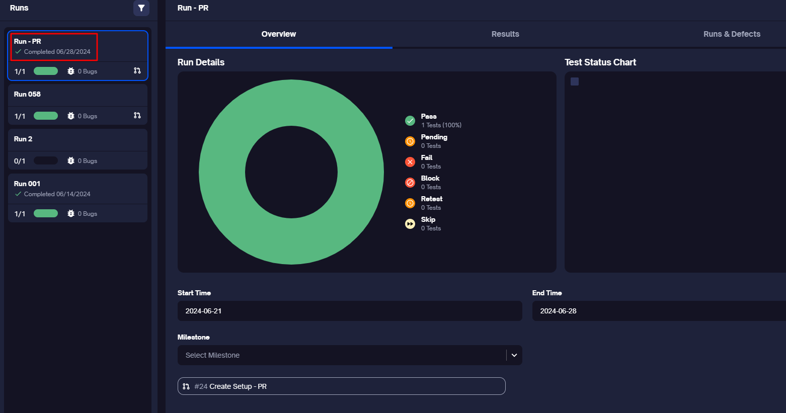

### Link a cycle to a repo

At the project level, you can link a cycle to a repository so runs are created automatically when new PRs are opened.

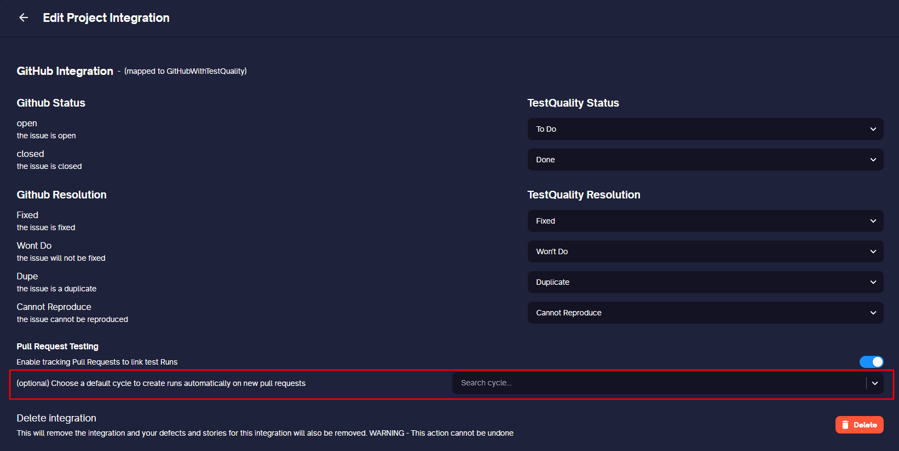

### Auto-create a run from a PR

TestQuality can automatically create a run when a PR is linked to a story.

**Requirements:**
- Pull request testing toggle must be enabled
- The story must exist in TestQuality and be linked to the GitHub issue before the PR is opened

**Steps:**

1. In GitHub, create an issue (e.g. `#45`)
2. In TestQuality, go to **Stories**, create a new story linked to issue `#45`, and attach test cases

   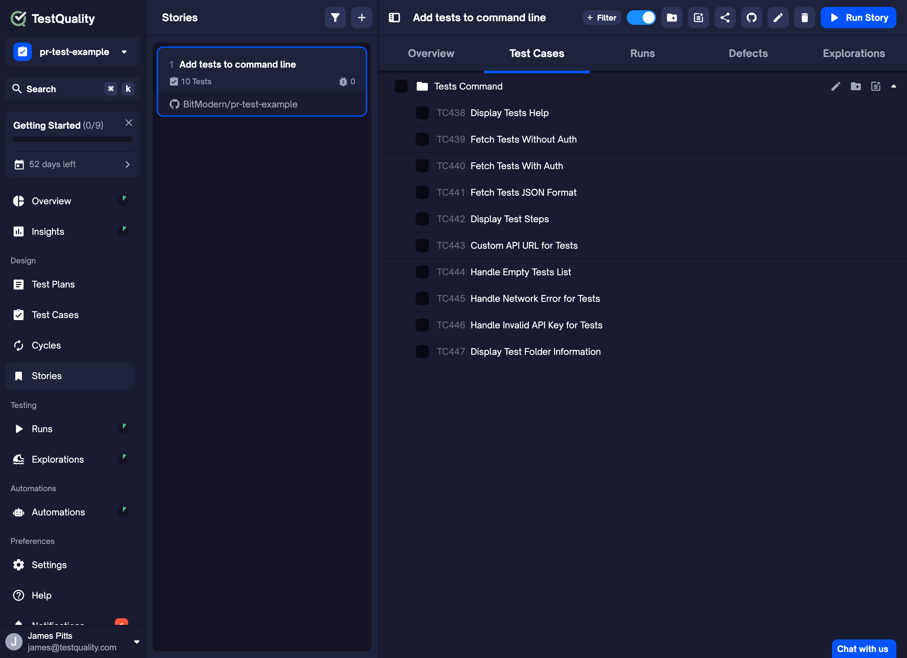

3. In GitHub, open a PR and reference the issue in the description using any supported keyword:
   - `Closes #45`
   - `Resolves #45`
   - `Fixes #45`

   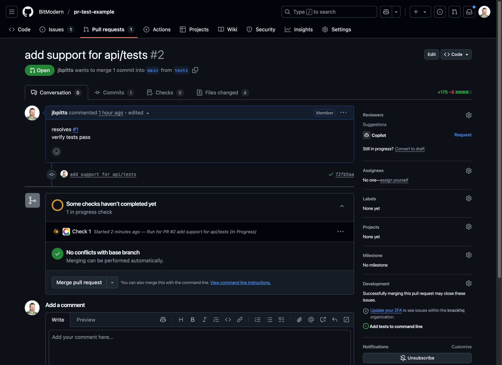

4. Go to the **Runs** tab in TestQuality — a run is automatically created and linked to the story

   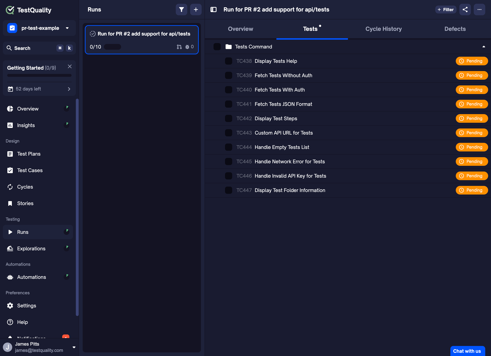

If you push new commits to the PR, TestQuality automatically re-triggers the run. Status updates from **Pending** to **Completed** once results are available.

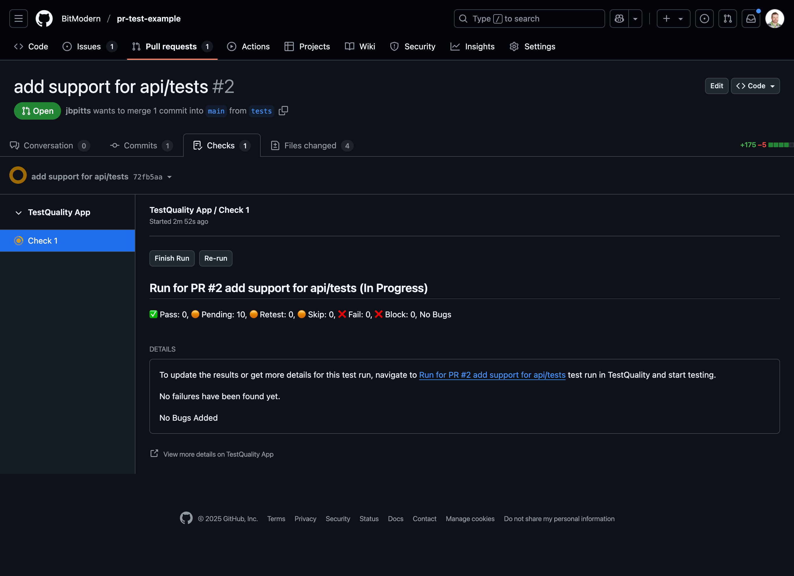
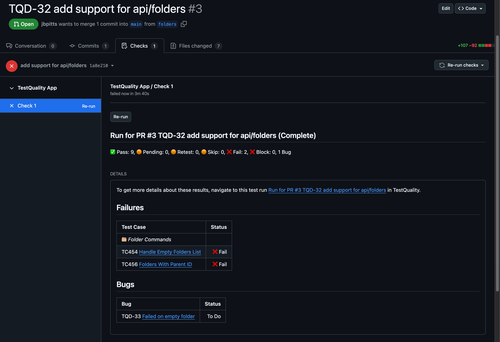

> The story must exist in TestQuality before the PR is opened for auto-triggering to work.