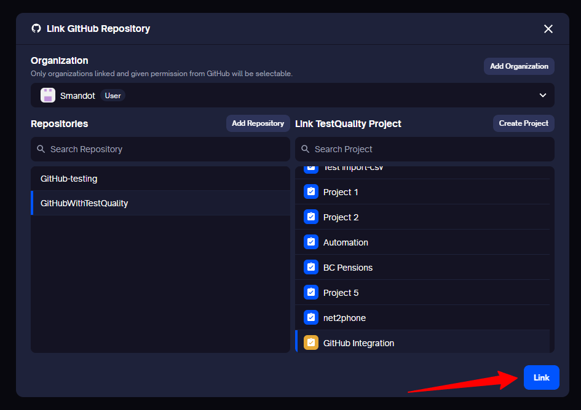
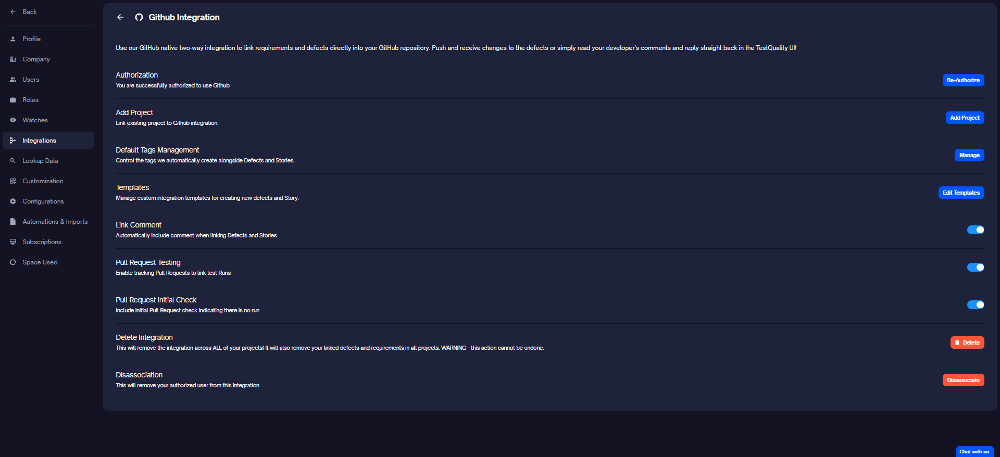
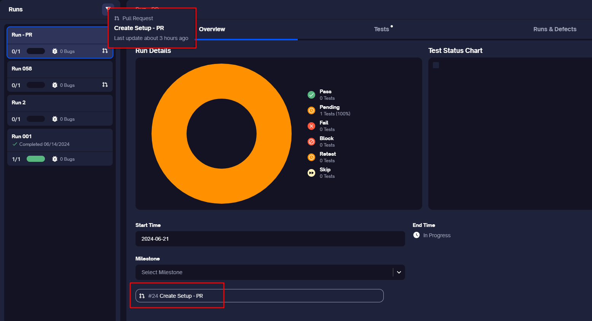
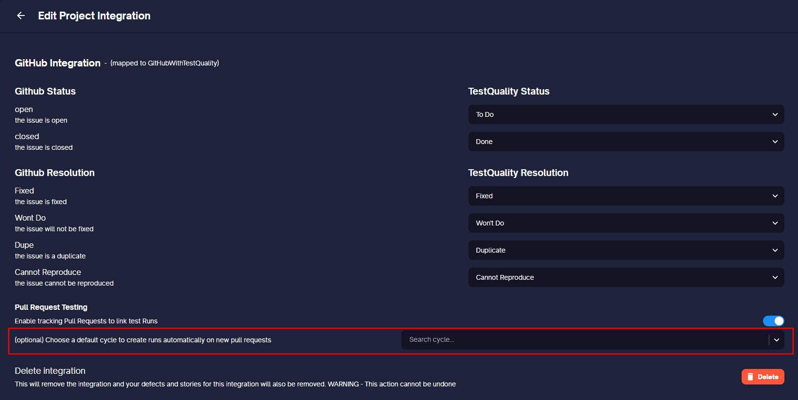
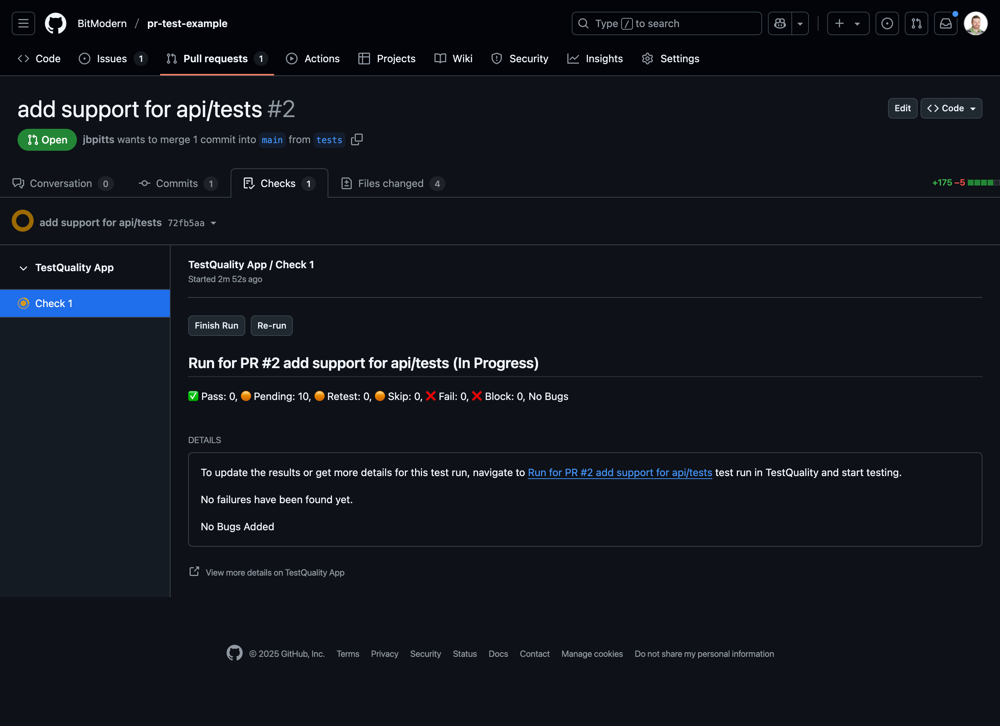

[GitHub](https://github.com/) serves as a central hub for developers, offering version control, collaboration tools, and project management features. Integrating TestQuality with GitHub brings together the power of test case creation, defect management, and test coverage analysis within your GitHub environment.
Additionally, TestQuality's integration with [GitHub Pull Requests (PR)](#github-prpull-request-integration) ensures that every PR is thoroughly tested before being merged into the main branch, maintaining the integrity of your codebase.

## Leveraging Two-Way Integration

The core advantage of TestQuality's integration with GitHub lies in its live two-way synchronization. This means that changes made in either platform, whether it's updating [defect priorities](https://doc.testquality.com/defect_management) or [adding new stories](https://doc.testquality.com/stories), are reflected instantly across both TestQuality and GitHub. This real-time synchronization ensures that your teams and tools are always in sync, leading to enhanced productivity and collaboration.

## Setting up your GitHub Integration

To set up GitHub integration, follow these steps:

**Step 1: Begin Integration** 
- Navigate to the 'Create New Project' -> 'Project Details' screen -> 'Add GitHub Repo' or via the Settings menu -> Integrations.

**Via Create New Project**

**Via Settings**

- Locate the GitHub section.
- Click on 'Link on GitHub.'

 **Note:** Make sure you have admin privileges for the GitHub repository you're connecting to.

**Step 2: Authorize Access** 
- During installation, you may be prompted to authorize TestQuality to access your GitHub repositories and organizations. 
- Follow the on-screen instructions to grant the necessary permissions. 

- You will be navigated back to TestQuality after authorization.

**Step 3: Add Project** 
- Click on 'Add Project' to link an existing project to the GitHub integration. 
- Select the organization, repository, and project, and then click on 'Link.' You can also add a new project here.

You have the flexibility to link the same project to multiple GitHub repositories and vice versa.

After completing these steps, GitHub will be integrated with TestQuality, allowing for seamless interaction between the two platforms. Once integrated, you can now add stories and log defects from TestQuality.

### Configuring your Integration:

You can configure your integration at both the global and project levels by accessing the gear icon.

**At Global Level**

- Manage default tags
- Edit integration templates for creating new stories and bugs
- Enable Link Comment
- Enable Pull Request Testing
- Delete the integration
- Disassociate the integration

**At Project Level**

- Enable Pull Request Testing
- Delete the integration

**Note:** Proceed with caution when deleting an integration. It will remove all defect and story integrations from TestQuality but not from GitHub.

## GitHub PR(Pull Request) Integration

TestQuality's integration with [GitHub PR](https://docs.github.com/en/pull-requests/collaborating-with-pull-requests/proposing-changes-to-your-work-with-pull-requests/about-pull-requests) ensures that every PR is thoroughly tested before being merged into the main branch. This integration helps streamline the development workflow by ensuring that all changes made in a PR are tested before being merged, maintaining the integrity of the main branch.

### Why Add Manual Test Runs to a Pull Request?

A GitHub [pull request check](https://docs.github.com/en/pull-requests/collaborating-with-pull-requests/collaborating-on-repositories-with-code-quality-features/about-status-checks) is an automated process that runs tests, validations, or other scripts to ensure that the changes proposed in a pull request meet specific criteria before the pull request is merged into the main codebase. These checks help maintain code quality and prevent errors from being introduced. TestQuality adds to this by providing manual testing as a PR check to ensure that only high-quality, tested, and validated code is merged into the main codebase.

Running manual tests on pull requests before they get merged is essential for many reasons. Here are just a few:

1. **Catch Edge Cases**
    - Automated tests are excellent for catching predictable issues and ensuring code meets specific criteria. However, they may not cover all possible edge cases or unexpected behaviors. Manual testing allows testers to explore and identify these edge cases.

2. **Human Insight**
    - Manual testers can use their intuition and experience to identify potential usability issues, user experience problems, and other subtle issues that automated tests might miss. This human insight is invaluable in assessing how real users might interact with the software.

3. **Complex Scenarios**
    - Some complex scenarios, especially those involving multiple systems or integrations, might be challenging to replicate in automated tests. Manual testing can help verify these complex workflows and ensure that all parts of the system work together as expected.

4. **UI/UX Validation**
    - User interface and user experience aspects often require a human touch to evaluate correctly. Manual testing allows testers to assess the look and feel, ease of use, and overall user experience, which is crucial for end-user satisfaction.

5. **Acceptance Criteria**
    - When new features are introduced or significant changes are made, it’s essential to manually test these to ensure they meet the intended functionality and business requirements. This can help catch issues early and provide feedback for improvements.

6. **Integration Testing**
    - Manual testing is beneficial for checking integrations with third-party services, ensuring that APIs and other external dependencies work correctly with the changes introduced in the pull request.

7. **Exploratory Testing**
    - Manual testing allows for exploratory testing, where testers can investigate the application without predefined test cases. This can lead to the discovery of unexpected bugs and issues that would otherwise go unnoticed.

8. **Immediate Feedback**
    - Manual testing provides immediate feedback on the pull request, allowing developers to make necessary adjustments before the code is merged. This can prevent issues from propagating to the main codebase and affecting other parts of the application.

9. **Quality Assurance**
    - Ultimately, manual testing ensures a higher level of quality assurance. It complements automated testing by providing an additional layer of scrutiny, reducing the likelihood of bugs reaching production.

By running manual tests on pull requests, development teams can ensure that code changes are thoroughly vetted, leading to more stable, reliable, and user-friendly software.

### Associate the Run to a PR

Once the PR testing setting is enabled, you can link specific test runs to the PR when creating a run. Note that you can link only one run at a time to a PR in this workflow. While multiple runs can be linked to the same PR, each must be done individually. 

Once a Run is assoiated with a PR in TestQuality, it will be displayed under 'Checks' in GitHub. This ensures that test results are visible directly within the PR in GitHub.
 

### Configuration Options
#### Enabling/disabling PR Testing

By default, PR testing is enabled.

You can enable or disable PR testing at both the global and project levels by accessing the gear icon.
Refer to [Configuration](#configuring-your-integration).

#### Associate the Cycle to a Repo

At the Project level, you can link the Cycle to a Repo so runs get created automatically when new PRs are created.

### Executing Tests in a Run

You can execute the run in TestQuality, and the results will be synced with the associated PR check. 

Additionally, you can re-run or finish a run directly from the PR check. 

When you click on 'Finish Run',

the results will be synched with TestQuality.

### Auto-Create Test Run from GitHub Pull Request

TestQuality can automatically create a Test Run when a GitHub Pull Request (PR) is associated with a Story.

To enable this:

- Ensure the **"Pull Request Testing"** toggle is enabled in the repository settings under **Integrations → GitHub**.
- The Story in TestQuality must already be created and linked to the corresponding GitHub Issue before the PR is opened.

---

#### How it Works — Step by Step

1. In GitHub, create an **Issue** (e.g., `#45`)

2. In TestQuality, go to **Stories**  
   - Create a new Story by selecting the GitHub issue `#45` from the synced list  
   - Attach one or more Test Cases to complete the Story

   

3. Back in GitHub, open a **Pull Request** and reference the issue using any supported keyword in the description, such as:

- Closes #45
- Resolves #45
- Fixes #45

4. After opening the PR, go to the **Runs** tab in TestQuality.  
A new Run should be automatically created and linked to the Story.

---

#### Re-runs & Status

- If you push new commits to the PR, TestQuality will automatically re-trigger the test run.
- The Run status will update from **Pending** to **Completed** once the results are available.

  

---

### ⚠️ Notes & Tips

- **Timing matters:** The Story must exist in TestQuality *before* the PR is opened for the auto-trigger to work.
- **Valid PR keywords:** GitHub supports multiple linking keywords (`closes`, `resolves`, `fixes`) — all are accepted by TQ.

