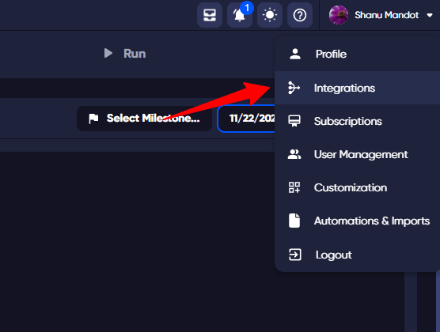
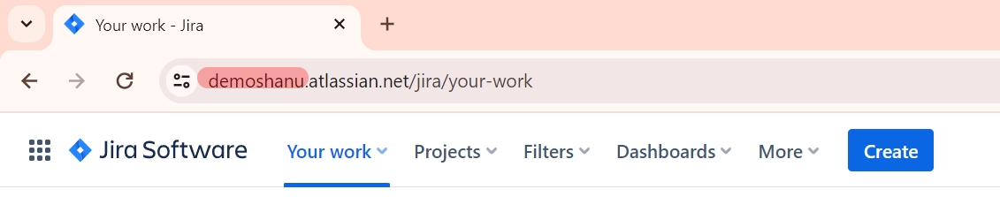
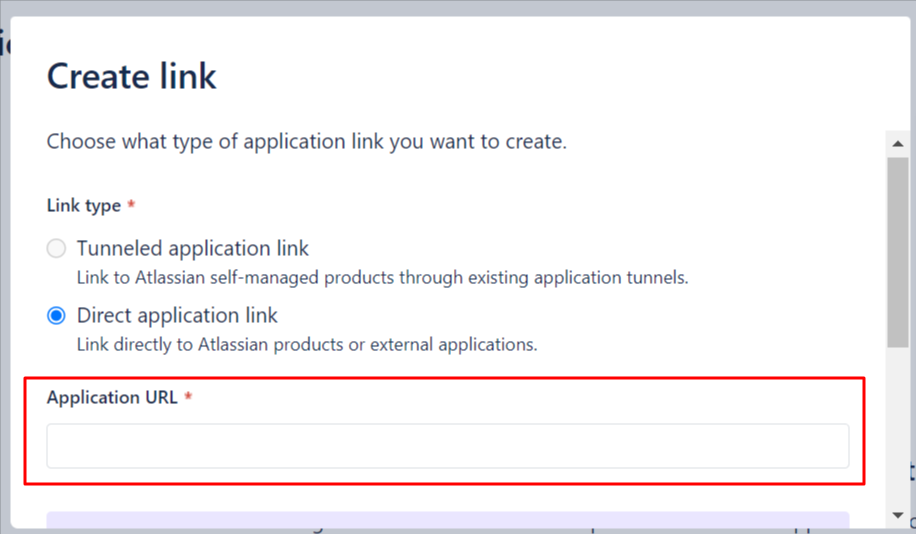
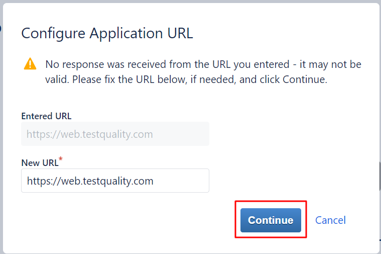
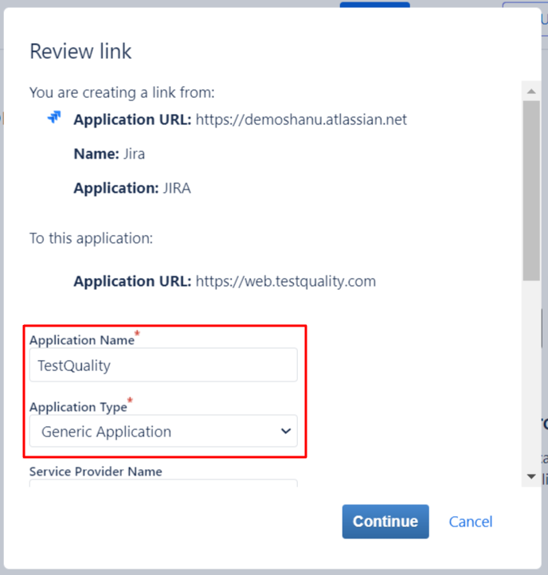
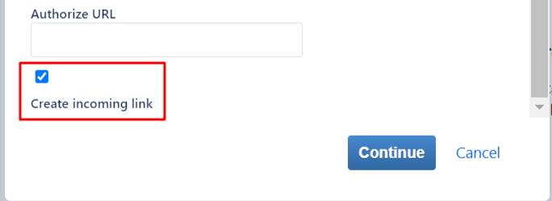
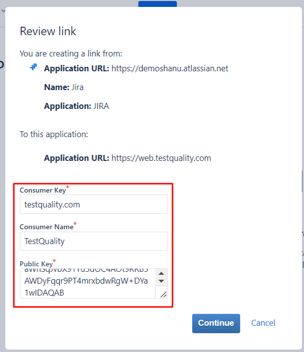
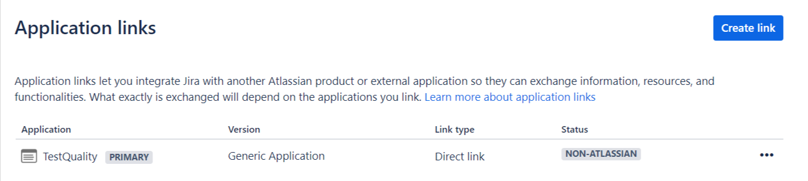
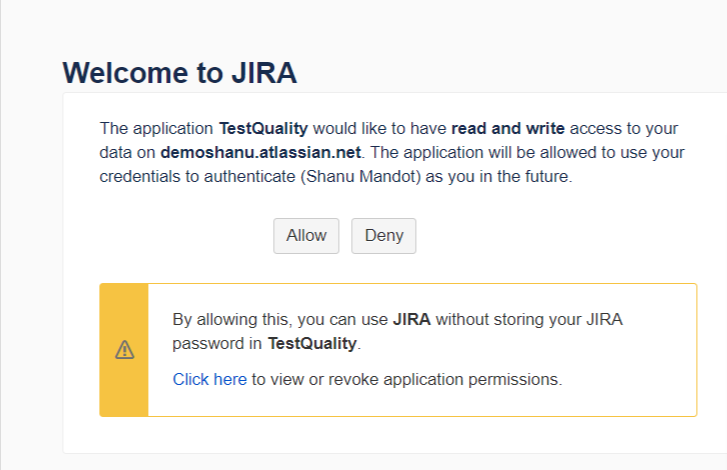

# Jira

Integrate Jira with TestQuality to sync defects and requirements between both platforms. Changes made in either platform are reflected in real time.

## Prerequisites

- Active TestQuality and Jira accounts
- Admin rights in both TestQuality and Jira

## Setup

1. In TestQuality, go to **Settings → Integrations**
2. In the Jira section, click **Link Project**

   

3. Select your Jira instance type (Cloud or Server)
4. Enter your Jira subdomain — found in your Jira URL, e.g. `yoursubdomain.atlassian.net`

   

5. Click **Update**, then click **Jira Application Links**

   

6. In Jira, paste the TestQuality URL (`https://web.testquality.com`) into the Application URL field and click **Continue**

   

7. If a warning appears, click **Continue**

   

8. Fill in the application link form:
   - **Application name**: TestQuality
   - **Application type**: Generic Application
   - Check **Create incoming link**
   - Click **Continue**

   
   

9. Copy the **Consumer Key**, **Consumer Name**, and **Public Key** from TestQuality and paste them into the Jira Review Link popup. Click **Continue**

   
   

10. Back in TestQuality, click **Integrate**
11. In the **Authorization** section, click **Authorize**
12. When prompted, click **Allow** to grant TestQuality access to your Jira account

    

Your Jira integration is now active.

## Configuration

Access configuration settings by clicking the gear icon next to a linked project in **Settings → Integrations**.

**Re-authorize** — Click **Re-authorize** to reset and refresh the connection with your Jira account. Use this if the authorized user changes or the connection breaks.

**Add Project** — Click **Add Project** to link an existing TestQuality project to the Jira integration.

**Include TestQuality labels** — When enabled, TestQuality labels are automatically added to issues created in Jira.

**Templates** — Click **Edit Templates** to customize the format of defects and stories created in Jira. You can use static content or dynamic variables using [Handlebars/Mustache syntax](https://handlebarsjs.com/guide/). Click **Revert to defaults** to reset.

**Link comment** — When enabled, a comment is automatically added when linking defects and stories.

**Delete integration** — Removes the integration across all your projects, including all linked defects and requirements.

**WARNING:** This action cannot be undone.

**Disassociation** — Removes your user as the authorized admin for this integration. Another admin will need to re-authorize to restore the connection.

## Troubleshooting

- **Connectivity issues** — Ensure both TestQuality and Jira are accessible and your internet connection is stable
- **Permission errors** — Verify you have admin rights in both TestQuality and Jira
- **URL mistakes** — Double-check copied URLs and subdomains for typos or extra spaces
- **Application link problems** — If Jira rejects the TestQuality URL, verify there are no formatting errors in the URL field