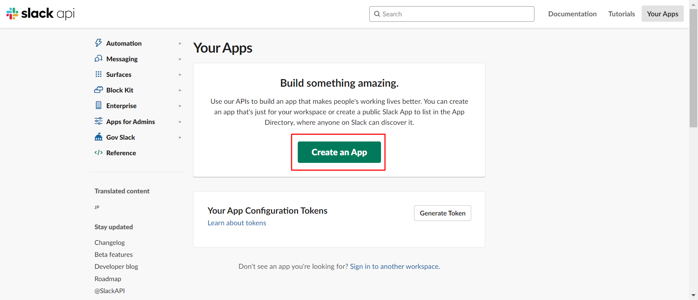
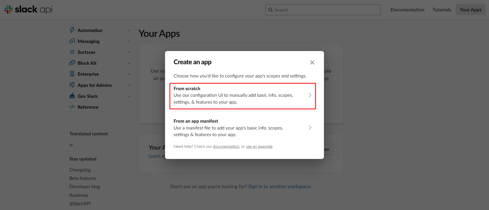
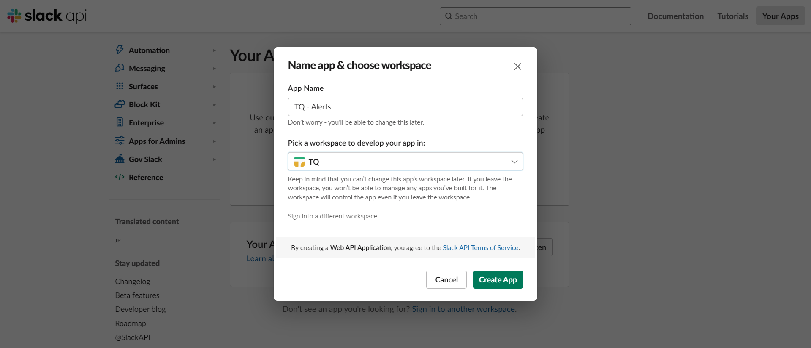
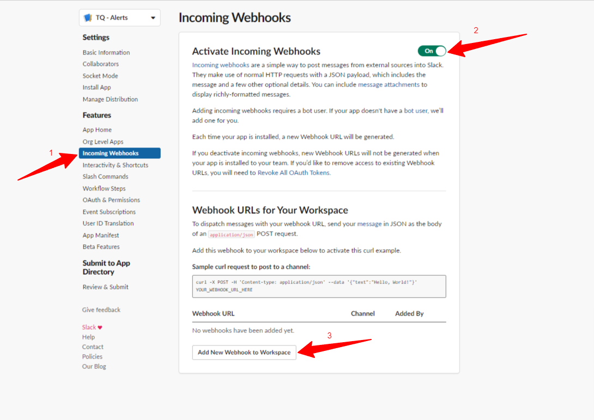
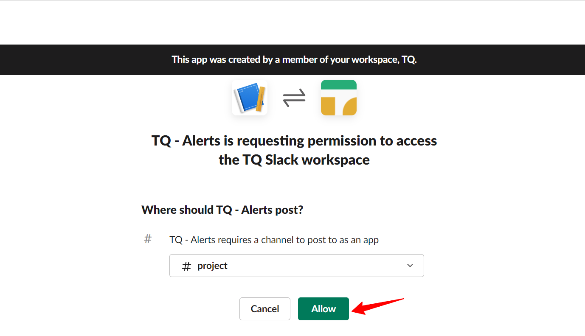
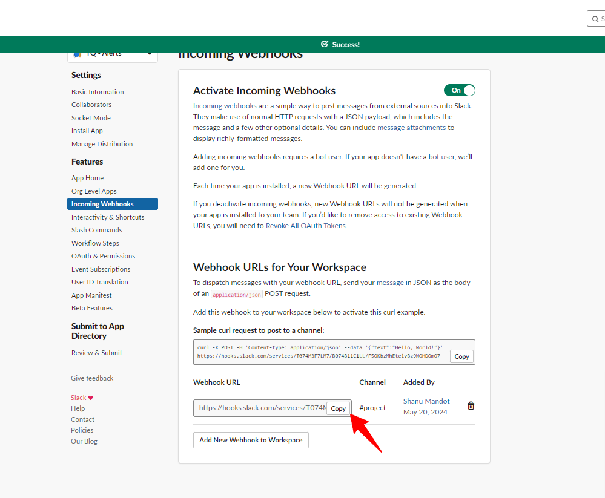
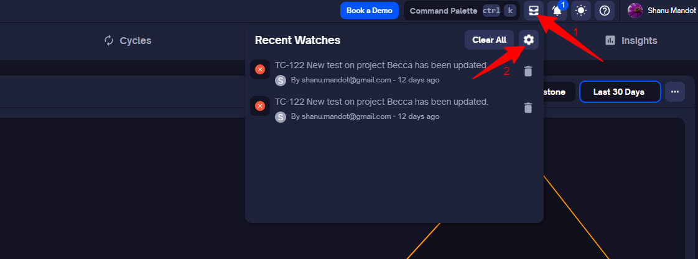
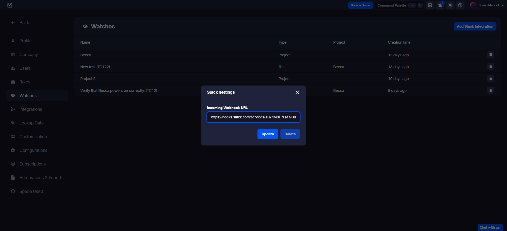
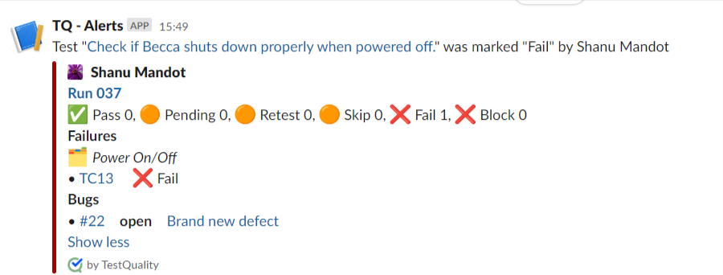

Integrating Slack with TestQuality allows you to receive real-time notifications directly in your Slack channels, ensuring that your team stays updated on critical testing events without needing to constantly check TestQuality. This seamless integration enhances collaboration and ensures prompt responses to issues as they arise.

### Why Integrate Slack with TestQuality?

By adding Slack to your TestQuality notifications, you can:

- **Improve Collaboration:** Keep your entire team informed about testing events in a shared Slack channel.
- **Increase Visibility:** Ensure that test failures and other critical notifications are seen and addressed promptly.
- **Streamline Workflow:** Reduce the need to switch between TestQuality and Slack by receiving all important updates in one place.

### How It Works

When you set up a Slack integration, TestQuality sends notifications to a specified Slack channel whenever a watched event occurs. This could be a test case failure, a project milestone, or any other significant testing event you choose to monitor.

### Step 1: Setting Up Slack

1. **Create a Slack Workspace**
    - Navigate to [slack.com](https://slack.com) and create a new workspace if you do not already have one.

2. **Create or Select a Slack Channel**
    - Within your Slack client app, create a new channel or select an existing channel where you would like to receive notifications.

3. **Create a Slack App**
    - Visit the [Slack API Apps](https://api.slack.com/apps) page.
    - Click **Create an App**.

         
    - Select **From scratch**.

         
    - Enter an **App Name**. This name will appear in all notifications.
    - Choose the workspace you created or selected.
    - Click **Create App**.

        

4. **Activate Incoming Webhooks**
    - From the left-hand menu under **Features**, click **Incoming Webhooks**.
    - Toggle the **Activate Incoming Webhooks** switch to **On**.
    - Scroll down and click **Add New Webhook to Workspace**.

        
    - Authorize the app to access the workspace by selecting a channel and clicking **Allow**.

        
    - Copy the generated Webhook URL by clicking **Copy**.

        

    > **Optional:** Verify the Webhook URL by using a provided curl request example.

### Step 2: Configuring TestQuality

1. **Log In to TestQuality**
    - Access your TestQuality account by logging in.

2. **Navigate to Watch Settings**
    - Go to **Watch Settings** via the top menu or from the settings page.

         

3. **Add Slack Integration**
    - Click on **Add Slack Integration** located at the top right-hand corner. A dialog box will appear.
    - Paste the copied Webhook URL into the provided field.
    - Click **Update** to save the integration.

        

Your setup is now complete. Any existing watches will send notifications to the designated Slack channel.

A watch added to a test, when integrated with Slack, will look like this:

### Understanding Watch Notifications

Watches in TestQuality are triggered when specific events occur, such as a test or project run that fails. This action generates a watch notification.

#### Adding a Watch

- Click the eye icon on elements such as Projects, Folders, Tests, and Cycles.
- If you are watching a project and a test within that project fails, you will receive a notification. The same principle applies to folders and cycles.

