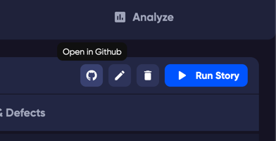
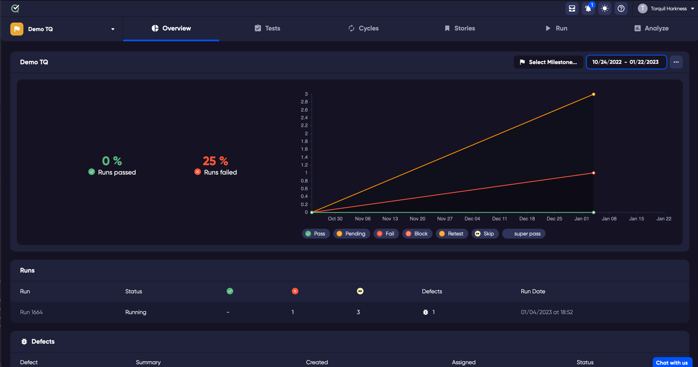

## GitHub

TestQuality extends your Github DevOps workflow to provide powerful and modern GitHub issue powered test case creation and management. TestQuality is FREE for GitHub public repo’s and affordable for teams on private repo's.

**Live 2-way Integration Keeps Your Teams and Tools in Sync. Always.**
Change the priority of a defect in TestQuality and the priority is always current in GitHub and vice versa.

Seamless test workflows and defect coverage analysis
Your GitHub workflows are transparently extended with test management capabilities so you never need to leave your workflows.

## Jira

Test Management dashboards in JIRA provide for easy access and to promote knowledge of your testing effort. Including test quality analysis to help you determine test value, trouble tests, coverage, and more.

How to set up your [Jira integration](jira_setup)

## Configuration

Add an integration with GitHub or Jira in the [configuration page](administration/integration_config)

## Linking and creating new defects

Creating a defect or bug can be done from a test in a test [run](run). 

To create a defect or bug, select a test in a run.

Once you click on a test, it will open the [Test Drawer](test_drawer).

Click Log Defect button at the bottom right of the test drawer.

From here you can link an existing defect by searching in the search field. 
Or you can create a new defect that will create an issue in your linked repository.

To create a defect, type the name of the defect that you would like to create in the 'Issue Title' field.

As you start typing, the Link button will change to Next. When you have finished typing the name of the defect that you want to create, click 'Next'.

The defect window will open.

Edit any of the fields you would like to change, such as Priority or a label. 

Click 'Create'.

Your new defect has now been created in your linked repository. 
To see your new defect, click on the Runs and Defects tab in the test drawer.

To open the Defect in the drawer, you can click on the defect number link.

To open the defect page in your linked repository, click the link in the drawer.

This will open the 3rd party site where the defect has been created.

