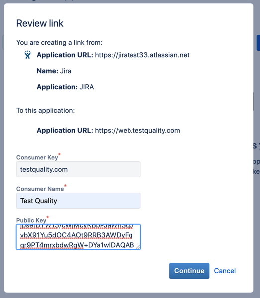

## Setting up your Jira integration

Click your username in the top right corner of the screen and choose Integrations from the drop down menu.

Click the configure integration link as shown in red in the image below.

Sign in to Jira and copy your subdomain (The example here is a test for creating this page. You will have something different than _jiratest33_).

Paste your subdomain into the Jira Sub Domain box in TestQuality.

Click the 'Jira Application Links' link just below the sub domain field.

In the Jira page that opens, it will ask for a URL.

In the TestQuality page you can copy the required URL (https://web.testquality.com) using the copy button to the right of the field.

In Jira, paste the URL into the field and click the 'Create New Link' button

In the warning that pops up, click Continue.

In TestQuality, copy the Application name and paste it into Jira in the Application Name field. 
Choose the Generic Application as the application type.

Click on the selection box at the bottom to **create the incoming link**.

Click Continue

Copy and paste the 'Consumer Key', 'Consumer Name', and 'Public Key' from TestQuality, to Jira. 

Click Continue.

Congratulations, you have configured your Jira integration!
