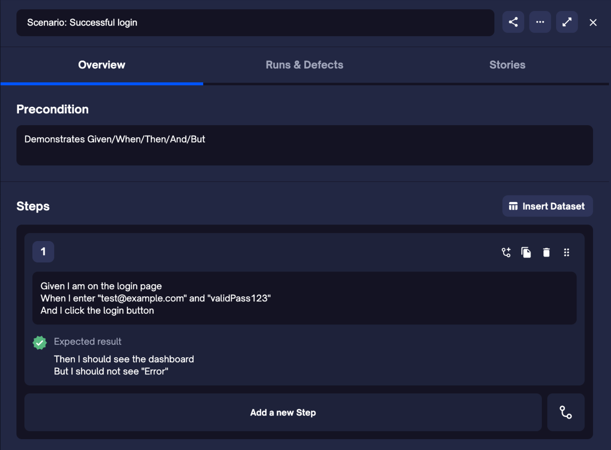
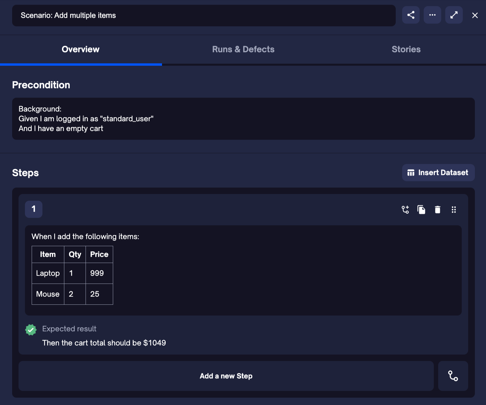
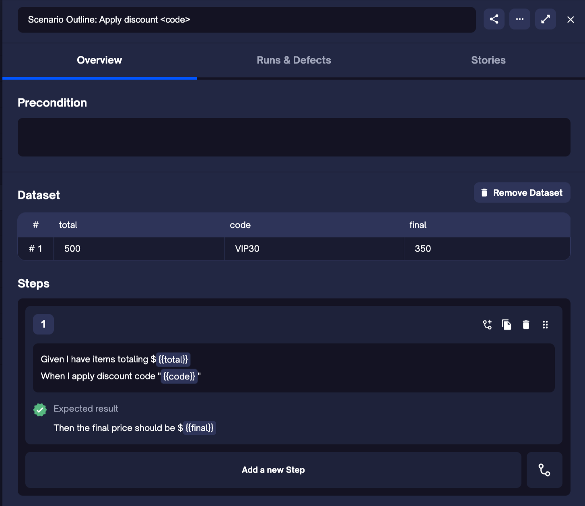
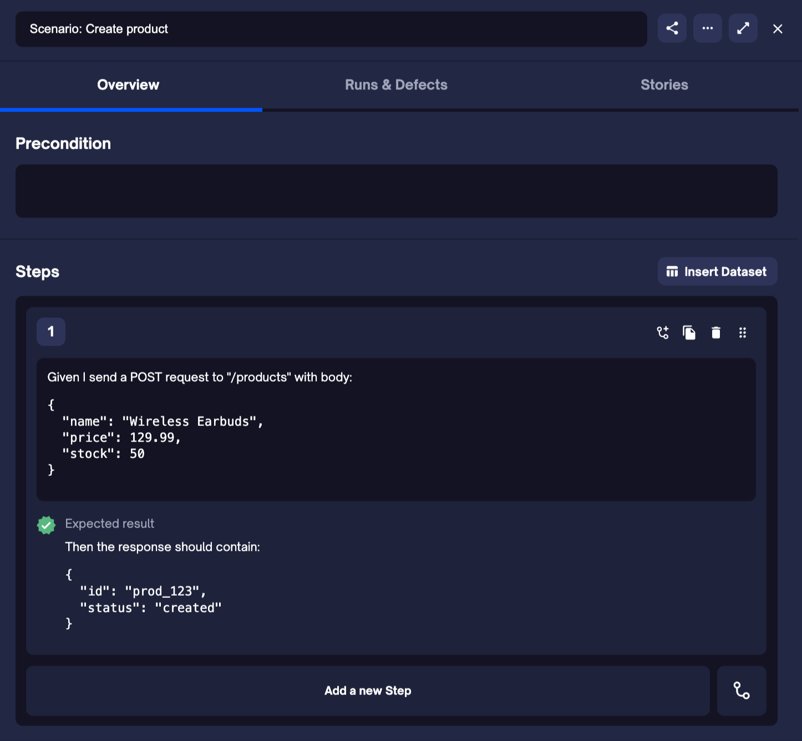

TestQuality supports most of the standard [Gherkin](https://cucumber.io/docs/gherkin/reference/) keywords used to write clear, structured test cases. This allows QA teams to define scenarios in a natural language format while maintaining consistent test structure.

## Supported Keywords

Below is a list of supported keywords, how they are typically used, and how each is mapped within the TestQuality interface.

> ⚠️ **Note:** `Rule` is not supported yet.  
> 🖍️ **Syntax highlighting** is planned — track progress on our [public roadmap](https://testquality.productlift.dev/p/support-for-gherkin-syntax-highlighting-for-your-manual-test-H2Yue2).

| **Gherkin Keyword** | **Usage**                                          | **TestQuality UI Mapping**      |
|---------------------|----------------------------------------------------|---------------------------------|
| `Feature`           | Groups related scenarios                           | Folder name                     |
| `Scenario`          | Describes a single test case                       | Test case name                  |
| `Scenario Outline`  | Defines a parameterized scenario                   | Test case with dataset          |
| `Examples`          | Provides data sets for a scenario outline          | Dataset                         |
| `Background`        | Setup shared by all scenarios in a feature         | Precondition                    |
| `Given`             | Defines initial context                            | Test step                       |
| `When`              | Describes an action                                | Test step                       |
| `Then`              | Expected outcome                                   | Expected result                 |
| `And`               | Additional step/context/outcome                    | Test step                       |
| `But`               | Negative or exception step                         | Test step                       |
| `# Comment`         | Inline notes, not executed                         | Ignored/comment only            |
| `"""` (Doc Strings) | Preserved multi-line text in steps                 | Multiline text in test step     |
| `\|` (Data Tables)   | Tabular values passed to a step (with escaping)    | Table input within test step    |

## Examples

### Examples

**Basic Keywords**

[Download `basic_keywords.feature`](https://github.com/testquality-examples/gherkin-samples/raw/main/basic_keywords.feature)

```bash
@core @smoke
Feature: Basic Gherkin Keywords
  Demonstrates Given/When/Then/And/But

  Scenario: Successful login
    Given I am on the login page
    When I enter "test@example.com" and "validPass123"
    And I click the login button
    Then I should see the dashboard
    But I should not see "Error"

  Scenario: Failed login
    Given I am on the login page
    When I enter "test@example.com" and "wrongPass"
    Then I should see "Invalid credentials"
```

 

**Background + Data Tables**

[Download `background_table.feature`](https://github.com/BitModern/testQualityCli/tree/master/samples/featureFiles/background_table.feature)

```bash
@ecommerce
Feature: Shopping Cart with Background
  Background:
    Given I am logged in as "standard_user"
    And I have an empty cart

  Scenario: Add multiple items
    When I add the following items:
      | Item       | Qty | Price |
      | Laptop     | 1   | 999   |
      | Mouse      | 2   | 25    |
    Then the cart total should be $1049
```

 

**Scenario Outline**

[Download `scenario_outline.feature`](https://github.com/BitModern/testQualityCli/tree/master/samples/featureFiles/scenario_outline.feature)

```bash
@checkout @parameterized
Feature: Discount Calculator
  Scenario Outline: Apply discount <code>
    Given I have items totaling $<total>
    When I apply discount code "<code>"
    Then the final price should be $<final>

    Examples:
      | total | code   | final |
      | 100   | SAVE10 | 90    |
      | 200   | SAVE20 | 160   |

    Examples: VIP Customers
      | total | code    | final |
      | 500   | VIP30   | 350   |
```
 
 

**Doc Strings + Tags**

[Download `docstrings.feature`](https://github.com/BitModern/testQualityCli/tree/master/samples/featureFiles/docstrings.feature)

```bash
@api @v2
Feature: Product API with Doc Strings
  Scenario: Create product
    Given I send a POST request to "/products" with body:
      """
      {
        "name": "Wireless Earbuds",
        "price": 129.99,
        "stock": 50
      }
      """
    Then the response should contain:
      """
      {
        "id": "prod_123",
        "status": "created"
      }
      """
```

 

**Full Demo File**

[Download `full_demo.feature`](https://github.com/BitModern/testQualityCli/tree/master/samples/featureFiles/full_demo.feature)

```bash
@regression @full
Feature: Comprehensive Gherkin Demo
  Background:
    Given I open the application
    And I clear all test data

  Scenario: User registration
    When I register with:
      | Field | Value         |
      | Email | user@test.com |
      | Pass  | Secure123!    |
    Then I see "Registration successful"

  Scenario Outline: Search for <term>
    Given I am on the search page
    When I search for "<term>"
    Then I see at least <results> results

    Examples:
      | term      | results |
      | "laptop"  | 10      |
      | "monitor" | 5       |

  @error
  Scenario: Invalid payment
    When I submit payment with:
      """
      {
        "card": "4111111111111111",
        "expiry": "13/2025"
      }
      """
    Then I see "Invalid expiry date"
```