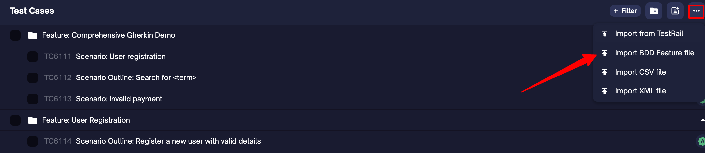
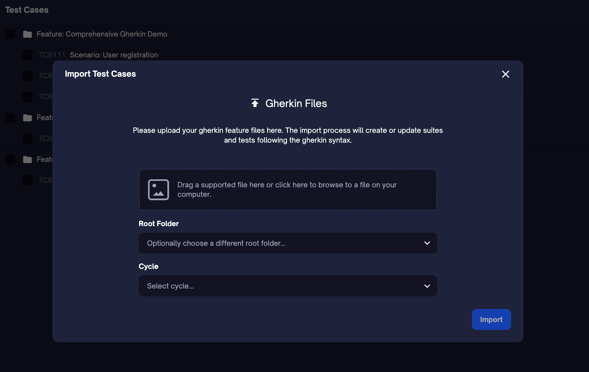
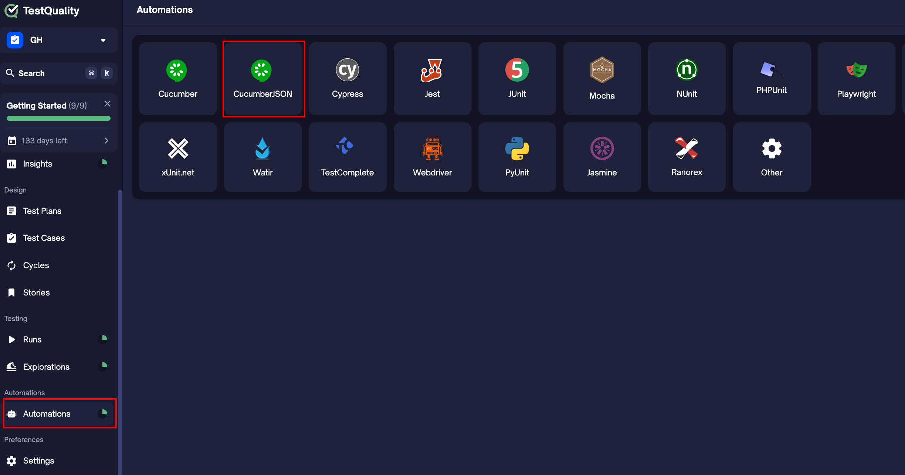
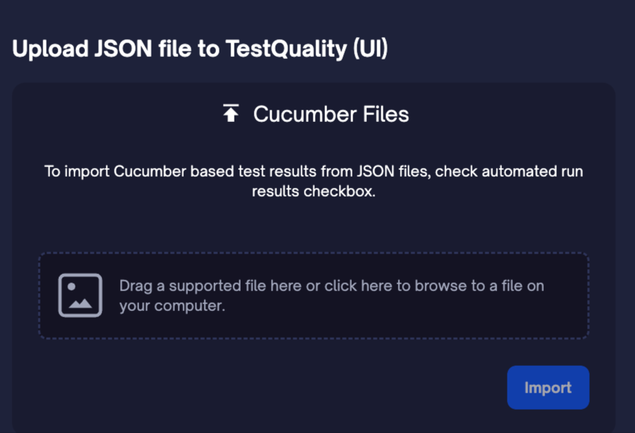
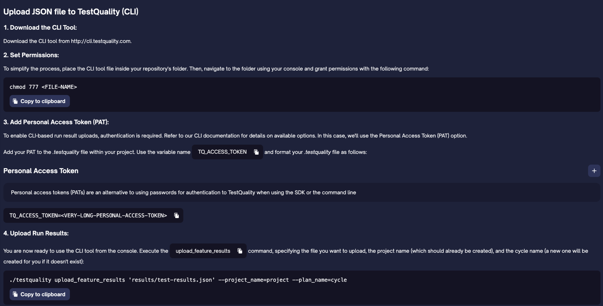

TestQuality supports most of the standard [Gherkin](https://cucumber.io/docs/gherkin/reference/) keywords used to write clear, structured test cases. This allows QA teams to define scenarios in a natural language format while maintaining consistent test structure.

## Supported Keywords

Below is a list of supported keywords, how they are typically used, and how each is mapped within the TestQuality interface.

> ⚠️ **Note:** `Rule` is not supported yet.  
> 🖍️ **Syntax highlighting** is planned — track progress on our [public roadmap](https://testquality.productlift.dev/p/support-for-gherkin-syntax-highlighting-for-your-manual-test-H2Yue2).

| **Gherkin Keyword** | **Usage**                                          | **TestQuality UI Mapping**      |
|---------------------|----------------------------------------------------|---------------------------------|
| `Feature`           | Groups related scenarios                           | Folder name                     |
| `Scenario`          | Describes a single test case                       | Test case name                  |
| `Scenario Outline`  | Defines a parameterized scenario                   | Test case with dataset          |
| `Examples`          | Provides data sets for a scenario outline          | Dataset                         |
| `Background`        | Setup shared by all scenarios in a feature         | Precondition                    |
| `Given`             | Defines initial context                            | Test step                       |
| `When`              | Describes an action                                | Test step                       |
| `Then`              | Expected outcome                                   | Expected result                 |
| `And`               | Additional step/context/outcome                    | Test step                       |
| `But`               | Negative or exception step                         | Test step                       |
| `# Comment`         | Inline notes, not executed                         | Ignored/comment only            |
| `"""` (Doc Strings) | Preserved multi-line text in steps                 | Multiline text in test step     |
| `\|` (Data Tables)   | Tabular values passed to a step (with escaping)    | Table input within test step   |


## Examples

### Basic Keywords

[Download `basic_keywords.feature`](https://github.com/BitModern/testQualityCli/blob/master/samples/featureFiles/basic_keywords.feature)

```bash
@core @smoke
Feature: Basic Gherkin Keywords
  Demonstrates Given/When/Then/And/But

  Scenario: Successful login
    Given I am on the login page
    When I enter "test@example.com" and "validPass123"
    And I click the login button
    Then I should see the dashboard
    But I should not see "Error"
```

**In TestQuality** 

 

### Background + Data Tables

[Download `background_table.feature`](https://github.com/BitModern/testQualityCli/blob/master/samples/featureFiles/background_table.feature)

```bash
@ecommerce
Feature: Shopping Cart with Background
  Background:
    Given I am logged in as "standard_user"
    And I have an empty cart

  Scenario: Add multiple items
    When I add the following items:
      | Item       | Qty | Price |
      | Laptop     | 1   | 999   |
      | Mouse      | 2   | 25    |
    Then the cart total should be $1049
```

**In TestQuality** 

 

### Scenario Outline

[Download `scenario_outline.feature`](https://github.com/BitModern/testQualityCli/blob/master/samples/featureFiles/scenario_outline.feature)

```bash
@checkout @parameterized
Feature: Discount Calculator
  Scenario Outline: Apply discount <code>
    Given I have items totaling $<total>
    When I apply discount code "<code>"
    Then the final price should be $<final>

    Examples: VIP Customers
      | total | code    | final |
      | 500   | VIP30   | 350   |
```
 
 **In TestQuality** 
 
 

### Doc Strings + Tags

[Download `docstrings.feature`](https://github.com/BitModern/testQualityCli/blob/master/samples/featureFiles/docstrings.feature)

```bash
@api @v2
Feature: Product API with Doc Strings
  Scenario: Create product
    Given I send a POST request to "/products" with body:
      """
      {
        "name": "Wireless Earbuds",
        "price": 129.99,
        "stock": 50
      }
      """
    Then the response should contain:
      """
      {
        "id": "prod_123",
        "status": "created"
      }
      """
```

**In TestQuality** 

 

### Full Demo File

[Download `full_demo.feature`](https://github.com/BitModern/testQualityCli/blob/master/samples/featureFiles/full_demo.feature)

```bash
@regression @full
Feature: Comprehensive Gherkin Demo
  Background:
    Given I open the application
    And I clear all test data

  Scenario: User registration
    When I register with:
      | Field | Value         |
      | Email | user@test.com |
      | Pass  | Secure123!    |
    Then I see "Registration successful"

  Scenario Outline: Search for <term>
    Given I am on the search page
    When I search for "<term>"
    Then I see at least <results> results

    Examples:
      | term      | results |
      | "laptop"  | 10      |
      | "monitor" | 5       |

  @error
  Scenario: Invalid payment
    When I submit payment with:
      """
      {
        "card": "4111111111111111",
        "expiry": "13/2025"
      }
      """
    Then I see "Invalid expiry date"
```

## Manual + Automation with Gherkin

TestQuality bridges the gap between manual and automated testing by making **Gherkin** the shared language of your QA team. Whether you’re manually designing test cases or importing results from automation tools like **Cucumber**, **Behave**, **SpecFlow**, or **Gauge**, TestQuality provides a unified platform to manage, track, and scale your quality process.

---

### Importing `.feature` Files for Manual Test Cases

You can import Gherkin-based `.feature` files to quickly create structured test cases inside TestQuality.

**Step 1: Open the Import Dialog**  
Go to the **Test Cases** module → click **Import BDD Feature File**.



**Step 2: Upload the Gherkin `.feature` File**  
Drag and drop your Gherkin file into the dialog box or click to browse and select it from your computer. You can also assign the test cases to a root folder and cycle during this step.



- Each `Feature` will be turned into a folder
- Each `Scenario` or `Scenario Outline` will become a test case
- Gherkin tags, tables, backgrounds, and doc strings are preserved
- Ideal for teams adopting BDD manually or starting test design with natural language syntax

---

### Importing `.json` Files for Automation Results

You can upload Cucumber-compatible JSON files after executing your automated tests using either of the following two options:

Go to the **Automations** module → click **Import Cucumber File (JSON)**.


---

#### Option 1: Upload via UI



- Drag and drop your result file
- Associate it with a test cycle
- Execution results will be tracked, reported, and linked

---

#### Option 2: Upload via CLI (Recommended for CI/CD)

Use the TestQuality CLI to upload results automatically as part of your pipeline.



### Works with Your Favorite BDD Tools

TestQuality supports seamless integration with test automation frameworks that use Gherkin syntax, including:

- **Cucumber** (Java, Ruby, JavaScript)
- **Behave** (Python)
- **SpecFlow** (.NET)
- **Gauge**
- **Lettuce**
- And other tools that output `.feature` files or Cucumber-style `.json` results

---

