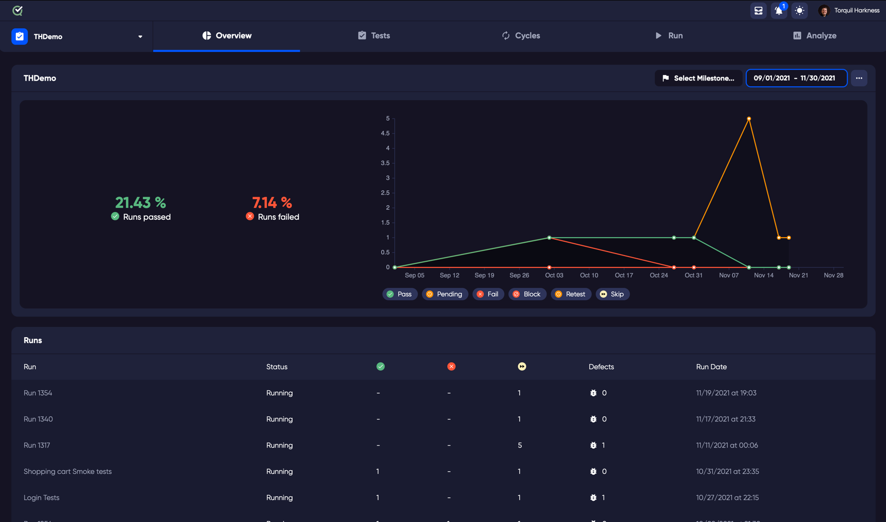
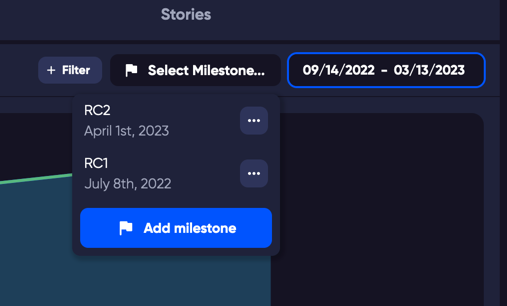

The Overview is where you can get an instant understanding of your project. The progress of your testing and number of defects or bugs.

Select any of your projects or choose a date range to view the status and progress of your projects. Whenever you log in to TestQuality, you will see the last project that you had open.

## Milestones

Your Milestones are how you track progress of a planned event. It could be a new release, or feature or whatever you choose to track. The graph at the top of the page shows you the results from your Test Runs in that milestone. The view is dependent on the date range or milestone that you select in the top right of the graph.

To set up a new Milestone, click the Milestone selector on the Overview page. From here you can create a new milestone, or edit any that exist already.

### The graph

To help identify the different test results over time, the results in the graph are colour coded. 

Filtering the displayed results - Clicking on the different statuses at the base of the graph will hide or show those results on the graph.

## Run History

The Runs table shows you all the runs that have happened in the timeframe you have selected. That is either the dates of your currently selected Milestone, or the dates that you have selected in the date selector above the graph.  

## Defects

The Defects table shows what defects or bugs have been registered in the time period of the selected date range.
Your defects are linked to GitHub or Jira.