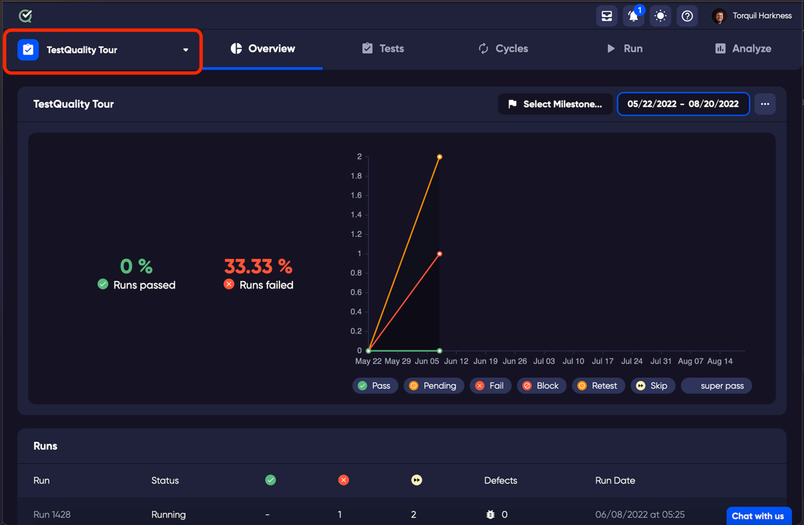
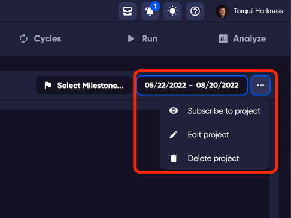
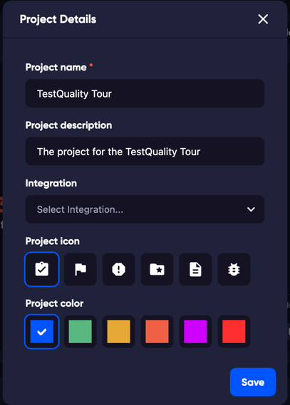

The Project selector is where you can create or change your projects.

Select the project that you wish to open using the dropdown, or you can create a new project. Whenever you log in to TestQuality, you will see the last project that you had open.

## Editing a project

To edit your current project, click the ellipses next to the milestone date selector on the right of the main window. Then choose 'Edit project' from the dropdown menu.

## Project settings

When you open the edit project menu, you can change the various elements of the project, including the project integration. This can also be changed in the main settings page. 

