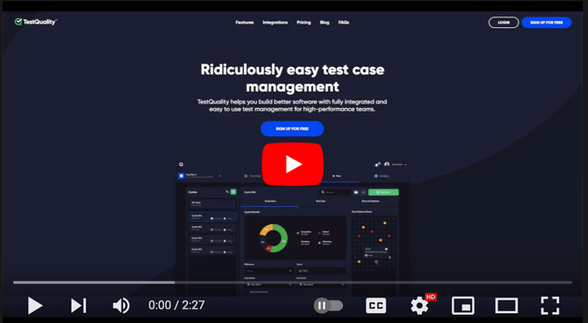
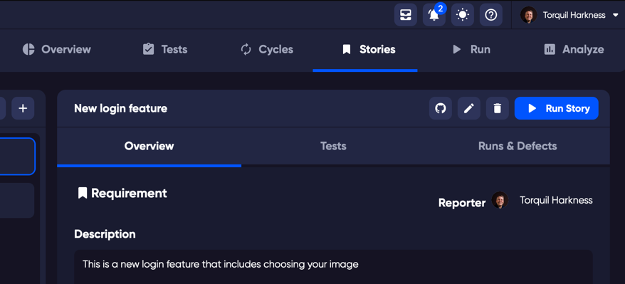
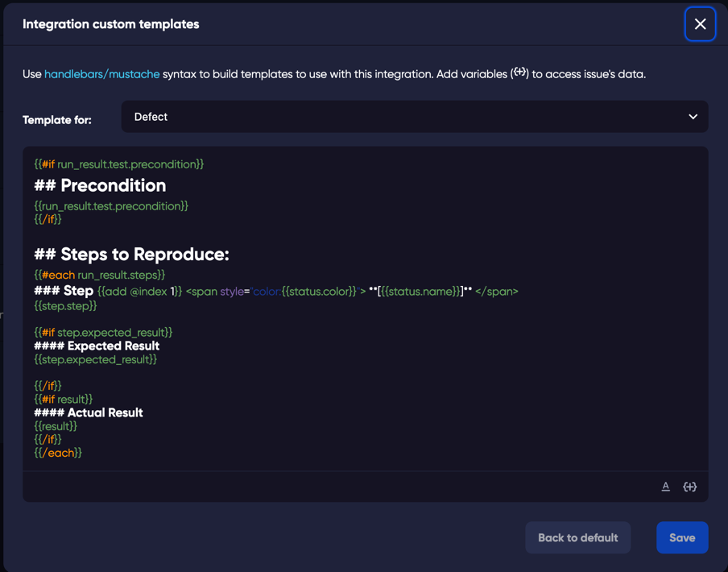
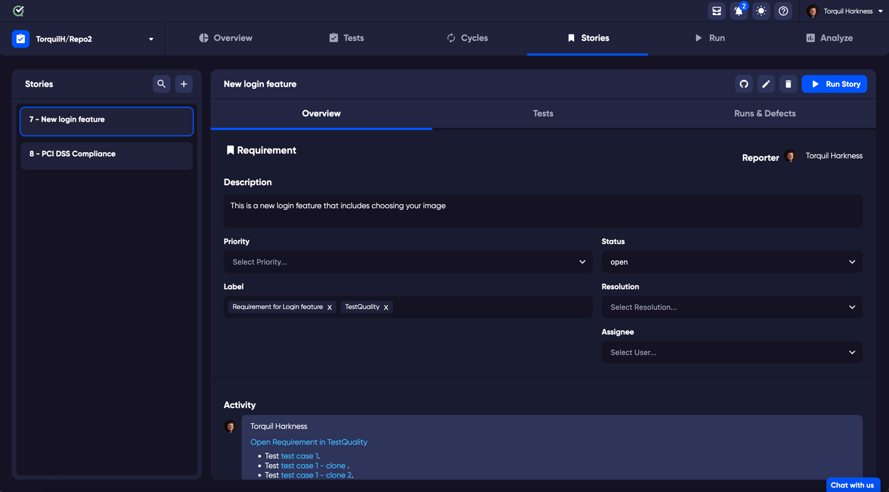

<a href="https://www.youtube.com/watch?v=x9TJeLVYB4Y"> 

</a>

TestQuality is a test management solution to easily monitor your testing efforts. TestQuality natively integrates with GitHub and Jira with a two-way integration for defects and requirements, and many other CI solutions using XML or Gherkin integration. 

With TestQuality you can author tests, create test runs, and group common tests into cycles. Set these against your own milestones to monitor your progress. The metrics and reports give you instant understanding of your test results over time.
Jump in at http://web.testquality.com

At TestQuality we understand that your tests, are the backbone of your testing. So we have built an interface to match your priorities, with tests at the core of operations, with workspaces that match all your Test Management tasks and ensure success, once your tests are in place.

The interface is divided into 5 main areas that are easily navigated to at any time with a single click. Meaning that each set of your test management tasks has a single pane for each.
## 5 task screens:
### [Overview](overview.md)
Edit and check your milestones, view your test run results, and monitor logged defects/bugs over time.

This view is great for your daily check-in.

### [Tests](tests.md)
Create and organise your tests. You have visibility for all tests and can organise and manage a single test or edit multiple tests at once with ease.

For each test you can add steps, preconditions, and expected results. Link your tests to requirements, group in folders and more.
* The 'Command' feature gives you extreme power over your tests.

  

### [Run](run.md)
Add a single test, or multiple tests and folders to a run. A test run, is your test in 'execute' mode. Where you create a branch of your tests to check against a system in test.
In the Run screen, you can view the run overview, the results, and any logged defects.

### [Cycles](cycles.md)

If you have tests that are often grouped together, for a task that you would run on a regular basis, creating a Cycle gives you the flexibility to ensure that the same tests are made every time. 

In the Cycles screen you have the same easy-to-use tabs that you will see in the Runs screen, the Overview, Test List, and Runs & Defects, giving you a easy management of your test Cycles.

From here you can also send a Cycle to a Run, generating a new test Run, from your chosen Cycle. 

### [Analyze](analyze.md)

