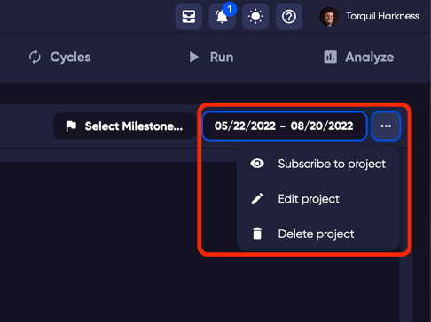
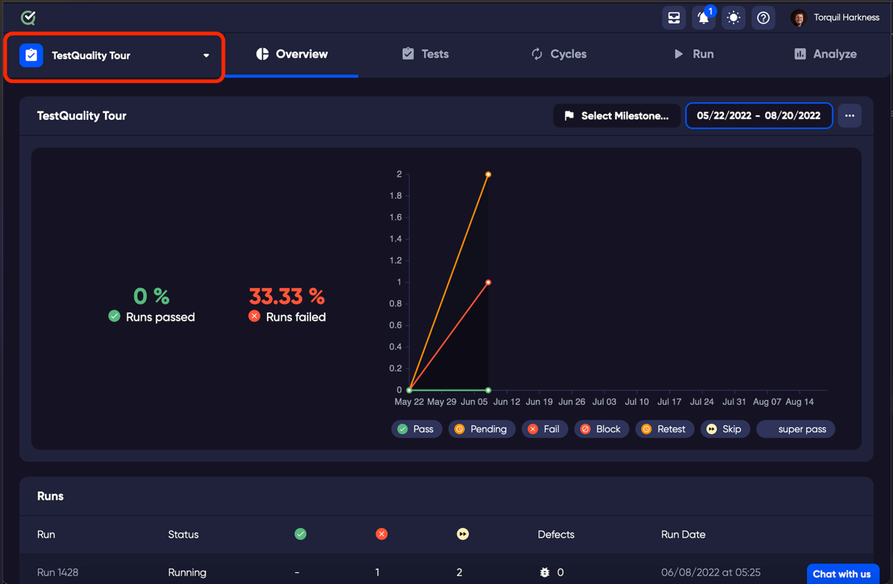

To execute your test cases, you will need to send them to a Run. You can send a single test case, or multiple test cases. When you have test cases that you run repeatedly, it is easier to organise the test cases in to a Cycle and send the test Cycle to Run. 

What is a Run? - Your tests include a number of steps, preconditions, or expected results. The test that you create is designed to be executed by a QA tester, or a test automation system that will go through all of the steps and check that the expected result is a match with the process they have done. This process of executing a test is a test Run.

The Run tab is where you will find all the information about your tests in execution mode. 

You can send a single test to a test run, or a Cycle of many tests. 

On the left of the Run page, you will see a list of your test runs. Each Run tile has an overview of the Run information, such as the name, originating location of the tests (e.g. Cycle name), number of bugs, completed date if the run has finished.

Clicking on the elipses(...) in the top right of the selected run shows a menu for the following commands:
 - Start/Finish Run - Depending on the run status, it will display start or finish run. If you choose to finish the run, the run will be marked as complete. Starting an already completed run will create a new run that is a duplicate of the currently selected run.
 - Create Cycle - This will create a [Cycle](cycles) that contains all of the tests in the currently selected run. 
 - Delete Run - This deletes the currently selected run. 

###  Overview
The Overview tab is a summary of the run information and contains the following:
 - Run Details - A breakdown of statuses for all included tests.
 - Test Status Chart - A visual representation of the run and its statuses. Clicking on any square will take you directly to the test.
 - Milestone - The Milestone that is linked to this run.
 - Cycle - If the run originated from a Cycle, the Cycle name is listed here. The "All Tests" label signifies that the run was created Ad-hoc from the list of all tests.
 - Start Time - When the run was started.
 - End Time - The time the run was completed.
 - End Permanently - If the run results should be saved permanently and not purged when storage space is low.

###  Test Runs/Run Results
Depending on the Run status, this tab will be a list of tests results of a completed run, or a list of the tests that are included in the in-progress run. It keeps the same order and folder structure as in the Tests page so the order in which the tests are run is kept the same.
The status/result of each test is shown on the right. 

Filtering - To work on the tests in the order you prefer, or if you would like to see progress of status of some tests, you can use the filter command, located in the Run window menu, to show only those tests that you choose to view. The filter does not remove the tests from the run, only the current view.

###  Runs & Defects

The previous Run history gives you instant access to the details of your run activity. Clicking on the name of another run will change the selected run.

The defect list is a list of defects that have been linked to your runs.

