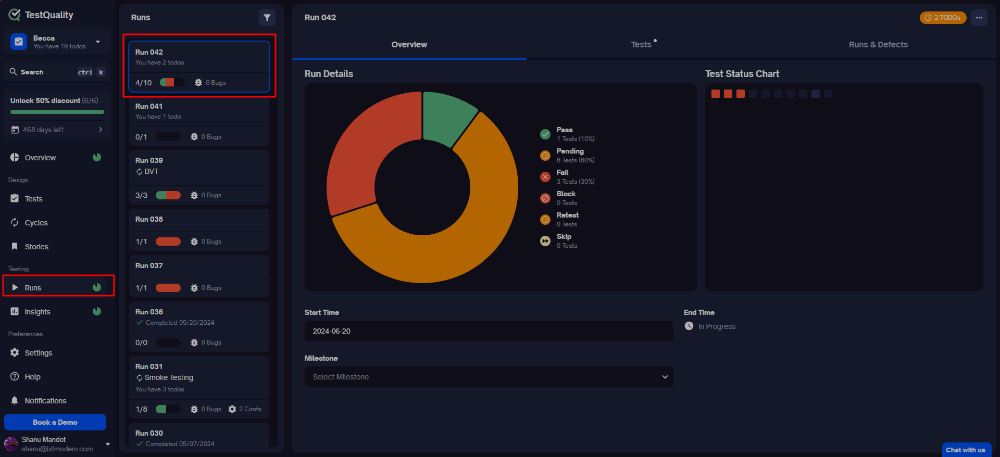
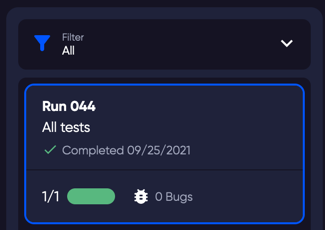
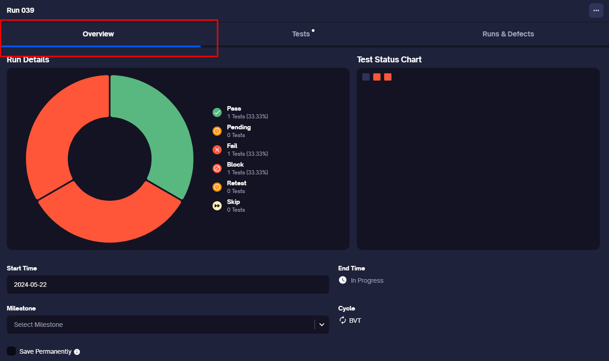
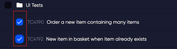

TestQuality Runs help you execute your test cases efficiently. You can send single or multiple test cases to a Run, or organize repeated test cases into a [Cycle](cycles) and send the Cycle to a Run.

### What is a Run?

A Run is the process of executing a test. Your tests include steps, preconditions, and expected results. A QA tester or test automation system follows these steps and checks if the actual results match the expected results.

### Navigating the Run Menu

The Run menu provides all the information about your tests in execution mode. Here's how to navigate and use it:

1. **Send Tests to a Run**: You can send a single test or a Cycle of many tests to a Run.
2. **View Test Runs**: On the left side of the Run page, you'll see a list of your test runs. Each Run tile provides an overview, including:
    - Run name
    - Originating location (e.g., Cycle name)
    - Number of bugs
    - Completed date (if the run is finished)
    
    

### Managing Test Runs

Clicking on the ellipses (...) in the top right of a selected run reveals the following commands:

- **Start/Finish Run**: Depending on the run status, this option will either start or finish the run. Finishing the run marks it as complete. Starting an already completed run creates a new, duplicate run.
- **Create Cycle**: This creates a [Cycle](cycles) that contains all tests in the selected run.
- **Export Run**: Provides options to export the run in CSV, Excel, and Gherkin formats.
- **PDF Report**: Creates a PDF report of the selected run with a few customizable capabilities.
- **Edit Run**: Allows you to edit the run name.
- **Delete Run**: This deletes the selected run.

### Run Overview Tab

The Overview tab summarizes run information and includes:

- **Run Details**: Breakdown of statuses for all included tests.
- **Test Status Chart**: Visual representation of the run and its statuses. Clicking any square takes you directly to the test.
- **Milestone**: The milestone linked to this run.
- **Cycle**: Lists the originating Cycle if applicable. The "All Tests" label indicates an ad-hoc run from all tests.
- **Start Time**: When the run started.
- **End Time**: When the run was completed.
- **Save Permanently**: Option to save run results permanently to avoid purging when storage is low.

  

### Tests/Results Tab

Depending on the run status, this tab shows either:

- A list of test results from a completed run, or
- A list of tests in the in-progress run.

  

The order and folder structure match the Tests page, and the status/result of each test is shown on the right.

#### Filtering Tests

Use the filter command in the Run window menu to:

- Work on tests in your preferred order.
- View progress of specific tests by filtering the view. 

**Note**: Filtering does not remove tests from the run, only changes the current view.

### Runs & Defects

- **Run History**: Provides instant access to previous run details. Clicking on another run’s name changes the selected run.
- **Defect List**: Lists defects linked to your runs.

  

### Rerun Tests

To rerun tests, for instance, if you have failing tests and want to keep the failure history in the current run:

1. Under **Run -> Tests** tab, select the tests you want to rerun by clicking the selection box next to each test in the list.

    

2. In the menu at the bottom of the window, choose 'Re-Run'.

    

3. In the Create Run window that opens, make any necessary changes and click 'Create'.

**Note**: When rerunning tests, the new run will automatically include the parent cycle if one exists. For ad-hoc runs without a parent cycle, the rerun will not include a cycle in the create run dialog.

