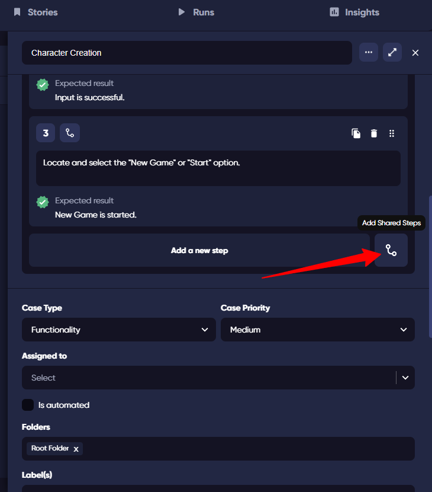
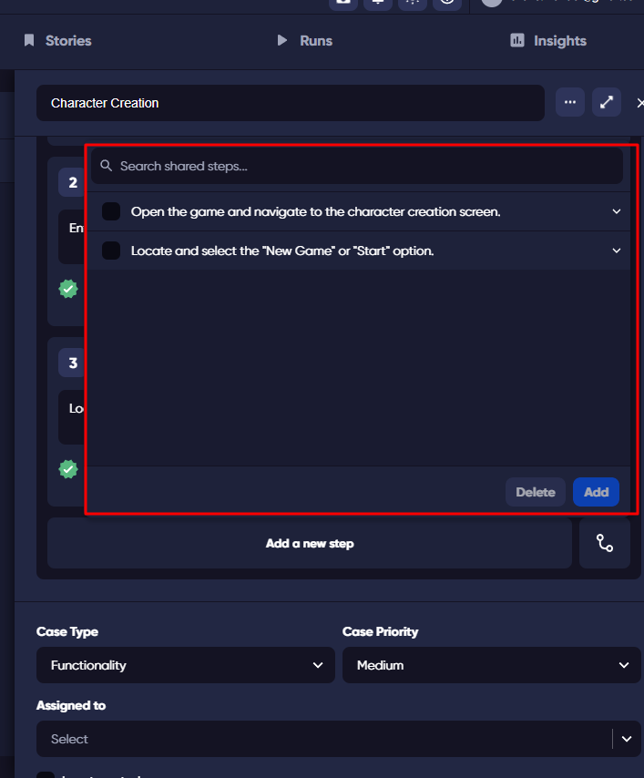

Shared Steps in TestQuality enable you to maintain a consistent testing approach by facilitating the reuse of steps across multiple test cases, thereby reducing redundancy and effort in test case management. 

You can easily create a Shared Step from an existing step or utilize them to construct or update test cases. Here's how:

## Creating a Shared Step

### From an Existing Step

- **In Edit/Create Test Case**: Click the **Convert to Shared Step** icon next to the desired step to share it.

*Create Test Case screen*

After clicking `Convert to Shared Step`, the step becomes shared, with a corresponding icon displayed.

*Edit Test Case screen*

After clicking `Convert to Shared Step`, the step becomes shared, with a corresponding icon displayed.

## Using Shared Steps in Test Cases

- **Edit/Create Test Case Screen**: Open the test case you are editing or creating a new one. Click the **Add Shared Steps** icon to view available steps. Use the search bar to quickly find specific shared steps.

After clicking `Add Shared Step`, select steps from the list in the opened dialog by checking the checkboxes and clicking 'Add.' These selected steps will then be added to the test case.

**Shared Step Auto-Detection**

This feature automatically identifies existing shared steps when creating new steps and helps users avoid redundancy by promoting the reuse of shared steps.

## Modifying Shared Steps

### Updates and Deletions

- **Update**: Modify the shared step in any test case and save. Changes apply to all test cases using this Shared Step.
- **Delete**: Removing a Shared Step deletes it from all referenced test cases. 

**Warning:** Exercise caution when removing a Shared Step, as this action can't be undone.

Shared Steps streamline testing processes, making them more efficient and consistent. This guide enables you to fully leverage Shared Steps, enhancing productivity and testing quality.