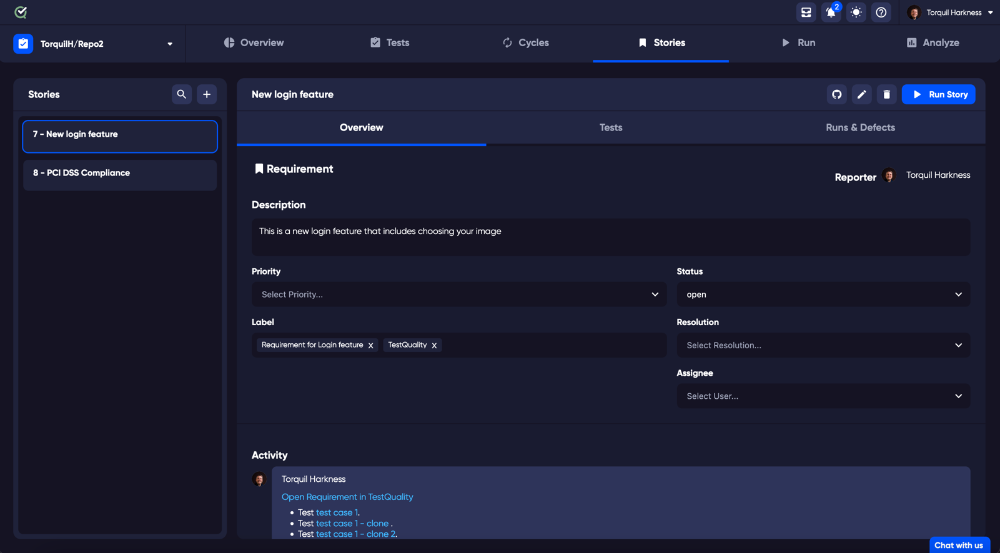
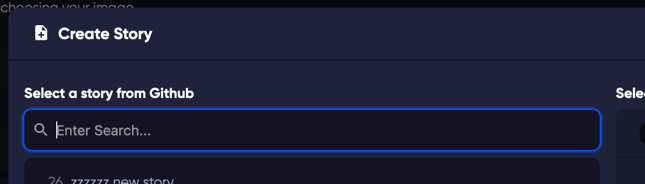
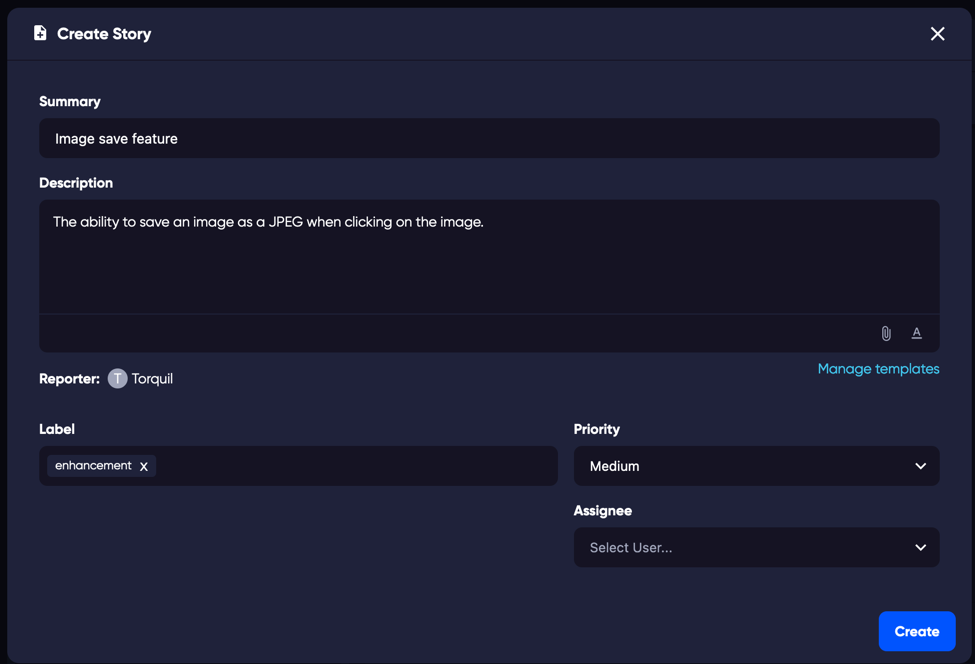
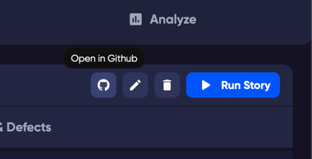
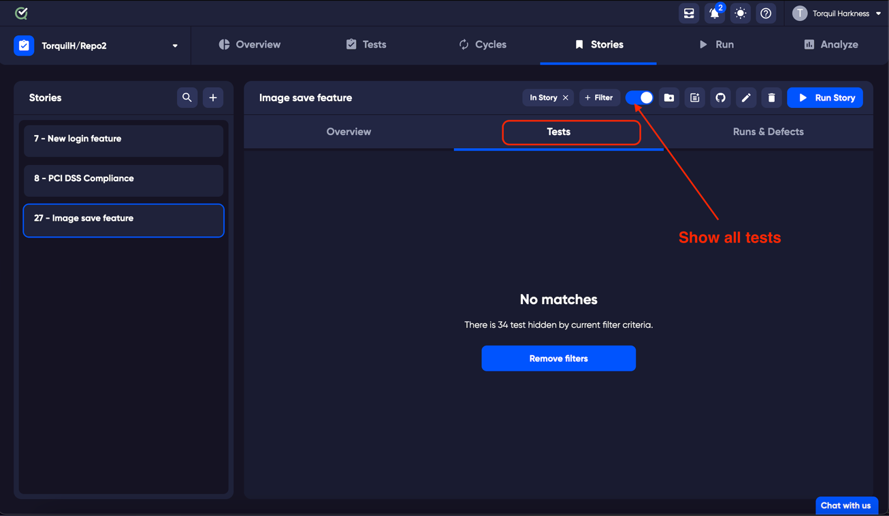
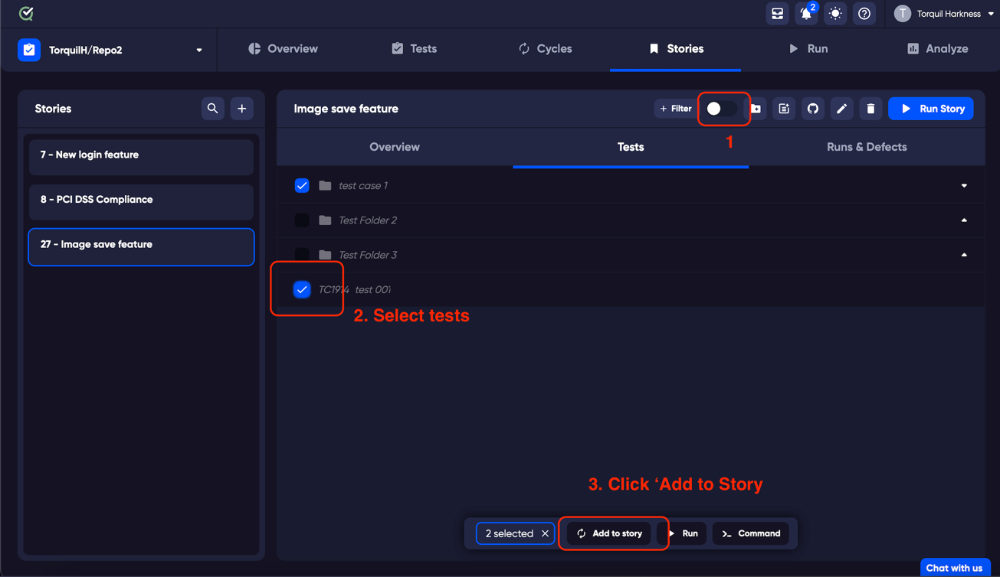

**Stories** allow you to track your features or requirements effectively within your project. Here’s how you can leverage Stories in your workflow:

### Linking Tests to Stories

Connect tests to your story to ensure alignment on what is being tested and why. Describe the story in the **Description** field and use **Labels**, **Priority**, **Status**, and **Assignee** to define and manage your story.

### Creating a Story

You can either link to an existing issue/requirement from your integrated repository or create a new one. 

When adding a new story, you will be prompted to include additional details such as a description or priority.

### Managing and Tracking Stories

Once a story is created, you can update and track it directly from TestQuality. If you need to view the requirement/issue in your linked repository, click the corresponding button on the Story page to be taken directly to GitHub or Jira.

### Adding Tests to Stories

You can add tests related to the story at any time through the **Tests** tab on the Story page. 

If you haven't added any tests, slide the 'Show all tests' switch to list all available tests, select the ones you wish to add, and include them in the story. 

### Tracking Your Tests

As your story evolves, the number of associated tests may change. Track the progress of your story by viewing changes in the [Analyze](/analyze)  tab.

