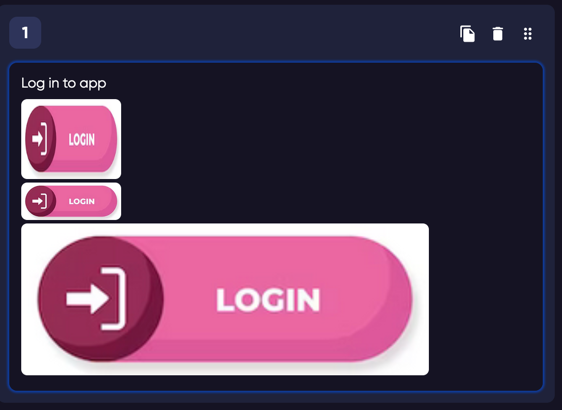
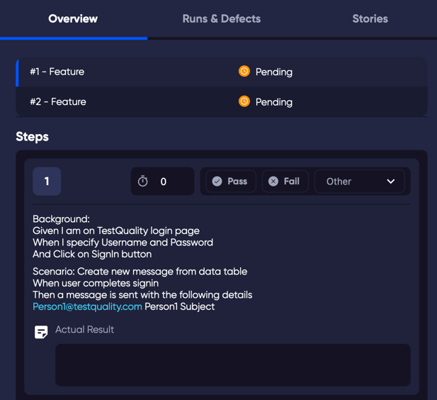

When you click on a test in a test list, the Test Drawer opens to give you more details. 

**NOTE:** _The contents of the drawer will depend on the view. The information displayed for a test in a run execution will contain information related to the run, such as configurations. Or some fields will not be visible e.g. Preconditions is only visible in the test run when it has information to display._

## Overview

**A Note about Markdown:** 

The free text fields such as the precondition, or steps in a test are configured for Markdown syntax. 

Images can be added and will automatically be generated in the correct format by either dropping onto the field, pasting with your computer when your cursor is in the field, or using the attachment button (paperclip icon) in the interface. 

Image size can be defined in the brackets of the image link: 

`   simple, assumes units are in px`

`    sets the height to "auto"`

`  Image with width of 80% and height of 50%`

For example:

Will look like this:

### Configurations
A list of [configurations](/administration/environments) that you have applied to the test in a cycle.

### Precondition
A free text field that you can add anything that needs to be in place, or done before the test steps are carried out.

### Steps
Steps are the procedure that your tester will follow to complete the test execution. Each time you add a step, it is necessary to save the changes.

### Datasets
<a href="https://youtu.be/3eLp0H6VUsY"> 

</a>

You can add a dataset to a test to create multiple variations on a particular test. 
Adding double braces (curly-brackets) around the title of a column in the dataset will automatically create variations of a test when the test is sent to a run. 

#### Expected Result
When you add text to the Expected Result field, it will become visible when you close the edit. Leaving the field empty will keep the field hidden. The expected result can be added to any step, which you may wish to use to help your tester ensure each step is successful. Or you may wish to only use an Expected Result on the final step, so the tester can know what the test result should be overall.

### Actual Result
This is normally used by a manual tester to explain what happened when they ran the test, and the result was not as expected. Used in conjunction with the test list filter "Filter by Result has content", can be very powerful for test management to quickly identify when a new bug should be created that may not be relevant to the test. 
### Case Type
Depending on your type of test you can set a Case Type to define if your test is for example a Functionality, Performance, Security, Usability, Accessibility, Compatibility, Destructive etc. You can also set your own Case Type in the [Lookup Data](administration/lookup_data) section.  
### Case Priority
Test Priority is a way to prioritise and schedule your test cases. You can modify the priority options in the [Lookup Data](administration/lookup_data) section. By default, TestQuality comes with the following priority modes: Lowest, Low, Medium, High, Highest. This can help you plan your testing schedules, and also help you view your testing efforts by  [filtering](/filtering) those tests that you consider a higher priority. 
### Assigned to
Assigning a test to a user in your organisation will help you identify the tests that are handled by different members of your team, but also when a [Run](run) is made that includes the assigned test, the Test in executable mode will be added to the assigned user's ToDo list.  

### Attachments
A list of any attachments that have been linked to the test.

### Time Spent
Only available for a test in a test run, the time spent is normally used in automated testing where the time spent to run the test is added by the test runner.
### Is Automated
This can be set manually on a test to indicate that it is an automated test, or when importing results.

### Cycles
The Cycles that the test is linked to.

### Folders
The folders that the test is linked to.
### Label(s)
A list of any labels that have been added to the test.

### Test Quality
An indicator of the test value. Calculated from the behaviour surrounding this test. If a defect was logged, if the defect was fixed, and other actions surrounding the test all affect the Quality score.

### Estimate
An estimate of how long the test takes to process.

### Custom Properties
Any custom properties that you have applied to your tests. Custom properties can be added in the [Customization](administration/customization)

### Activity
The log of changes made to the test.

### Leave a comment
Comments can be used to add notes, or messages to your colleagues regarding the test.

##  Runs and Defects

Run Results
  - Lists the test runs that in which this test has been included.

Defects
 
 - Lists the defects that are linked to this test. To create a Defect, you will need an  integration. 

##  Requirements

List of requirements that are linked to this test.
Requirements come from a third party system, such as GitHub and Jira. Tracing test cases back to requirements helps us understand the origin of the tests. Also associated tests help us determine if we have created coverage for our requirements.

It is also possible to link or add a new requirement here, using the Add Requirement button at the bottom of the drawer.

