The Test Plan feature in TestQuality is designed to streamline the process of creating, managing, and executing comprehensive test plans. It provides step-by-step guidance and built-in templates, helping you create structured test plans that cover all necessary components for a thorough testing process, all within one integrated platform.

## Why Use TestQuality for Test Plans?

A well-crafted test plan is the foundation of any successful testing process, outlining the scope, objectives, and strategy that ensures comprehensive software coverage. With TestQuality’s Test Plan, teams can create dynamic and customizable plans that leave no critical area untested.

Unlike generic templates, TestQuality’s **In-App Guide** enhances the planning process by offering step-by-step guidance for each key component, from objectives and scope to testing approaches and deliverables. This ensures that every aspect of the test plan is fully integrated with the broader test management strategy, optimizing the testing process for efficiency and thoroughness.

## How to Create a Test Plan:

### 1. Choose and Preview Your Test Plan
Begin by selecting one of the three available options:
- **Software Application Template**: Ideal for structured software projects. Click "Preview Template" to explore the predefined sections before proceeding.
- **Sample "Crossing the Atlantic"**: A helpful example for understanding readiness testing. Use "Preview Template" to view the structure and details before starting.
- **Blank Template**: For users who prefer a fully customizable approach. Directly click "Create Blank Test Plan" to begin without a predefined structure.

   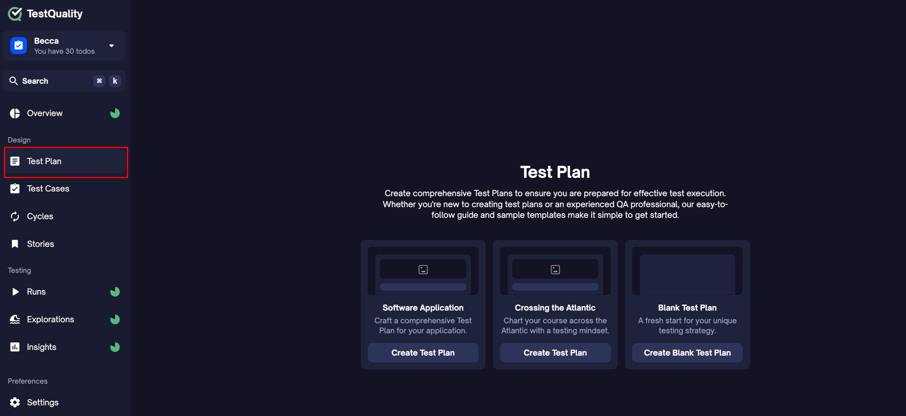

Once you've previewed a template (if applicable), click the "Create Test Plan" button within the preview to get started.

   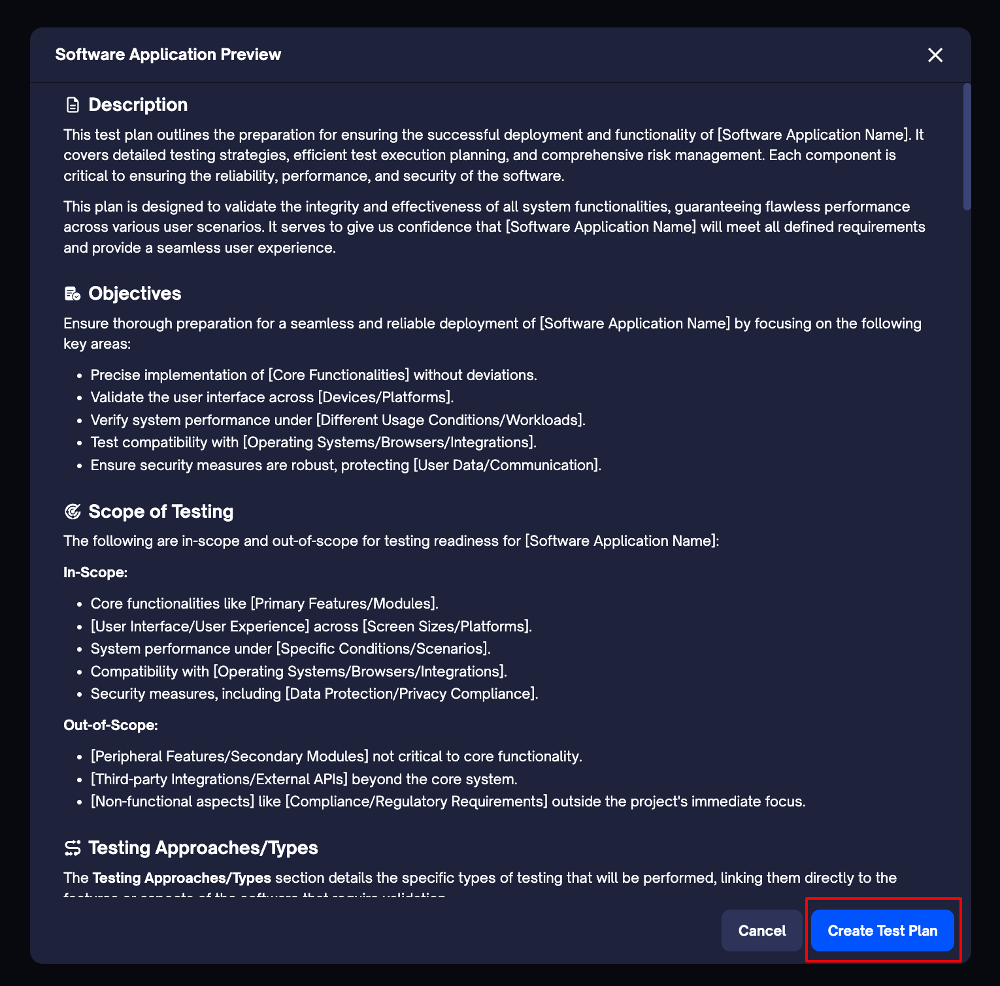

### 2. Add Components
Based on your selection in Step 1, choose the necessary components from the right-hand menu. You'll see recommended components like Description, Objectives, Test Strategy, and Testing Phases and Cycles, but you can also explore other components depending on your project requirements.

   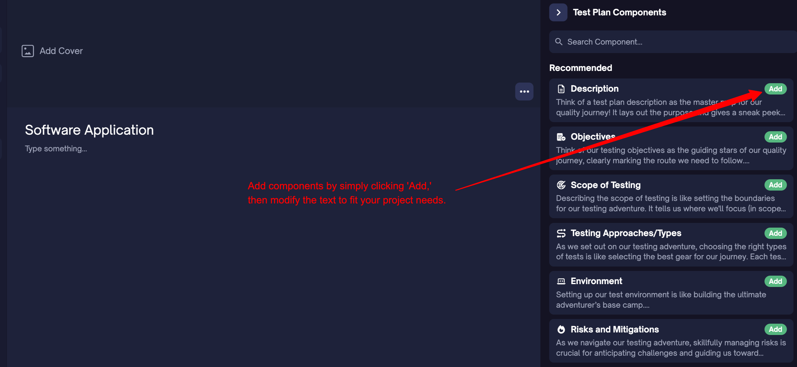

### 3. Integrated Components: Linking Your Test Plan

Certain components in TestQuality’s Test Plan offer **bi-directional integration**, linking your test plan with other key areas of the app. These components streamline workflows and ensure consistency by enabling:

- **Centralized Management:** Update data in one place and see it reflected across your testing ecosystem.
- **On-the-Fly Customization:** Tailor components to project-specific needs without leaving the editor.
- **Efficient Tracking:** Monitor progress, resource use, and schedules directly within the plan.

The integrated components include:

**Testing Phases and Cycles**: 

 This component enables you to define and manage the stages of testing directly within your test plan. It integrates seamlessly with the **Cycles** feature in TestQuality for streamlined management and tracking.

#### How It Works:

- **Default Cycles Creation:**
  - If no cycles exist in your project, this component automatically generates default cycles such as:
    - Unit Testing
    - Integration Testing
    - System Testing
    - Regression Testing
    - User Acceptance Testing
  - *Note: Clicking on these default cycles will navigate you to their respective entries in the Cycles menu, where you can manage them.*

      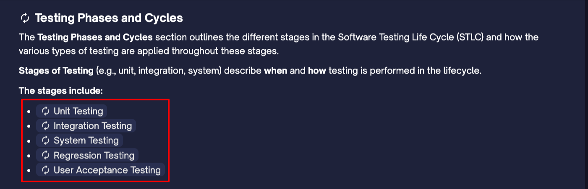

- **Adding Existing Cycles:**
  - Use the `/cycle` command in the editor to add existing cycles to your test plan, ensuring alignment with your current project requirements.

      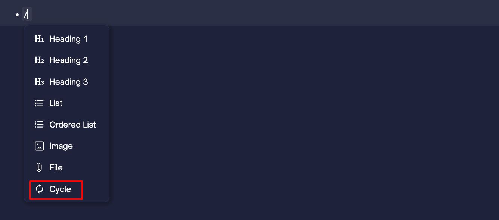

**Testing Approaches and Types**: 

This component lets you define and link the required testing types directly within your test plan, integrating with **Case Types** in **Settings → Lookup Data** for streamlined management.

#### How It Works:
- **Select Case Type:**  
   Click **"Add Case Type"** to choose from predefined options like Accessibility, Compatibility, Performance, and more, fetched from **Case Types** in **Settings → Lookup Data**.

    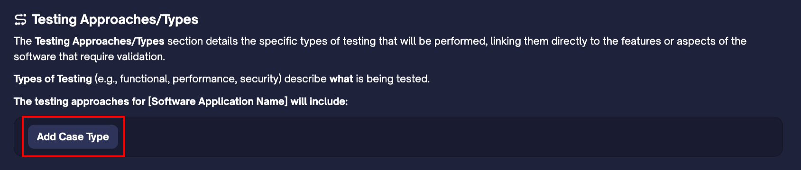

- **Custom Case Types:**  
   Use **"Create New"** to add custom types directly, making them instantly available across all test cases in the project.

**Environments**: 

This component helps you define the physical setup for testing, combining specific configurations such as devices, operating systems, browsers, and network conditions to replicate real-world scenarios. It integrates seamlessly with the **Environments** feature in TestQuality, ensuring streamlined management and alignment across your testing processes.

#### How It Works:

- **Existing Environments:**
  - If environments already exist in your site, they will be listed here, making it easy to select and use them in your test plan.

- **Adding a New Environment:**
  - If no environments exist, click on the **Add Environment** button to create a new environment tailored to your project’s requirements.

      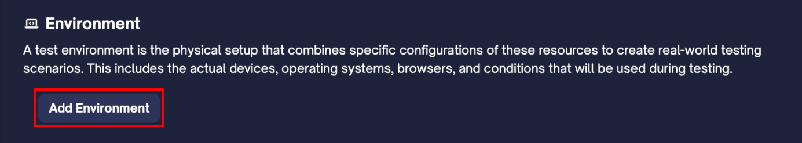

For a comprehensive guide on how to create and manage environments, refer to our [detailed documentation on environments](/administration/environments).

**Schedule**: 

 This component helps you define key timelines for your testing process directly within your test plan. It integrates seamlessly with the **Milestones** feature in TestQuality for efficient timeline management.

#### How It Works:

- **Default Milestones Creation:**
  - If no milestones exist in your project, this component automatically generates two default milestones:
    - **Bug Resolution:** Fixing identified bugs, retesting, and ensuring no regressions have been introduced.
    - **Feature Testing:** Executing tests on key features, validating functionality, and identifying defects.

      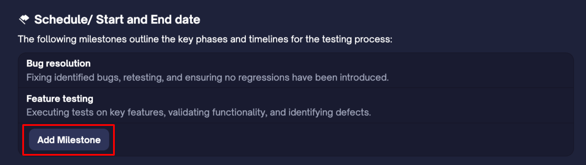

- **Adding Custom Milestones:**
  - Click on the **Add Milestone** button to create additional milestones tailored to your project needs.

      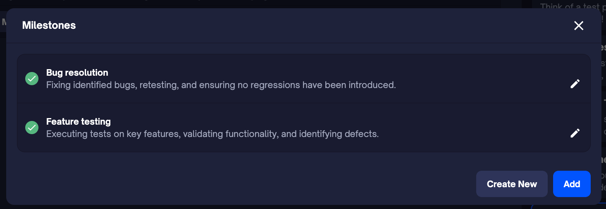

### 4. Fill in Relevant Details
If you've selected the Software Application Template, the guide will automatically populate with predefined sections. Customize each section by entering your project-specific details—such as your core functionalities, user interfaces, and testing environments.

   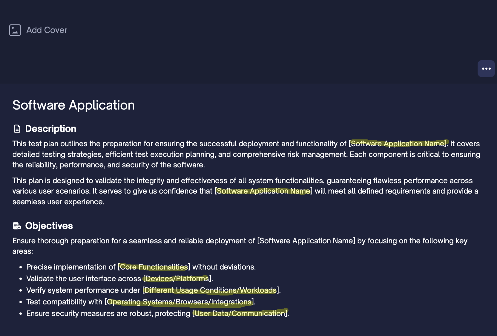

### 5. Share Your Test Plan
With the new **Share Feature**, you can now easily collaborate with your team and stakeholders. To share your test plan:

1. Click on the **Share** icon at the top of your test plan.
2. Enter email addresses to invite specific users or copy the link to share with others.
3. Set permissions to control who can view or edit the test plan, ensuring secure collaboration within your team.

   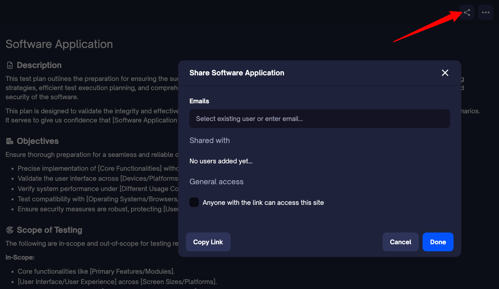

This Share Feature enables streamlined collaboration, allowing your team to stay aligned and up-to-date on the latest changes within the test plan. By making test plans accessible, you can quickly gather feedback and keep everyone on the same page.

### 6. Manage Your Test Plan

Once you’ve completed your test plan, the **More Options** (`...`) menu now offers four actions to help you manage your test plan effectively:

- **Add Cover**: Customize your test plan with a unique cover for better organization and visual appeal.
- **Export to PDF**: Download your test plan in a PDF format for sharing or documentation purposes.
- **Delete Test Plan**: Remove a test plan when it is no longer needed.
- **Version History**: Access the version history of your test plan to track changes if needed.

   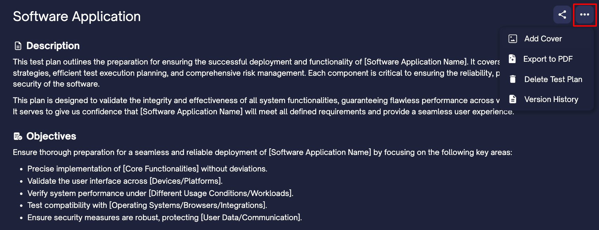