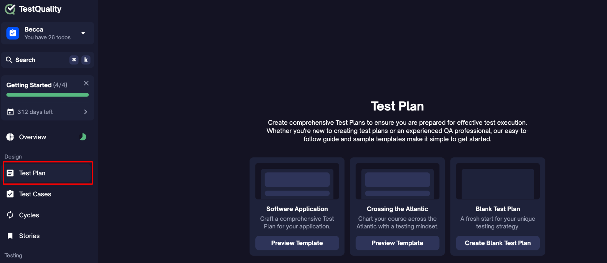

The Test Plan feature in TestQuality is designed to streamline the process of creating, managing, and executing comprehensive test plans. It provides step-by-step guidance and built-in templates, helping you create structured test plans that cover all necessary components for a thorough testing process, all within one integrated platform.

## Why Use TestQuality for Test Plans?

A well-crafted test plan is the foundation of any successful testing process, outlining the scope, objectives, and strategy that ensures comprehensive software coverage. With TestQuality’s Test Plan, teams can create dynamic and customizable plans that leave no critical area untested.

Unlike generic templates, TestQuality’s **In-App Guide** enhances the planning process by offering step-by-step guidance for each key component, from objectives and scope to testing approaches and deliverables. This ensures that every aspect of the test plan is fully integrated with the broader test management strategy, optimizing the testing process for efficiency and thoroughness.

## How to Create a Test Plan:

### 1. Start Your Test Plan:
Begin by selecting one of the three available options:
- **Create from Software Application Template**: Ideal for structured software projects with predefined sections.
- **Create from Sample "Crossing the Atlantic"**: A sample template for understanding how readiness testing can be applied.
- **Create from a Blank Template**: For users who prefer to start from scratch.

   

### 2. Add Components:
Based on your selection in Step 1, choose the necessary components from the right-hand menu. You'll see recommended components like Description, Objectives, Test Strategy, and Testing Phases and Cycles, but you can also explore other components depending on your project requirements.

   

### 3. Fill in Relevant Details:
If you've selected the Software Application Template, the guide will automatically populate with predefined sections. Customize each section by entering your project-specific details—such as your core functionalities, user interfaces, and testing environments.

   

### 4. Share Your Test Plan:
With the new **Share Feature**, you can now easily collaborate with your team and stakeholders. To share your test plan:

1. Click on the **Share** icon at the top of your test plan.
2. Enter email addresses to invite specific users or copy the link to share with others.
3. Set permissions to control who can view or edit the test plan, ensuring secure collaboration within your team.

   

This Share Feature enables streamlined collaboration, allowing your team to stay aligned and up-to-date on the latest changes within the test plan. By making test plans accessible, you can quickly gather feedback and keep everyone on the same page.

### 5. Export and Manage:
Once you’ve completed your test plan, you can export it as a PDF for sharing or documentation purposes. Afterward, manage your testing process through TestQuality’s powerful features—track test cycles, execute test cases, log defects, and generate real-time reports.

   
