### Release Notes - Sept 2022

## Integration Tags Management

When a defect is linked or created in your remote repository, labels or tags are added to identify the issue.
These tags are now editable with our new editor!

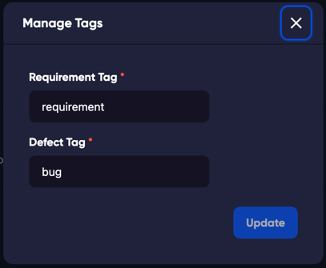

## Custom Integration Templates

Defects and Requirements in GitHub or Jira can now have your very own custom template! Create your own template to better match your use case, or preferred format of issues in Jira or GitHub.

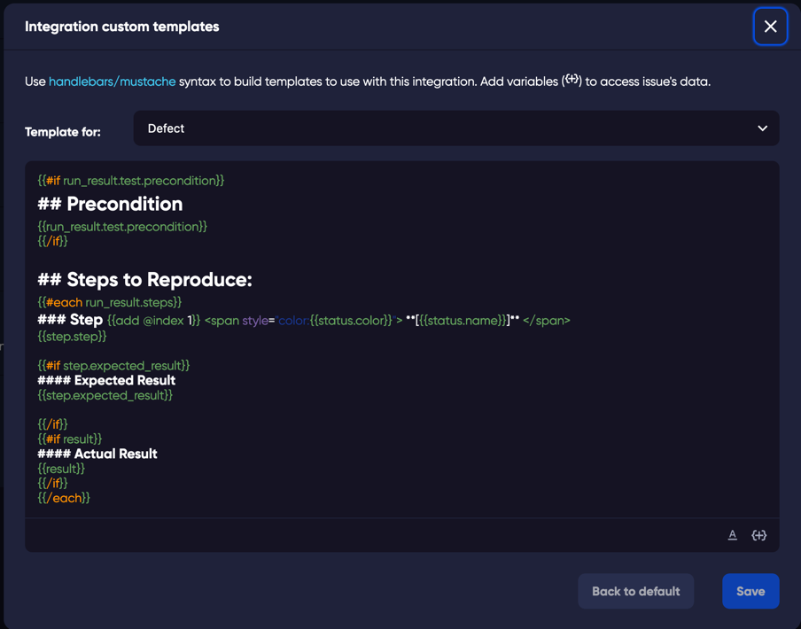

## Previous Release - May 2022

### 'Clone to Project' feature added to the clone function
When you want to copy some tests across to another of your projects, you can now easily use the clone tool to send tests, or folders of tests to another project. 

## Bug fixes.
This month our developers fixed some reported bugs. Bugs that were reported by our amazing customers! For example, it is now possible to use the 'Tab' key to jump out of a text field in the Test Drawer. Making it faster and easier to fill in the different fields without going back to your mouse. Or the new search feature in Cycles and Runs pages!

This is the pleasure of working in an application for QA people. Thank you to all of you that reach out to us and tell us what you find, and also to those that ask for feature enhancements. It is super exciting to add release notes for features and bugs that improve the day of nice people. Thank you! 

## Previous Release - May 2022

### [Re-Run](run#rerun) feature added to Runs 
Easily send your failed tests to a new run, directly from a current run. When tests fail within a run, you can now simply filter these in the run list, and choose to create a new run directly from the list. TestQuality will detect the current Cycle in use and add it to the config of the new run.

### Actual Result option added to tests in execution.
Add the results of your testing to the Actual Results field so that the details are maintained in the run history. The field also available in the filters, by either a specific search term, or the filter "Actual Result has content"will allow you to see any comments added by the tester.

### Add labels to folders via the command tool

It is now possible to add a label to a folder as well as a test. This makes filtering and finding folders even easier.

## Previous Release - February 2021
### [Configurations](administration/configurations)

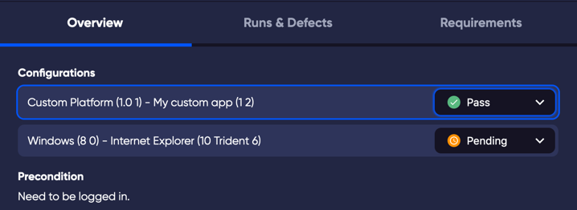

Add Run Configurations to your testing cycles. 

Custom Configurations are also really easy to add. To add a Configuration to your Cycle, click on the ellipsis menu in the Cycles tab and choose Configurations.

### [Save Filters](filtering)

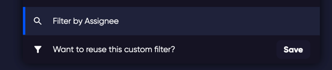

Save your favourite view filters!

Instantly see your favourite tests by saving complex filters in to a single custom filter.

### Space Used 
It is almost impossible to use up your allocated space in TestQuality as we increase your site allocation for every subscription added to your site, but so you can understand what your site data contains, we have added this easy to read chart of site space.  

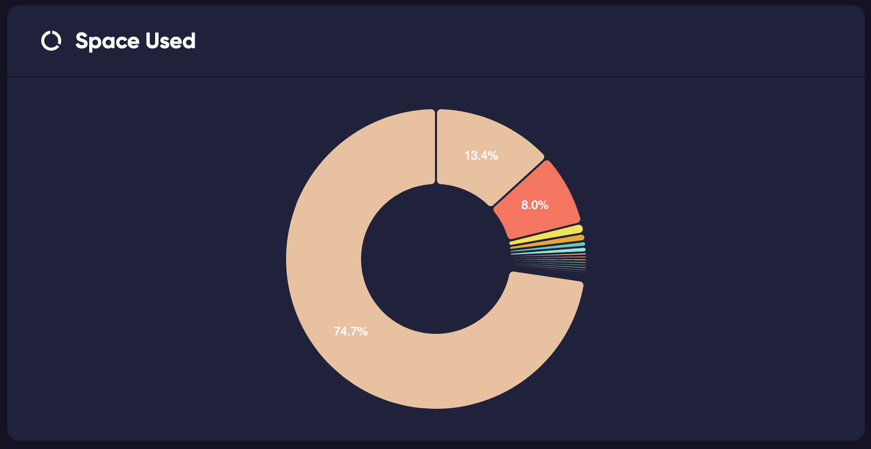

### Other improvements
- Updated the colour of tests in Light Mode to be more visible.
- When you clone a test in a cycle, it now adds the test to the cycle.
- Added documentation links to the in-app menu.
- other bug fixes.

## Previous Release - September 2021
### Following and Watch List 

Follow status changes of Tests and Cycles using the 'Watch' menu option found in the ellipses menu in Tests and Cycles. 

This will notify you of any changes to the status of these watched Tests or tests in the watched Cycle. You can check all of the notifications in the Recent Watches menu drop-down.

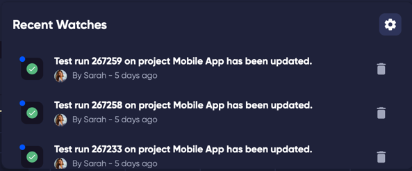

## Previous release - August 2021
### ToDo Items

Instantly know how many outstanding tasks you have waiting for you with the ToDo list feature. The total are listed under the project name so you can quickly find which project needs your attention. 

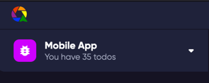

### Test navigation 
While working in a test run, you can now easily move to the next or previous test, meaning that working with your tests is even simpler and faster.

### Display by Milestone
The Overview page for your project is now able to be filtered not only by date range, but also by your Milestone.

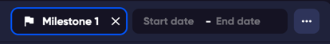

### [Profile](administration/profile) and [Settings](administration/company)
Configure your user or your site. The new Profile and Company pages are now available and ready for you to customise your TestQuality experience.

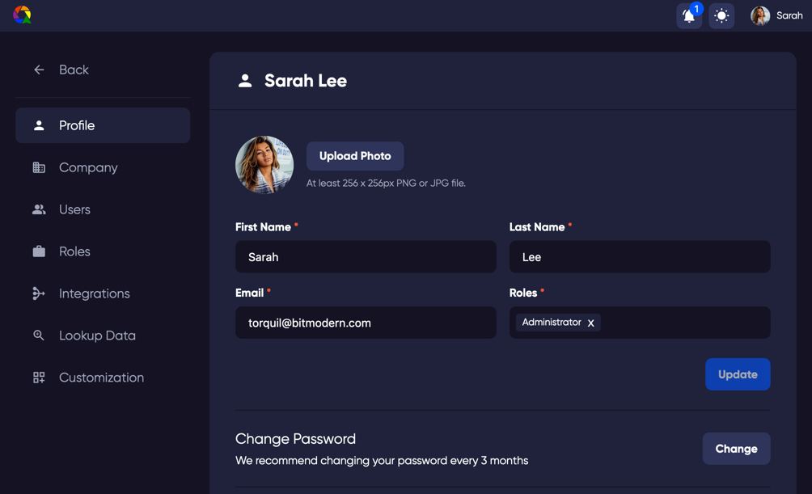

### [Customisation](administration/customization) pages
Manage your User permissions, Roles, and customise your site. You can add your own fields to your tests and different Status, Purpose, Case Type, Priority or Labels.

By adding a new status you can match a different use case for your testing.

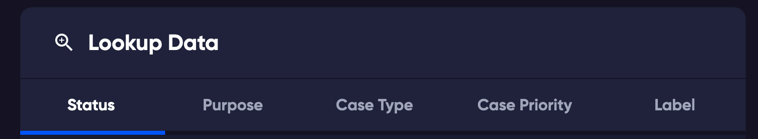
### Notifications
Stay up to date with changes and information for your site.

### [Filter](Filtering) test list
Filter and display your tests to help you organise and manage by Author, Assigned, Type, Priority, Automated, Label, Cycle, Name.

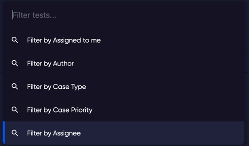

### Import test results

Import test results using the Automation XML import feature using Junit XML files. You can also upload your Gherkin feature files, creating or updating suites and tests following the gherkin syntax.

Included is the ability to import Gherkin based test results from json files.

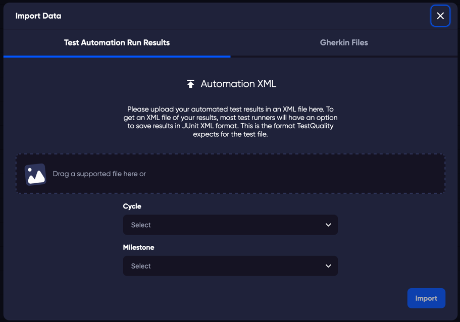

### Export of test cases and Gherkin feature files

Select multiple tests and export to CSV, Excel, or Gherkin feature file format.

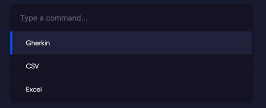

## Previous Releases
### Major Release - Summer 2021
### New Features
- **New UI**.

We are very pleased to announce a simpler, yet more capable interface to your Test Management. The new look TestQuality brings you simplicity in test authoring, easy organisation of your tests, a faster way of monitoring your project, and flexibility to match your workflow.
	
*The same but different...*

**A new structure** -  You may be familiar with our old framework of Project, Plan, Suite, (Sub Suite), Test Case, however because your test cases are very often the focus of your test management, it makes sense that the interface has a similar focus. In our new interface you have a dedicated tab for your tests, which you can organise into folders (and sub folders) and that's it. We have reduced the requirements for the full tree structure, so you can focus on what is important to you.

The user interface is now arranged into 4 tabs to group the functions that are often used together, but divided into common test management tasks. 
	
	
 - **Overview** - An easy glance at the overall status of your project, your 'quick check' page. View by milestone or date range. This is how you can quickly identify any issues before they become a problem. 
 - **Authoring Tests and Cycles** - A fresh way to create and edit your tests. Organise them in folders and choose the sequence that you want your tests to be run. Your tests are the backbone of your testing efforts, we wanted to give you an effective way of managing your tests in focus that they deserve. 
 
 Cycles are the tests that you want to run over and over again, perhaps you want to specify a particular environment or a particular tester, Cycles are part of your test plan and are used to achieve a particular testing goal.  
 - **Running your Tests and Cycles** - You now have a dedicated page to view your test runs. The Run page is where you can monitor your runs and do quick analysis on your test runs. Easy view of the tests in each test run, your test statuses and bug monitoring.
 - **Analysing your test results** - The analysis page is a more indepth study of your tests and runs. How many tests have been added, which tests are working great, and which tests might need some attention. 

**Light/Dark mode** - Dark mode, because... well, just because. Apparently some people really like turning off the lights and working in the dark, so we wanted to join the party and give you the best looking dark mode you have ever seen. It's 🔥!
 

